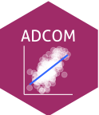

{fig-align="center"}

```{r}
#| message: false
devtools::load_all()
```

Materiale per il corso di Analisi dei Dati in Ambito di Comunità (ADCOM, 6 CFU) nel corso di Psicologia di Comunità, della Promozione del Benessere e del Cambiamento Sociale. 

In questo sito sarà presente tutto il materiale come slides, esercizi, approfondimenti, codici e dati. Per ogni comunicazione ufficiale si faccia sempre riferimento alla [pagina Moodle del corso]().

# Slides

::: {#slides}
:::

# Files

::: {#files}
:::

# Papers

::: {#papers}
:::

# Materiale extra

## R

- Corso intensivo (20 ore) su R, parte dei corsi [ARCA](https://www.dpss.unipd.it/applied-research-courses-academy-arca) del Dipartimento di Psicologia dello Sviluppo e della Socializzazione (DPSS). Potete trovare tutto il materiale [https://arca-dpss.github.io/course-R/](https://arca-dpss.github.io/course-R/).
- Libro in italiano riguardo R che supporta il corso ARCA [https://psicostat.github.io/Introduction2R/](https://psicostat.github.io/Introduction2R/)
- Corso ARCA su R [https://arca-dpss.github.io/course-R/](https://arca-dpss.github.io/course-R/)

# Data

::: {#data}
:::

# Links utili

- [Padlet](https://padlet.com/unipd/adcom2526-8obpqgzm4mdnoyyl)
- [Calendario](https://docs.google.com/spreadsheets/d/1rhXgzPZJYWaGu5bKYFfrJvaycTlxF838ap0lkPV2tyk/edit?gid=0#gid=0)