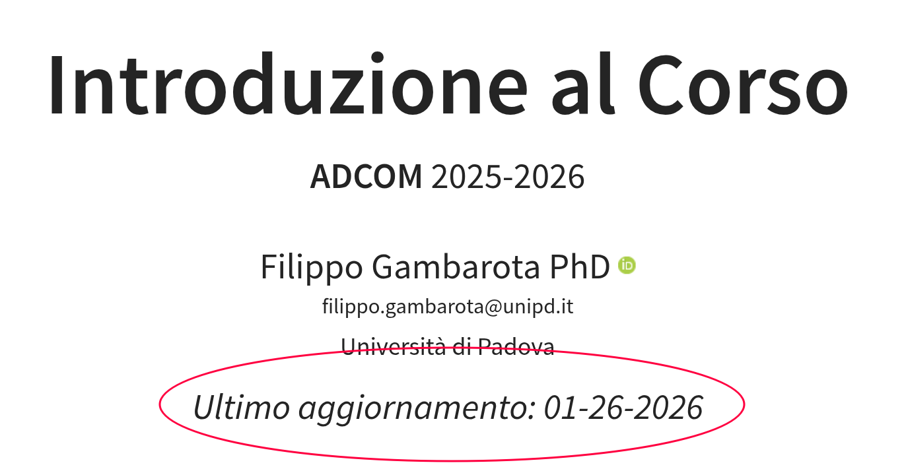
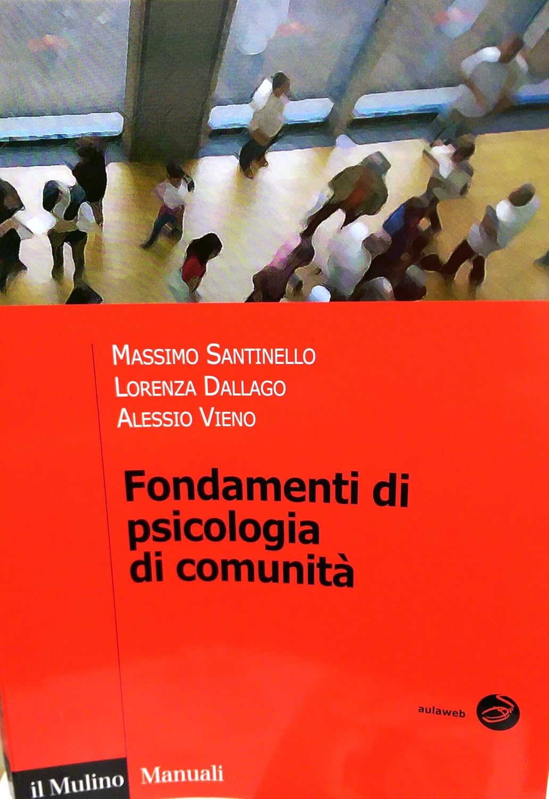
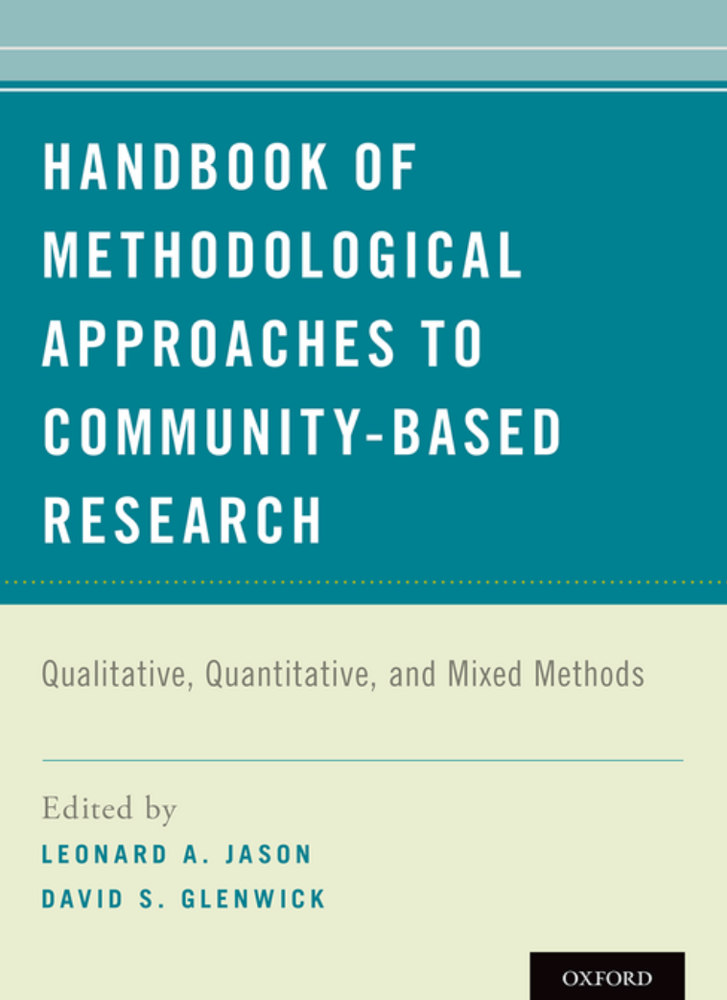

```{r}
#| label: setup
#| include: false

library(tidyverse)
devtools::load_all()

theme_set(theme_bw(15))
```

# Informazioni generali

## About me

- Attualmente sono *Ricercatore (RTDa) in Psicometria* presso il Dipartimento di Psicologia dello Sviluppo e della Socializzazione
- Sono uno *Psicologo Clinico* (dello Sviluppo)
- Ho fatto un Dottorato in Psicologia Sperimentale e Neuroscienze riguardo i correlati comportamentali e neurali di stimoli subliminali
- Attualmente mi occupo di analisi dei dati in Psicologia, in particolare metanalisi e simulazioni Monte Carlo

## Contatti

- Ricevimento il Venerdì 10:00 - 12:00 nell'ufficio 025 al 5° Piano del CLA. Il ricevimento si tiene in prezenza o alternativa su Zoom.
- Potete scrivermi a [](mailto:) o chiamarmi (weird) al +390498271221

Per qualsiasi altra informazione:

- [Sito personale]()
- [Pagina docente Unipd]()

# Programma

## Programma

- Il **programma d'esame** riguarda **esclusivamente le slides** ed i contenuti affrontati a lezione. Nel caso di materiale aggiuntivo, sarà espressamente indicato se parte o meno dell'esame.
- Sulle slide a volte è presente il tag `#extra`. Questo significa che quella specifica slide o riferimento aggiuntivo indicato è utile, interessante ma non sarà oggetto d'esame.

Potete trovare a questo link []() (anche su Moodle) un calendario con orari ed argomenti (aggiornati progressivamente) delle lezioni.

## ~ Programma

A grandi linee il programma sarà:

- Introduzione all'analisi dei dati: utilità, disegni di ricerca, problematiche e aspetti importanti
- Variabili, statistiche descrittive e grafici
- Cenni di misurazione e testing psicologico
- Inferenza statistica
- Regressione Lineare
- Cenni di regressione lineare multilivello <sup>*</sup>
- Metanalisi e metaricerca <sup>*</sup>

::: aside
<sup>*</sup> Questi argomenti, in caso di modifiche al programma, sono quelli che più facilmente possono essere saltati. L'eventuale materiale sarà comunque a disposizione.
:::

## ~ Programma

Inoltre, se abbiamo tempo ci saranno degli approfondimenti molto pratici:

- Come usare (e come non usare) chatGPT (e simili) nello studio, scrittura e analisi dei dati
- Introduzione ad R: qualche lezione mirata sulle basi di R
- Data management
- Bibliographic research

# Esame

## Esame

Come riportato nel [*syllabus*]():

L'esame è scritto e consiste di **31 domande a risposta multipla**. Per ogni domanda ci sono **4 alternative di risposta** di cui solo una corretta. I punteggi sono assegnati nella seguente modalità:

- 1 punto per ogni risposta corretta
- -0.33 punti per ogni risposta sbagliata
- 0 punti per ogni risposta non data

Durante l'esame non è possibile utilizzare internet, l'intelligenza artificiale generativa o altro materiale cartaceo. La durata è di **45 minuti**.

## Esame (fun)

Questa è la distribuzione simulata di 1000 student* che fanno questo esame, rispondendo totalmente a caso.

```{r}
set.seed(2027)

n <- 31
choices <- 4
correct <- 1

# studente che risponde a tutto, a caso

resp <- replicate(1e4, sample(1:choices, size = n, TRUE))
pts <- apply(resp, 2, function(x) sum(ifelse(x == 1, 1, -0.33)))

data.frame(
  pts = pts
) |> 
  ggplot(aes(x = pts)) +
  geom_histogram(bins = 18, col = "black", fill = "dodgerblue") +
  xlab("Voto") +
  geom_vline(xintercept = median(pts), lwd = 1.5, col = "firebrick") +
  theme(axis.title.y = element_blank())
```

## Organizzazione esame

- Gli appelli d'esame si terranno nei periodi stabiliti dalla Scuola di Psicologia:  sessione estiva (giugno-luglio), autunnale (settembre) e invernale (gennaio-febbraio). **Non sono previsti preappelli**!
- Fate sempre riferimento al [sito ufficiale](https://agendastudentiunipd.easystaff.it/index.php?view=easytest&_lang=en) per date e variazioni.
- Per poter fare l'esame **bisogna** essere regolarmente iscrittə su Uniweb entro i termini previsti.
- In ogni caso, a ridosso della prima data d'esame ci saranno indicazioni pratiche/logistiche più precise.
- L'esame si svolgerà in aula informativa. E' obbligatorio iscriversi al corso nella piattaforma Moodle esami (che non è Moodle normale)^[La piattaforma per gli esami sta cambiando, avrete informazioni precise più avanti].

## Esercizi, analisi dei dati ed R

- Durante il corso faremo lezioni teoriche e pratiche con un rapporto di 3:1 circa. Le lezioni pratiche consistono nell'implementare i metodi con dati reali tramite il software R/Jamovi.
- La conoscenza di R o Jamovi non è necessaria per svolgere l'esame. Tuttavia rispondere alle domande sarà sicuramente più semplice seguendo anche la parte pratica.
- L'utilizzo di R/Jamovi verrà usato principalmente da me per la parte pratica. Vi consiglio quindi di installare R e Jamovi (istruzioni dopo) per potermi seguire e provare.

# Regole del gioco

## 1. Quality over quantity

1. Il programma è denso, tutte le slide e materiali saranno a disposizione. Tuttavia la mia priorità è passarvi al meglio i concetti principali.
2. Preferisco approfondire o chiarire maggiormente gli aspetti di base invece di fare esattamente tutto il programma previsto.
3. In ogni caso, in presenza di modifiche al programma l'esame sarà sempre su quello che è stato effettivamente trattato a lezione.

## 2. Partecipazione

Il punto 1 di prima, è particolarmente vero a patto che io sappia quello che non è chiaro. Quindi:

- partecipate
- fate domande (vedi slide dopo)
- chiedete approfondimenti
- datemi feedback
- sono sempre disponibile a ricevimento o via email MA preferirei una discussione partecipata in aula
- partecipate
- partecipate

## 3. Domande

> " [...] every question is a cry to understand the world. There is no such thing as a dumb question"
> <footer>— Carl Sagan</footer>

Vi assicuro che la cosa più soddisfaciente per un docente è la partecipazione attiva ed il ricevere domande. Le domande possono essere di chiarimento, ripetizione o di approfondimento/curiosità. Cercherò di rispondere al meglio ad ognuna di queste.

## 3. Questions pt.2

So che fare domande o partecipare non è sempre semplice (sono uno Psicologo alla fine). 
Per identificare meglio gli argomenti critici e quelli da ripetere ho creato una board su Padlet. Per ogni macro-argomento c'è una sezione e potete (in modo anonimo) mettere domande, dubbi, commenti (il link è presente anche su Moodle).

<center>


[]()

</center>

Prima di cominciare la lezione, dedichiamo una decina di minuti a rivedere gli argomenti critici. Potete quindi inserire domande tra una lezione e l'altra.

## 3. Questions pt.3

Se non emerge nessuna domanda a lezione (preferibilmente) o su Padlet, do per scontata sia per le lezioni future che per l'esame, l'assenza di dubbi e quindi la chiarezza di quell'argomento. 

</br>
</br>
</br>

<center>
Think carefully 🙃.
</center>

## 4. Materiale

Tutto il materiale principale come slides, esercizi, approfondimenti, etc. si trova su [Moodle](). Tutto il materiale (oltre a cose aggiuntive che sono meno pratiche da gestire con moodle) si può trovare anche al seguente sito []().

Il materiale è in costruzione e continuo aggiornamento/miglioramento. Su Moodle o sul sito indicato prima le slide hanno sempre la data di ultimo aggiornamento. Se avete delle slide più datate, scaricate quelle più recenti. I cambiamenti comunque saranno minimi (piccoli errori, grafici migliori, miglioramenti, etc.)

{fig-align="center"}

## 5. Logistica lezioni

Le lezioni saranno organizzate in questo modo:

- **prima parte**: revisione domande su Padlet + domande a voce
- **argomento del giorno** in caso di lezioni teoriche/metodologiche
- **esempi con dati** reali da articoli/libri

Nel caso di lezioni pratiche (1 ogni 3 circa), useremo un dataset il più possibile rilevante per l'ambito e di interesse e con R o altro applicheremo dei concetti studiati in precedenza.

## Libri di testo?

No non sono previsti libri di testo, il materiale di studio sono le slide usate durante la lezione.

Tuttavia, per avere comunque dei riferimenti per approfondire:

- [Pastore, M. (2015) Analisi dei Dati in Psicologia](https://www.mulino.it/isbn/9788815258984)
- [Navarro, D. Learning Statistics with R](https://learningstatisticswithr.com/) [eng, disponibile gratuitamente]
- [Navarro, D. & Foxcroft D.R. Learning Statistics with Jamovi](https://davidfoxcroft.github.io/lsj-book/) [eng, disponibile gratuitamente]

## Libri di testo?

::: {.columns}
::: {.column}

{width="50%"}

:::
::: {.column}

Il capitolo VI *I metodi di ricerca in Psicologia di Comunità* fornisce una panoramica utile rispetto ai disegni di ricerca e l'approccio statistico per gestire dati a più livelli (situazione tipica in Psicologia di Comunità).

:::
:::
<!-- end columns -->

## Libri di testo?

::: {.columns}
::: {.column}

{width="50%"}

:::
::: {.column}

Testo in inglese molto completo ed interessante sulla metodologia della ricerca in Psicologia di Comunità. In particolare il capitolo 13 ([](files/glenwick2016_chapter13.pdf))

:::
:::
  
# Laboratorio di analisi dei dati

## Laboratorio di analisi dei dati

Il laboratorio verrà introdotto direttamente alla prima lezione. L'obiettivo è quello di:

- approfondire a livello pratico alcuni argomenti del corso (e.g., metanalisi)
- approfondire l'utilizzo del software R
- introduzione al software [Quarto](https://quarto.org/) per produrre report, tesi e presentazioni

Le lezioni saranno di 3 ore il Venerdì dalle 11:30 alle 14:30. Potete trovare a questo link []() (anche su Moodle) un calendario con orari ed argomenti (aggiornati progressivamente) delle lezioni.

# Didattica integrativa

## Didattica integrativa

La didattica integrativa sarà gestita e tenuta dal Dr. [Matteo Manente](https://manentematteo.github.io/) Potete scrivere a [matteo.manente.3@phd.unipd.it](mailto:matteo.manente.3@phd.unipd.it) per informazioni. Eventuale materiale sarà comunque disponibile in [Moodle](https://psico.elearning.unipd.it/course/section.php?id=60321) con una sezione e forum dedicati. Se siete interessatə iscrivetevi al [forum dedicato](https://psico.elearning.unipd.it/mod/forum/view.php?id=268046).

Eventuali approfondimenti non sono parte del programma ufficiale del corso e quindi dell'esame. Sono previsti materiali extra ed esercizi sul programma oltre a 1-2 lezioni su argomenti attuali e rilevanti per la ricerca psicologica.

## Didattica integrativa

Le attività di didattica integrativa sono considerate delle **ore aggiuntive** e **facoltative** per *chiarire*, *approfondire* ed *esercitarsi* sui contenuti del corso e saranno gestite dal Dr. [Matteo Manente](https://manentematteo.github.io/). Eventuale materiale sarà comunque disponibile in [Moodle](https://psico.elearning.unipd.it/course/section.php?id=60321). 


# Getting started

## Installare R ed R Studio

Senza andare nei dettagli (vedremo nelle prossime lezioni) vi chiedo di installare R ed R Studio. Per farlo potete seguire la guida a questo [link](https://psicostat.github.io/Introduction2R/install.html). La fornisce le istruzioni per Windows, MacOS e Linux.

- Installare R Studio da solo non è sufficiente. R Studio è solo l'interfaccia grafica (o IDE) ma il motore R deve essere installato.

## R ed R Studio senza PC

Se avete a disposizione un tablet (es. Ipad) probabilmente non sarete in grado di installare R ed R Studio. Ci sono due opzioni principali:

- Se avete un PC a disposizione ed è possibile portate quello durante le lezioni
- Se avete solo un tablet potete usare R Studio Cloud. Sostanzialmente è come avere R Studio Desktop ma lo utilizzate tramite browser. Ci sono alcune limitazioni ma per l'utilizzo (sopratutto in aula) dovrebbe andare più che bene.

Per usare R Studio Cloud è sufficiente creare un account gratuito a questo [link](https://login.posit.cloud/register?product=cloud&redirect=%2Foauth%2Fauthorize%3Fredirect_uri%3Dhttps%253A%252F%252Fposit.cloud%252Flogin%26client_id%3Dposit-cloud%26response_type%3Dcode%26show_auth%3D0).

Qui trovate un breve [video tutorial](https://drive.google.com/file/d/1BwUxn-H8LGQhrKM_CMB79ri1sQpL5C38/view?usp=drive_link) su come utilizzare R Studio Cloud.

## Jamovi

Nel caso di Jamovi vale lo stesso principio di R ed R Studio. Con un classico PC è sufficiente installare l'applicazione dal sito [https://www.jamovi.org/download.html](https://www.jamovi.org/download.html).

Esiste anche nel caso di Jamovi una versione cloud ([https://www.jamovi.org/cloud.html](https://www.jamovi.org/cloud.html)) analoga a quella di R Studio ma sembra essere molto limitata. Può essere sufficiente per fare alcune prove ma per avere un ambiente di lavoro più stabile è consigliato utilizzare quella completa e locale.

## Link utili (teneteli nei bookmarks)

Ci sono una serie di link utili (presenti anche su Moodle) che useremo spesso:

- [Padlet con domande]()
- [Sito del corso]() (parallelo a Moodle)
- [Programma lezioni e argomenti]()

## Qualche conoscenza statistica

Mettiamoci alla prova con qualche domanda generale!

<center>



</center>

## Piccolo questionario

Vi chiedo di fare un piccolo questionario totalmente anonimo. Non vi dico ancora a cosa servirà ma lo vedremo nelle prossime lezioni ma vi garantisco che sarà molto utile.

<center>



</center>