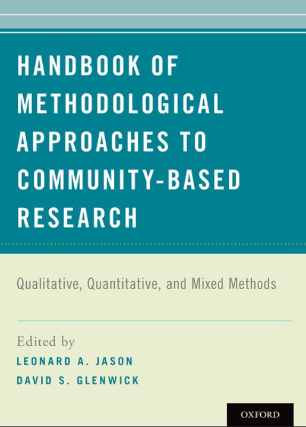

```{r}
#| label: setup
#| include: false

library(tidyverse)
library(dagitty)
library(ggdag)
devtools::load_all()
```



# Perchè imparare analisi dei dati?

## La psicologia è una scienza statistica

Rispetto al pensiero comune dove le hard-sciences (fisica, ingegneria, matematica) richiedono competenze di analisi dei dati, sono le scienze sociali sono altrettanto (se non di più) complesse:

- **quantità direttamente non osservabili** (*variabili latenti*) come depressione, autostima, senso di comunità
- **elevate differenze individuali** scomponibili a vari livelli in interazione (geni, ambiente, educazione, etc.)
- **fenomeni sempre multivariati** dove non sempre tutte le variabili coinvolte sono chiare e facilmente misurabili

## Devo essere unə statisticə per fare lə psicologə?

Assolutamente no. Una buona metafora è:

> La statistica studia il funzionamento del motore sia in termini di funzionamento attuale che come migliorarlo. Lə scienziatə (ad esempio in Psicologia) deve essere un buon pilota.

La conoscenza tecnica può aiuta ad essere dei piloti migliori MA non è il principale oggetto di studio (almeno per la maggior parte).

## Perchè capire la statistica?

Tanto quanto sapere l'inglese è necessario per conoscere la letteratura scientifica, conoscere la statistica è necessario per leggere in modo adeguato i risultati di un paper.

## Lo dice anche il codice deontologico

> **Articolo 5**: Lo psicologo è tenuto a mantenere un livello adeguato di preparazione e **aggiornamento professionale**, con particolare riguardo ai settori nei quali opera. La violazione dell’obbligo di formazione continua, determina un illecito disciplinare che è sanzionato sulla base di quanto stabilito dall’ordinamento
professionale. Riconosce i limiti della propria competenza e usa, pertanto solo strumenti teorico – pratici per i quali ha acquisito adeguata competenza e, ove necessario, formale autorizzazione. **Lo psicologo impiega metodologie delle quali è in grado di indicare le fonti e riferimenti scientifici, e non suscita, nelle attese del cliente e/o utente, aspettative infondate.**

## Lo dice anche il codice deontologico

> **Articolo 7**: Nelle proprie attività professionali, nelle attività di ricerca e nelle comunicazioni dei risultati delle stesse, nonché nelle attività didattiche, **lo psicologo valuta attentamente, anche in relazione al contesto, il grado di validità e di attendibilità di informazioni, dati e fonti su cui basa le conclusioni raggiunte**; espone all’occorrenza, le ipotesi interpretative alternative, ed esplicita i limiti dei risultati. Lo psicologo, su casi specifici, esprime valutazioni e giudizi professionali solo se fondati sulla conoscenza professionale diretta ovvero su una documentazione adeguata ed attendibile.

## Lo dice anche il codice deontologico

Per avere un buon aggiornamento scientifico (richiesto dal codice deontologico) è necessario approcciare in modo critico le informazioni. Per avere un approccio critico riguardo informazioni scientifiche è necessario:

- conoscere la metodologia della ricerca
- conoscere l'analisi dei dati (pensate sempre alla metafora del motore)
- saper intepretare i dati e integrare criticamente i risultati con la teoria

## Formule, formule, formule

Tuttə voi conoscete e capite questa formula giusto? Possiamo dare per scontate queste cose?

$$
L(\mathbf{\beta}, \sigma^2 \mid \mathbf{y}) = \prod_{i=1}^n \frac{1}{\sqrt{2\pi \sigma^2}} \exp\left( -\frac{(y_i - \mathbf{x}_i^\top \mathbf{\beta})^2}{2\sigma^2} \right)
$$

In realtà, nemmeno io la capisco fino in fondo. L'obiettivo di questo corso non è capire o studiare le formule ma capire più ad alto livello quello che implicano.

## Formule, formule, formule

Le formule sono come dei modi di dire molto sintetici. Sono estremamente efficiaci ed eleganti per esprimere concetti complessi MA perdono la loro efficacia se non si ha un pochino di familiarità. Ad esempio:

$$
\bar x = \frac{1}{n} \sum^{n}_{i = 1} x_i
$$

Cosa significa questa formula? Ci sono dei simboli, delle convenzioni, c'è un iterazione $\sum^{n}_{i = 1}$. Quando questa grammatica di base diventa più chiara e familiare, le formule diventano molto utili.

## Formule, formule, formule

$$
\bar x = \frac{1}{n} \sum^{n}_{i = 1} x_i
$$

In questo caso, immaginate $\sum^{n}_{i = 1}$ come un ciclo di operazioni che si ripete $n$ volte da 1 a $n$. $i$ identifica ogni giro di questo ciclo (primo giro $i = 1$, secondo giro $i = 2$, etc.). Gli elementi a destra di $\sum^{n}_{i = 1}$ sono quelli su cui fare l'operazione. L'operazione in questione è la somma, convenzionalmente come $\sum$.

Quindi sarebbe come dire, $x$ è un insieme di numeri di lunghezza $n$. Prendi il primo elemento $x_1$, poi sommalo al secondo $x_2$, poi alla somma aggiungi il terzo $x_3$ e così via fino all'ultimo ($n$). Questa somma di $n$ numeri moltiplicala per $1/n$ (ovvero dividi per $n$). Cosa otteniamo? La media aritmetica!

## Un piccolo esempio (1)

Immaginate di leggere su un paper riguardo **due studi** dove un *gruppo clinico* e un *gruppo di controllo* vengono **confrontati** rispetto ad un certo *costrutto psicologico* **misurato** tramite una scala self-report. L'**ipotesi** degli autori dice che ci si aspetta un punteggio diverso tra gruppo clinico e gruppo di controllo.

Nel **primo studio** viene raccolto un campione di *30 soggetti*. Nel **secondo studio** viene raccolto un campione di *300 soggetti*.

Nel primo studio viene riportato che il gruppo clinico ha una misura *significativamente* maggiore nella variabile d'interesse, mentre il secondo studio non riporta differenze *significative*.

Se doveste scommettere, quale dei due studi è maggiormente informativo? perchè

## Un piccolo esempio (2)

Un gruppo di ricerca ha sviluppato un nuovo intervento per il potenziamento dell'autostima nella scuola secondaria di secondo grado. Raccoglie un gruppo di studenti e studentesse ad inizio dell'anno scolastico, somministra una serie di questionari pre-intervento, esegue il programma di potenziamento e poi somministra nuovamente i questionari alla fine dell'anno scolastico.

I risultati dicono che i partecipanti migliorano *significativamente* la loro autostima. Voi siete un ipotetico ente finanziatore per programmi di questo tipo, finanziereste su larga scala il trattamento? Avete bisogno di altre informazioni? Che critiche potreste fare?

## Cosa ci dicono?

Questi due esempi ci dicono delle cose importanti che tratteremo e che sono estremante rilevanti:

- I costrutti vengono misurati ed interrogarsi sulla tipologia di misura è fondamentale
- La numerosità campionaria è un indice (non il solo) che ci permette di avere più o meno confidenza in un risultato
- La costruzione dell'esperimento/studio è fondamentale (oltre alle cose precedenti) per valutare un risultato come solido ed affidabile

## Simpson's Paradox

Nell’autunno del 1973, l’Università della California a Berkeley rese pubblici i dati relativi alle ammissioni ai **corsi di laurea magistrale**. Cosa potreste concludere guardando i dati aggregati?

```{r}
#| out-width: 80%
dat <- read.csv("https://waf.cs.illinois.edu/discovery/berkeley.csv")

dat_summ <- dat |> 
  mutate(admitted = ifelse(Admission == "Rejected", 0, 1)) |> 
  group_by(Sex) |>
  summarise(p_admitted = mean(admitted),
            n_admitted = sum(admitted),
            n_applications = n())

dat_summ |> 
  mutate(p_admitted = round(p_admitted * 100)) |> 
  ggplot(aes(x = Sex, y = p_admitted)) +
  geom_col(width = 0.3) +
  ylim(c(0, 100)) +
  xlab("Sex") +
  ylab("% di ammissioni") +
  geom_label(aes(x = Sex, y = p_admitted, label = paste("n =", n_admitted))) +
  ggtitle(sprintf("Applications totali n = %s", nrow(dat)))
```

::: aside
Si veda @Bickel1975-or
:::

## Simpson's Paradox

In modo *naive* si potrebbe concludere che ci sia un bias verso l'ammissione di candidati di sesso maschile. Ci potrebbero però essere altre spiegazioni?

Vi ricordo che:

- abbiamo solo il sesso come informazione riguardo i partecipanti
- i dati sono qui aggregati ma sono anche disponibili i dati separati per corso di studio

## Simpson's Paradox

Vediamo cosa succede se separiamo per corso di studio. Potete trovare il dataset con le percentuali di ammissione separato per dipartimento qui:

<center>

</center>

Cosa potete notare?

## Simpson's Paradox

Facciamo un grafico (un pochino complesso) dei dati in questione:

```{r}
dat_dep <- dat |> 
  mutate(admitted = ifelse(Admission == "Accepted", 1, 0)) |> 
  group_by(Major, Sex) |> 
  summarise(n_admitted = sum(admitted),
            n_applications = n(),
            p_admitted = n_admitted / n_applications) |> 
  group_by(Major) |> 
  mutate(n_applications_tot = sum(n_applications),
         n_admitted_tot = sum(n_admitted),
         p_admitted_tot = n_admitted_tot / n_applications_tot)

dat_dep$Major <- factor(dat_dep$Major, levels = 
unique(dat_dep$Major)[order(unique(dat_dep$p_admitted_tot))])

dat_dep |>
  filter(Major != "Other") |> 
  ggplot(aes(y = Major)) +
  geom_vline(data = dat_summ, aes(xintercept = p_admitted, color = Sex), lwd = 1, lty = "dotted") +
  geom_point(
    aes(x = p_admitted, color = Sex, size = n_applications),
    alpha = 0.9
  ) +
  coord_cartesian(xlim = c(0, 1)) +
  scale_x_continuous(labels = scales::percent_format(accuracy = 1)) +
  scale_size_continuous(range = c(2, 10), guide = "none") +
  labs(
    x = "% di ammissioni",
    y = "Corso di studi",
    color = "Sesso",
    size = "N domande"
  ) +
  scale_color_manual(values = c("#1abc9c", "#9b59b6"))
```

## Simpson's Paradox

Sostanzialmente, se ordiniamo i corsi per la % totale di ammissione (un indice della difficoltà ad entrare) vediamo che:

- Gli studenti tendono ad applicare di più a dipartimenti più facili
- Le studentesse tendono ad applicare di più a dipartimenti più difficili

Anzi, se calcoliamo la media della percentuale di ammissione tra corsi, è leggermente più alta per le studentesse.

## Simpson's Paradox

Questo fenomeno si chiama Paradosso di Simpson e può accadere quando in presenza di un *confounder* (la difficoltà di ammissione) le conclusioni guardando i dati aggregati è diversa rispetto a guardare i dati disaggregati (in questo caso rispetto al corso).

Questo è un ottimo esempio di come conoscere o non conoscere l'analisi dei dati aiuta a trarre conclusioni più appropriate.

Per approfondire, a questo link [https://setosa.io/simpsons/](https://setosa.io/simpsons/) trovate una visualizzazione interattiva del Paradosso di Simpson

## Simpson's Paradox

Vediamo una *simulazione* con due dipartimenti, uno facile e uno difficile. Il 50% dei maschi applica sempre a quello difficile. Vediamo cosa succede cambiando il tasso delle femmine.

```{r}
#| include: false
bias <- 1 # > 1 bias for women
hard <- 0.2
easy <- 0.8
p_wom_hard <- seq(0, 1, 0.1)
p_man_hard <- rep(0.5, length(p_wom_hard))

adm_m <- easy * (1 - p_man_hard) + hard * p_man_hard
adm_f <- (easy * bias) * (1 - p_wom_hard) + (hard * bias) * p_wom_hard
```

```{r}
#| fig-height: 8
easy <- 0.8
hard <- 0.2
n <- 100

dd <- expand.grid(
    p_hard_f = seq(0, 1, 0.01),   # % donne che scelgono hard
    p_hard_m = 0.5                # uomini fissati al 30% hard
)

dd <- dd |>
    mutate(
        # ammissioni donne
        adm_f = n * (
            p_hard_f * hard +
                (1 - p_hard_f) * easy
        ),
        
        # ammissioni uomini
        adm_m = n * (
            p_hard_m * hard +
                (1 - p_hard_m) * easy
        )
    )

dd |>
    pivot_longer(c(adm_f, adm_m), names_to = "sex", values_to = "admissions") |>
    ggplot(aes(p_hard_f, admissions, color = sex)) +
    geom_line(lwd = 1.2) +
    labs(
        x = "% donne che scelgono dipartimenti difficili",
        y = "Numero totale ammessi",
        color = "Sesso"
    ) +
    ylim(c(0, 100)) +
    ggtitle("% ammissione dip. facile    = 80%\n% ammissione dip. difficile = 20%") +
    scale_color_manual(values = c("#1abc9c", "#9b59b6"), labels = c("F", "M"))
```

# Quali tipi di domande di ricerca?

## Quali tipi di domande di ricerca?

Il capitolo *Introduction to Quantitative Methods* [](`r files$jason2016_chapter1_intro.pdf`) identifica i principali approcci quantitativi all'analisi dati in ambito di Psicologia di Comunità.

{fig-align="center"}

## E' possibile una ricerca empirica?

> On the one hand, more action-oriented proponents in the field argue in favor of constructivist or relativistic paradigms to promote greater engagement with the
contextual and community-based influences that impact our areas of study (Lincoln & Guba, 2000). From this perspective, there is concern about the potential limitations, or even the potential harms to those who are disenfranchised, of more objective experimental paradigms (e.g., positivism and postpositivisism). On the other hand, proponents of these quantitative methods argue that as a scientific discipline seeking to expand the influence of our field’s perspective on the way social and community research is conducted, we should embrace the strengths of methods based on these paradigms to facilitate rigorous hypothesis testing, produce research that is both internally valid and externally generalizable, and assess cause-and-effect relationships between constructs (Johnson & Onwuegbuzie, 2004).

## Quali tipi di domande di ricerca?

Di seguito, sono identificate le principali domande di ricerca:

1. La presenza e la forza della relazione tra due o più variabili
2. La presenza di differenze in variabili d'interesse tra due o più gruppi
3. Classificazione dei soggetti in gruppi, basandosi su variabili di interesse
4. Misurazione e strutture latenti di variabili e costrutti d'interesse
5. L'andamento temporale (i.e., longitudinale) di effetti e variabili d'interesse

## Quali tipi di domande di ricerca?

Quelle che affronteremo principalmente sono:

1. **La presenza e la forza della relazione tra due o più variabili**
2. **La presenza di differenze in variabili d'interesse tra due o più gruppi**
3. Classificazione dei soggetti in gruppi, basandosi su variabili di interesse
4. Misurazione e strutture latenti di variabili e costrutti d'interesse
5. L'andamento temporale (i.e., longitudinale) di effetti e variabili d'interesse

## Quali tipi di domande di ricerca

Inoltre, tratteremo altri due argomenti:

- **Strutture dati multilivello**: Questo è parzialmente compreso in (1) ma in Psicologia di Comunità spesso le domande di ricerca riguardano la relazione tra più livelli di analisi (e.g., come il contesto impatta il singolo e viceversa).
- **Metanalisi**: In un contesto dove ci sono sempre più ricerche pubblicate, sviluppare un meta-analytic thinking è essenziale. Il motto è che uno studio, anche il più ben fatto, non dice mai abbastanza sul fenomeno d'indagine.

## 1. Relazione tra due o più variabili

Possiamo valutare la relazione tra criminalità percepita ed età anagrafica:

```{r}
n <- 1e3
age <- round(runif(n, 18, 70))
pcrim <- 30 + 0.5 * age + rnorm(n, 0, 10)
pcrim <- filor::trim(pcrim, 0, 100)

data.frame(
    pcrim, age
) |> 
    ggplot(aes(x = age, y = pcrim)) +
    geom_point(size = 3,
               alpha = 0.5) +
    geom_smooth(method = "lm", se = FALSE) +
    xlab("Age") +
    ylab("Perceived Criminality")
```

## 1. Relazione tra due o più variabili

Oppure vedere la relazione tra uso dei social media e depressione in diversi paesi. Questa è una struttura multilivello:

```{r}
ns <- 100
nations <- c("it" = 1, "de" = 2, "fr" = 3, "gb" = 4, "usa" = 5, "jp" = 6)
nc <- length(nations)

nation <- rep(1:nc, each = ns)
smedia <- 20 + rnorm(nc, 0, 10)[nation] + rnorm(ns * nc, 0, 5)
wellbeing <- 20 + rnorm(nc, 0, 10)[nation] + (1 + rnorm(nc, 0, 0.5)[nation]) * smedia + rnorm(ns * nc, 0, 10)

data.frame(
    nation = names(nations[nation]),
    smedia,
    wellbeing
) |> 
    ggplot(aes(x = smedia, y = wellbeing)) +
    geom_point(aes(color = nation), alpha = 0.5) +
    geom_smooth(aes(color = nation), method = "lm", se = FALSE) +
    xlab("Social Media Usage") +
    ylab("Well-being")
```

## 2. Differenze tra gruppi

Possiamo indagare ad esempio punteggi di depressione e ansia in funzione del corso di laurea seguito:

```{r}
cdl <- c("psicologia", "fisica", "ingegneria", "filosofia")
lapply(c(80, 10, 30, 50), function(x) rnorm(100, x, 10)) |> 
    setNames(cdl) |> 
    data.frame() |> 
    pivot_longer(1:length(cdl)) |> 
    mutate(value = filor::trim(value, 0, 100)) |> 
    ggplot(aes(x = name, y = value)) +
    geom_point(aes(color = name), position = position_jitter(width = 0.1), show.legend = FALSE) +
    geom_boxplot(show.legend = FALSE) +
    theme(axis.title.x = element_blank()) +
    ylab("Depression")
```

## 3. Metanalisi

Possiamo anche combinare diversi studi relativi ad uno specifico ambito di ricerca. Ad esempio, 10 studi che valutano l'impatto di uno specifico programma di prevenzione:

```{r}
library(metafor)
mm <- filor::sim_meta(10, 0.3, 0.1, rpois(10, 50))
fit <- rma(yi, vi, data = mm)
forest(fit)
```

## Riferimenti