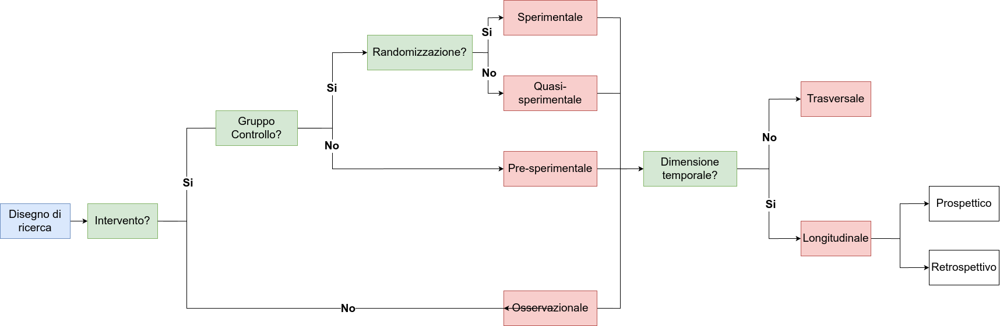
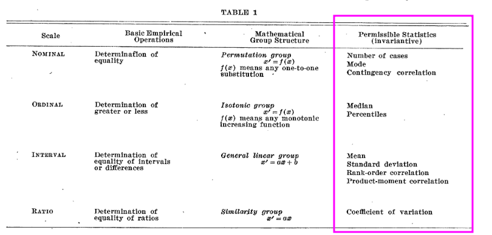
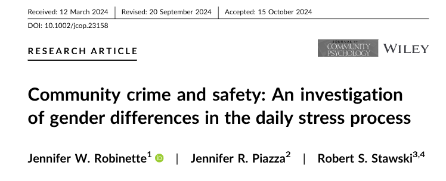
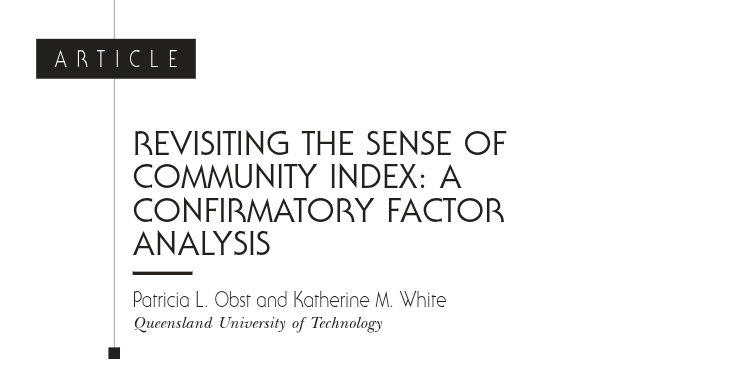

# Processo scientifico

```{r}
#| label: setup
#| include: false

library(tidyverse)
library(patchwork)
library(dagitty)
library(ggdag)
library(RefManageR)
library(here)
library(viridis)

devtools::load_all()

qtab <- function(x, width = NULL, fontsize = 0.85){
    tinytable::tt(x, width = width) |> 
        tinytable::theme_striped() |> 
        tinytable::style_tt(fontsize = fontsize)
}

knitr::opts_chunk$set(
  fig.align = "center",
  fig.dev = "svg"
)

theme_set(mtheme())

bib <- ReadBib(here("papers/papers.bib"))
NoCite(bib)

papers <- yaml::read_yaml(here("papers/papers.yml"))
names(papers) <- sapply(papers, function(x) x$key)

files <- get_slide_files()
```

## Qualche riferimento

[@Gravetter2018-ak]{.bibentry}

- Ricerca correlazionale ([](`r files$gravetter2018_correlational.pdf`))
- Ricerca sperimentale ([](`r files$gravetter2018_experimental.pdf`))
- Ricerca quasi-sperimentale ([](`r files$gravetter2018_non_quasi_experimental.pdf`))

## Qualche riferimento

[@Navarro2013-rh]{.bibentry}

- Introduzione alla metodologia della ricerca ([](`r files$navarro2015_chatper2_intro_research_design.pdf`))

## Qualche riferimento

[@Jhangiani2019-sa]{.bibentry}

- Ricerca sperimentale ([](`r files$files$jhangiani2019_experimental.pdf`))
- Ricerca non-sperimentale ([](`r files$files$jhangiani2019_non_experimental.pdf`))
- Ricerca quasi-sperimentale ([](`r files$files$jhangiani2019_quasi_experimental.pdf`))

## Processo scientifico

](img/scientific-process.png)

## Letteratura <--> Domanda di ricerca

Il punto di partenza è sempre la formulazione di domande di ricerca. 

Questo processo è bidirezionale perchè la letteratura scientifica può essere fonte o de le nostre domande di ricerca.

## Studio empirico

Possiamo identificare 3 aree generali relative alla realizzazione di uno studio empirico:

- **Disegno di ricerca**
- **Raccolta dati e campionamento**
- **Misurazione**

## ... e l'analisi dei dati?

Non ho messo l'analisi dei dati perchè è importante distinguere tra:

- analisi dei dati come azione pratica: ho il dataset e applico il modello di analisi
- analisi dei dati come mindset e *data literacy*

Il primo è facile, è sufficiente conoscere uno strumento (R, SPSS, Jamovi, etc.) e sapere quello che si deve fare. 

Il secondo invece richiede conoscenza, spirito critico, ragionamento e allenamento. Non è uno step separato ma accompagna tutti i momenti della ricerca. 

Conoscere la statistica permette di valutare uno studio in letteratura, conoscere il disegno di ricerca migliore, valutare le misure migliori e cosi via. Questo è quello su cui ci focalizzeremo maggiormente durante il corso.

## Data literacy

> Data literacy is the ability to collect, manage, evaluate, and apply data, in a critical manner (Risdale et al., [2015](https://dalspaceb.library.dal.ca/server/api/core/bitstreams/7c0db868-79ac-4c3c-9ad0-f2a93cf2ccc6/content))

## Metodologia della ricerca

All'interno della metodologia della ricerca possiamo individuare tre filoni fondamentali:

- Ricerca qualitativa
- Ricerca quantitativa
- Mixed Methods (qualitativa + quantitativa)

Noi ci focalizzeremo solo su quella *quantitativa* ma, soprattutto in Psicologia di Comunità è molto rilevante ed importante anche quella qualitativa. Da qui in poi, ci riferiamo a ricerca sperimentale come ricerca quantitativa.

## Disegni di ricerca

All'interno della ricerca quantitativa possiamo identificare:

- Ricerca Sperimentale
- Ricerca Quasi-Sperimentale
- Ricerca Correlazionale

## Ricerca sperimentale

Possiamo identificare 4 aspetti centrali che caratterizzano la ricerca sperimentale:

1. **Manipolazione**: una o più variabili vengono attivamente manipolate creando due o più condizioni (ad esempio trattamento vs placebo)
2. **Misurazione**: una o più variabili vengono misurate (considerando tutti gli aspetti che abbiamo illustrato prima)
3. **Confronto**: le condizioni create *manipolando* le variabili vengono confrontate rispetto alle variabili misurate (ad esempio performance nel gruppo trattato vs placebo)
4. **Controllo**: le variabili che non vengono manipolate, vengono controllate. Ci sono varie modalità di controllo sperimentale.

Questi 4 elementi permettono idealmente di poter trarre delle conclusioni **causa-effetto** della manipolazione sull'outcome.

## Terminologia

Quando parliamo di esperimenti, ricerche e analisi dati la terminologia è importante:

- $y$ sono gli **outcomes** (uno o più). Solitamente chiamate anche *variabili dipendenti* (ma preferisco *outcomes*)
- $x$ sono i **predittori**. Solitamente chiamate anche variabili *indipendenti* (ma preferisco *predittori*)

All'interno dei predittori possiamo trovare:

- variabili che rappresentano **manipolazioni sperimentali**
- variabili che non vengono manipolate e sono chiamate **estranee** ma possono avere un impatto su $x$ e/o $y$. Alcune di queste vengono misurate e diventano dei veri e propri predittori mentre altre esistono solo livello teorico ma non vengono misurate.

## Terminologia

- **dataset** è la struttura dati di dimensione $n \times k$ dove $n$ sono le righe e $k$ le colonne (pensate ad un foglio Excel). I predittori $x$ sono una parte delle colonne $k$ (o una loro trasformazione) che utilizziamo in un modello statistico.
- **unità statistiche** sono la l'elemento base o l'entità elementare su cui vengono misurati i caratteri oggetto di indagine all'interno di una popolazione statistica. Possono essere persone, animali, misurazioni nel tempo. A livello pratico è il significato delle $n$ righe nel dataset.

## Terminologia

Quando parliamo di variabili è importante anche distinguere tra **variabili osservate** e **latenti**. 

- Per **costrutto o variabile latente** intendiamo qualcosa di *non direttamente osservabile* ma che risulta essere il nostro oggetto d'interesse. Senso di comunità, autostima, depressione, benessere, etc. sono tutte variabili latenti.
- Essendo non direttamente osservabili dobbiamo usare degli **indicatori** che sono legati ed informativi della variabile latente. 
- Il legame tra variabile latente e indicatori si chiama **operazionalizzazione**.
- è importante distinguere variabili osservate/manifeste come l'età, peso, altezza, etc. rispetto a variabili osservate utilizzate come indicatori di costrutti latenti.

## Esempio

Il classico esempio è quello di un trattamento/intervento. La **manipolazione** consiste nel creare due condizioni (trattamento e controllo). Viene **misurata** una variabile che rappresenta l'*outcome* (esempio autostima). Si **confrontano** i punteggi tra le due condizioni **controllando** per tutte le altre variabili. Un'eventuale differenza tra le due condizioni è dovuta all'*effetto causale* della manipolazione sperimentale.

<center>
Riuscite a pensare a qualche esempio concreto?
</center>

## Ricerca sperimentale e oltre

Questo è uno schema riassuntivo ma non esaustivo dei diversi tipi di ricerca. I nodi decisionali sono quelli verdi mentre i vari disegni sono in rosso.


## Primo nodo, intervento

Il primo nodo decisionale riguarda la presenza o meno di un **intervento**. Un intervento viene inteso come una manipolazione sperimentale. In termini medici è un farmaco, un protocollo di cura, etc. In termini psicologici può essere un intervento educativo, psicoterapia, etc.

Possiamo anche considerare un intervento un evento esterno (catastrofe, nuova legge, cambiamento, etc.) che quindi crea delle condizioni sperimentali anche senza l'intervento sperimentale diretto. 

In caso non si faccia nessun intervento la ricerca viene definita osservazionale o correlazionale perchè l'interesse è sulla relazione non causale tra un insieme di variabili.

## Secondo nodo, il controllo delle variabili

Il controllo delle variabili è una caratteristica degli esperimenti e quasi-esperimenti. Tuttavia ci sono diversi tipologie di controllo sperimentale:

- **Randomizzazione**: a priori, assegnare i soggetti in modo casuale alle condizioni sperimentali
- **Fissazione**: a priori, selezionare i soggetti in modo che alcune variabili non possano avere un impatto
- **Controllo statistico**: a posteriori, controllare l'impatto delle variabili (regressione multipla, lo vedremo)

La randomizzazione (che vedremo a breve) è la tipologia di controllo sperimentale la cui presenza distingue gli esperimenti (puri) rispetto ai quasi-esperimenti. Nella pratica significa che i soggetti sperimentali vengono assegnati in modo totalmente *casuale* alle condizioni sperimentali (ad esempio gruppo sperimentale e controllo).

## Perchè è necessario il controllo delle variabili?

Immaginate di raccogliere dei dati di bambinə e ragazzə dai 6 ai 18 anni. Raccogliete punteggi a test di matematica e raccogliete il peso. Non avete altre informazioni.

<center>

<center>

Andate a questo link e provate ad esplorare il dataset. Cosa notate?

## Perchè è necessario il controllo delle variabili?

A questo link [https://www.tylervigen.com/spurious-correlations](https://www.tylervigen.com/spurious-correlations) sono presenti diversi esempi reali di quelle che si chiamano correlazioni spurie. Sono un bellissimo esempio del perchè, la relazione tra due variabili per essere interpretata in modo causale, necessita del controllo sperimentale.

## Third-variable problem

Esiste un problema noto in analisi dei dati che si chiama il third-variable problem e rappresenta il problema che abbiamo visto con le abilità matematiche e le correlazioni spurie. Più formalmente, la relazione tra un predittore $x$ (anche un intervento) e l'outcome $y$ può essere spiegata totalmente o in parte dalla presenza di una variabile *estranea* chiamata **confounder**.

L'obiettivo del controllo sperimentale, in particolare della randomizzazione, è quello di limitare se non eliminare l'impatto dei confounder. Mentre fissare a priori alcune variabili o il controllo statistico richiedono di conoscere e misurare tutti i possibili confounders, la randomizzazione permette in teoria di eliminare l'impatto anche di variabili non misurate.

## Confounder, un esempio

In pratica, $z$ (l'età in questo caso) è una variabile legata sia a $x$ che a $y$ che non osserviamo ma spiega totalmente (o parzialmente) la relazione $y \sim x$. Vedremo come tenere conto di $z$ statisticamente ma i confounder possono renderci la vita molto complessa.

```{r}
set.seed(2025)

N <- 1e3
age <- sample(6:18, N, replace = TRUE)
peso <- round(20 + 5 * (age - 6) + rnorm(N, 0, 5), 1)
math <- 5 + (age - 6) * 8 + rnorm(N, 0, 10)
math[math < 0] <- 0
math[math > 100] <- 100
math <- round(math)

dat <- data.frame(
    math, age, peso
)

dat <- dat[sample(1:nrow(dat), 1000, replace = TRUE), ]
ggplot(dat, aes(x = age, y = math, color = peso)) +
    geom_point(position = position_jitter(0.4), size = 3) +
    scale_color_viridis_c()
```

## Directed acyclic graph

Questo tipo di grafici sono molto utili per rappresentare graficamente modelli statistici ed ipotesi.

```{r}
mdag(
  y ~ x,
  y ~ z,
  z ~ x,
  m ~ x,
  y ~ m,
  outcome = "y",
  exposure = "x"
)
```

## Directed acyclic graph

Non li vedremo nel dettaglio, ma sono utili per semplici modelli. Una piccola legenda:

- la freccia $y \leftarrow x$ significa che $x$ ha un effetto causale su $y$
- il colore rosso indica la variabile *outcome*
- il colore blu indica una variabile *manipolata* (o trattamento)
- il colore verde indica una variabile non manipolata ma d'interesse
- il colore grigio indica una variabile *osservata* (ma non manipolata, ad esempio età)

## Randomizzazione, perchè funziona?

Immaginate di avere 100 persone, un trattamento $x$ ed un outcome $y$. Immaginate che per qualche ragione, l'età abbia un impatto sia sull'outcome $y$. Immaginate anche che i soggetti con età maggiore (in media) siano assegnati al gruppo di sperimentale.

```{r}
mdag(
    y ~ x,
    y ~ z,
    x ~ z,
    outcome = "y",
    exposure = "x",
    labels = c(
        y = "outcome",
        x = "trattamento",
        z = "age"
    )
)
```

## Randomizzazione, perchè funziona?

Nello scenario precedente non è possibile distinguere chiaramente l'effetto dell'età da quello del trattamento.

```{r}
n <- 100
x <- rep(0:1, each = n/2)
age_r <- round(runif(n, 18, 60))
age_nr <- sort(age_r)

y_nr <- 0.5 * x + 0.3 * age_nr + rnorm(n)
y_r <- 0.5 * x + 0.3 * age_r + rnorm(n)

dat <- data.frame(x = c(x, x), age = c(age_r, age_nr), y = c(y_r, y_nr),
                  design = rep(c("rand", "non-rand"), each = n))

dat |> 
    filter(design == "non-rand") |> 
  ggplot(aes(x = age, y = y, color = factor(x))) +
  geom_point(size = 4) +
  xlab("Age") +
  ylab("Outcome") +
  labs(color = "Trattamento")
```

## Randomizzazione, perchè funziona?

La *randomizzazione* mitiga (e in teoria rimuove) l'effetto di variabili non direttamente controllate assegnando gli individui in modo casuale al trattamento.

```{r}
dat |> 
    mutate(x = ifelse(x == 0, "Controllo", "Sperimentale"),
           design = ifelse(design == "rand", "Randomizzato", "Non Randomizzato")) |> 
    ggplot(aes(x = x, y = y)) +
    geom_point(position = position_jitter(width = 0.1),
               aes(color = age), size = 4) +
    facet_wrap(~design) +
    labs(
        color = "Age"
    )
```

## Randomizzazione, vediamola in azione

Andate a questo [link](https://docs.google.com/spreadsheets/d/1glh5LKlvnp0H7HGqAsm68o7SORLEE9MpaASWrWk_wU0/template/preview ) (con un account Google):

<center>

</center>

## Randomizzazione e DAG

```{r}
non_rand <- mdag(
    y ~ x,
    y ~ z,
    x ~ z,
    exposure = "x",
    outcome = "y"
) + ggtitle("Non randomizzato") + theme(title = element_text(size = 20))

rand <- mdag(
    y ~ x,
    y ~ z,
    exposure = "x",
    outcome = "y"
) + ggtitle("Randomizzato") + theme(title = element_text(size = 20))

non_rand + rand
```

## Perchè non randomizziamo sempre?

Ci sono delle condizioni dove non è possibile randomizzare per motivi etici o empirici.

Immaginate di dover capire l'impatto sulla salute di un certo comportamento (e.g., mangiare un certo alimento). Idealmente dovreste prendere in modo casuale soggetti, assegnarli una dieta e vedere l'impatto.

## Perchè non randomizziamo sempre?

Il problema è che non potendo randomizzare, non è possibile isolare chiaramente l'effetto del predittore d'interesse.

In realtà possiamo:

- Includere tutte le possibili variabili come predittore (*regressione multipla*) ma questo è valido solo se siamo sicuri di averle inserite tutte (molto poco plausibile)
- Evidenziare un'associazione tra $x$ e $y$ ma senza poterne trarre una relazione causale.

Vedremo quando parleremo di regressione cosa significa usare questi approcci.

## Disegni quasi-sperimentali

> Una scuola decide di implementare un nuovo protocollo di educazione sessuo-affettiva considerato innovativo e fondamentale per il benessere e lo sviluppo. Decide di implementare uno studio d'efficacia confrontando il nuovo protocollo con quello standard implementato in un'altra scuola.

E' chiaro che, nonostante sia presente un *intervento* (il programma educativo) l'assegnazione al gruppo sperimentale e controllo non è casuale. Ci potrebbero essere delle differenze tra scuole che possono influenzare l'effetto del protocollo educativo. Differenze di tipo geografico, insegnanti, status-socio economico, etc.

In questo caso, la relazione causale dimostrabile è più debole (non possiamo randomizzare) ma possiamo usare le altre modalità di controllo (fissazione e statistico).

## Disegni correlazionali

> Un gruppo di ricerca decide di studiare la relazione tra senso di comunità, benessere percepito e performance accademiche in un gruppo di studenti universitari. Raccoglie un campione, misura le variabili d'interesse e stima le relazioni tra le variabili.

In questo caso non abbiamo ne intervento ne randomizzazione. Stiamo stimando le relazioni tra variabili senza poter trarre conclusioni di tipo causale. Questo tipo di ricerca è molto diffuso in Psicologia, soprattutto in Psicologia Sociale e di Comunità.

## Validità dei disegni di ricerca

Ci sono due tipi principali di validità quando si valuta un disegno di ricerca (e poi di conseguenza i risultati):

- Validità Interna
- Validità Esterna

## Validità Interna

La validità interna di uno studio fa riferimento alla possibilità di trarre conclusioni causali riguardo le relazioni tra variabili. All'aumentare del controllo sperimentale e delle manipolazioni aumenta la validità interna perche siamo in grado di isolare l'effetto di una o più variabili.

## Validità Esterna

La validità esterna fa riferimento al concetto di generalizzabilità. Quello che osservo in un contesto sperimentale, controllando le variabili ed isolando gli effetti può diventare meno generalizzabile. 

> Ad esempio, se decido di studiare l'effetto della cannabis negli adolescenti e seleziono un campione ristretto controllando tutte le variabili posso trarre conclusioni più causali riguardo l'impatto della cannabis ma non posso generalizzare alla popolazione generale.

Allo stesso modo, ridurre il controllo sperimentale mi permette di generalizzare maggiormente avendo incluso una popolazione più eterogenea, riducendo però la capacità di descrivere gli effetti in modo causale.

# Misurazione Psicologica

## Diverse variabili, diverse analisi

Prima di imparare ad analizzare i dati è importante capire come i dati vengono raccolti e strutturati. Quando raccogliamo o trattiamo una variabile, chiediamoci sempre quale sia la tipologia. Il tipo di variabile influenza diversi aspetti, come:

- quali statistiche descrittive sono sensate e quali sono più informative
- le rappresentazioni grafiche più informative
- il modello statistico più adeguato per quella variabile

## Variabili, le tipologie principali

Possiamo individuare 4 tipologie principali di variabili:

- **nominale**
- **ordinale**
- **intervalli**
- **rapporti**

Questa viene anche chiamata tassonomia **NOIR**.

::: aside
Per un paper classico si veda @Stevens1946-te `r papers[["@Stevens1946-te"]]$file`
:::

## Variabili di tipo *nominale*

Le variabili di tipologia *nominale* sono anche definite variabili *categoriali*. Sono quindi delle etichette, verbali o numeriche, che vengono assegnate ad una tipologia di osservazione. Ad esempio:

- Regione di residenza
- Colore degli occhi
- Religione
- Categoria diagnostica

Le diverse categorie sono interscambiabili quindi *non c'è un ordine predefinito*.  L'unica operazione consentita è quella di contare le diverse categorie calcolando, in vari modi, distribuzioni di *frequenza*.

## Variabili di tipo *nominale*, esempi:

Lo vedremo meglio nelle prossime lezioni, ma possiamo rappresentare le frequenze tramite dei *barplot*:

```{r}
regione <- c("Veneto", "Sicilia", "Lombardia", "Marche", "Sardegna")
regione <- sample(regione, 100, TRUE, c(0.5, 0.1, 0.1, 0.2, 0.2))

diagnosi <- c("DDM", "DOC", "DCA", "DA")
diagnosi <- sample(diagnosi, 100, TRUE)

(ggbar(regione) + ggtitle("Regione")) + theme(axis.title.x = element_blank(), axis.text.x = element_text(angle = 90)) + (ggbar(diagnosi) + ggtitle("Diagnosi"))
```

## Variabili di tipo *nominale*, quali operazioni?

::: {.callout-caution}
Cosa succede, secondo voi, se dovessi calcolare la *media* di una variabile categoriale?

E se dovessi calcolare la *varianza* o la *mediana*?
:::

. . .

In sostanza, la tipologia di variabile è spesso legata anche a quali operazioni sono permesse, sensate o informative. In questo caso, calcolare la *regione media* non ha alcun senso.

Rivedremo le statistiche descrittive ed i grafici ma è importante sapere che ogni tipologia di variabile ha il suo tipo di grafico/statistica.

## Variabili di tipo *ordinale*

Le variabili di tipo *ordinale* sono quelle più comunemente utilizzate in Psicologia ed anche quelle in un certo senso meno intuitive.

Alcuni esempi:

- Risposte su scale *likert*
- Status socio-economico (e.g., alto, medio e basso)
- Livello d'istruzione

## Variabili di tipo *ordinale*

Rispetto alle variabili categoriali, le variabili *ordinali* hanno un ordine. Possiamo quindi pensarle categorie alle quali assegniamo un numero progressivo.

. . .

Quello che non è definito per le variabili ordinali, è la *distanza* tra le categorie. Potremmo assegnare allo status socio-economico 1 = basso, 2 = medio e 3 = alto, come 1.5, 2, 2.1.

. . .

In altri termini, la distanza tra le categorie non è nota e quindi non è utilizzabile come informazione.

## Variabili di tipo *ordinale*, esempi:

Anche qui, lo vedremo meglio nelle prossime lezioni ma un grafico a barre, ordinato è un tipo di rappresentazione grafica utilizzabile.

```{r}
ses <- sample(c("basso", "medio", "alto"), 100, TRUE, c(0.6, 0.3, 0.1))
ses <- factor(ses, levels = c("basso", "medio", "alto"))
ggbar(ses) + rm_title_x() + ggtitle("Status Socio-Economico")
```

## Variabili su scala ad *intervalli*

Questo è il primo tipo di variabile *numerica* in senso stretto. Le principali caratteristiche sono:

- L'ordine è significativo (questo viene ereditato dalle variabili ordinali)
- Le differenze (*intervalli*) tra due valori sono note e costanti per tutta la scala
- Non c'è uno zero assoluto definito come assenza della proprietà misurata

La mancanza di zero assoluto rende quindi non interpretabili i rapporti tra valori, mentre lo sono le differenze.

## Variabili su scala ad *intervalli*: esempi

Alcuni esempi sono:

- Temperatura come ad esempio Celsius o Fahrenheit
- In generale le misure psicologiche come intelligenza, personalità, etc.
- Le date sul calendario

Possiamo dire che la distanza tra un QI di 100 e 110 è la stessa rispetto ad un QI di 115 e 125 (sono 10 punti di QI). Non possiamo dire che una persona che ha QI di 200 sia il doppio più intelligente di un QI di 100.

## Variabili su scala ad *intervalli*: esempi

```{r}
QI <- rnorm(1e3, 100, 10)
gghist(QI) + xlab("QI")
```

## Variabili su scala a *rapporti*

Questo è il tipo più completo di variabile numerica che solitamente si trova nelle misurazioni fisiche. Eredità tutte le proprietà precedenti aggiungendo la presenza di uno zero assoluto inteso come assenza della proprietà.

Qualche esempio:

- Il tempo inteso come minuti, secondi, millisecondi: tempi di reazione in esperimenti cognitivi
- Segnale psicofisiologico come EEG, ECG, etc.

## Tipologia di variabili, riassunto:

Le 4 tipologie di variabili sono gerarchicamente ordinate rispetto alle operazioni permissibili e significative:

- *categoriali* --> uguaglianza: possiamo dire se due osservazioni sono nella stessa categoria
- *ordinali* --> ranking: possiamo dire chi è maggiore tra due osservazioni
- *intervalli* --> distanze: possiamo interpretare la distanza tra due osservazioni
*rapporti* --> rapporti: possiamo calcolare il rapporto tra due osservazioni

## Intervalli vs ordinale

Questa tassonomia non viene sempre rispettata. Ad esempio, le variabili ordinali come le scale *likert* vengono comunemente trattate come scale ad intervalli o anche a rapporti. Ad esempio viene assunto che la differenza tra 1 (per niente) e 2 (poco) sia la stessa che per altri livelli.

## Operazioni permissibili

Vedremo meglio quando parleremo delle varie statistiche descrittive. Tuttavia, in base al tipo di variabile ci sono delle operazioni *permissibili*.



## Vediamo un esempio insieme

Provate a cercare, scaricare il pdf di questo articolo @Robinette2025-wg:

{fig-align="center"}

Cercate nel metodo e risultati i vari tipi di variabili utilizzate e classificatele in base al NOIR.

## Misurazione Psicologica

La misurazione in Psicologia è forse l'argomento più complesso, critico ed affascinante di tutta la ricerca Psicologica e della Psicometria.

Lo scopo del corso non è quello di fornire una panoramica esaustiva riguardo la misurazione ed il testing ma di fornire uno sguardo critico rispetto alle misure che utilizziamo.

Le differenti variabili (colonne) del nostro dataset sono delle *misurazioni più o meno precise* di *costrutti più o meno definiti*.

Capire questo punto e capire come valutare la qualità delle nostre variabili è fondamentale per comprendere i risultati dell'analisi dei dati.

## GIGO - **G**arbage **I**n, **G**arbage **O**ut

Il GIGO è un principio cardine nell'analisi dei dati. L'idea è che non c'è analisi sofisticata, algoritmo o procedura che possa risolvere il problema della bassa qualità dei dati.


## GIGO - **G**arbage **I**n, **G**arbage **O**ut

In Psicologia, la qualità dei dati è sempre legata al tipo di strumento, alla sua affidabilità, precisione e alla procedura di acquisizione.

Pensate ad un dataset dove una delle colonne identifica un punteggio ad un questionario di depressione. Vediamo che questo è, per esempio, maggiore in soggetti italiani vs stranieri.

Concludiamo che, per qualche motivo culturale, genetico o psicologico gli italiani abbiano una tendenza maggiore alla depressione.

## GIGO - **G**arbage **I**n, **G**arbage **O**ut

Tuttavia, non abbiamo misurato la depressione come se misurassimo il peso o l'età ma un insieme di item che *in teoria* dovrebbero essere legati al costrutto depressione.

L'assunzione implicita è quindi che:

- il questionario misuri effettivamente e principalmente la depressione
- che misurandola più volte, questa sia più o meno simile
- che gli item vengano compresi allo stesso modo
- che gli item siano abbastanza sensibili da differenziare le persone

## Qualità della misura

Quindi non è sufficiente avere una misura di depressione ma dobbiamo chiederci:

- quanto è precisa la misura
- quanto è valida e affidabile
- quanto è specifica vs aspecifica
- ...

## Variabili latenti e osservate

In Psicologia, nella maggior parte dei casi siamo interessati a costrutti detti *latenti*. Latenti perchè non sono direttamente osservabili.

Non sono direttamente osservabili ma sono indirettamente osservabili tramite degli *indicatori*. La qualità della nostra osservazione quindi dipende dalla qualità degli indicatori.

Gli indicatori sono ad esempio gli item di un questionario o un insieme di questionari. La variabile *latente* è ad esempio la depressione.

## Un esempio

Vediamo un esempio di item del BDI-II:

0. Non sono più irrequieto o teso del solito.
1. Mi sento più irrequieto o teso del solito.
2. Sono così irrequieto o agitato che è difficile stare fermo.
3. Sono così irrequieto o agitato che devo continuare a muovermi o a fare qualcosa.

Perchè questo indicatore viene utilizzato per la depressione secondo voi?

## Un esempio

Teoricamente, tra le **manifestazioni cliniche della depressione** è presente agitazione e irrequietezza. Quindi, **se misurassi questa manifestazione mi aspetterei, in media, punteggi elevati in soggetti depressi**.

Quindi il collegamento tra indicatore e costrutto latente è teorico e viene assunto o inferito dall'osservazione ma non è scontato.

Inoltre, ci possono essere molti modi diversi di misurare l'irrequietezza che quindi concorrono a misurare (indirettamente) più o meno accuratamente il costrutto latente.

## Errore di misurazione

La *classical test theory* assume che il processo di misurazione porta a rilevare un risultato osservato $X$ (*observed score*) che è la somma del punteggio vero $T$ (*true score*) e dell'errore $E$.

$$
X = T + E
$$

Questo è un concetto fondamentale perchè l'obiettivo della statistica è quello di, partendo dal dato osservato $X$ stimare $T$ tenendo in considerazione l'errore $E$.

## Dati, modelli e residui

Più in generale, ma lo vedremo meglio più avanti, i modelli statistici sono rappresentazioni semplificate della realtà. I modelli $M$ partono dai dati osservati $D$ ed in modo più o meno complesso cercano di spiegare quello che succede. Essendo la spiegazione non sempre perfetta, quello che rimane si chiama errore o residuo $E$.

$$
D = M + E
$$

## Dati, modelli e residui

La linea blu è il nostro modello $M$, i punti sono i dati $D$ e l'errore o residui sono i segmenti rossi $E$. Diversi modelli si adattano in modo migliore o peggiore ai dati.

```{r}
#| fig-width: 15
#| fig-asp: 0.7
x <- runif(100, 0, 10)
y <- 10 + 0.1 * x + 4 * x^2 + 0.2 * x^3 + rnorm(100, 0 , 50)

dd <- data.frame(x, y)

fit0 <- lm(y ~ 1, data = dd)
fit1 <- lm(y ~ x, data = dd)
fit2 <- lm(y ~ poly(x, 3), data = dd)

dd$y0 <- predict(fit0)
dd$y1 <- predict(fit1)
dd$y2 <- predict(fit2)
dd$y3 <- dd$y

dd$plot <- dd$x %in% sapply(seq(0, 10, length.out = 10), function(x) filor::closest_number(dd$x, x))

ddl <- dd |> 
    pivot_longer(c(y0, y1, y2, y3)) |> 
    mutate(name = case_when(
        name == "y0" ~ "Modello 1",
        name == "y1" ~ "Modello 2",
        name == "y2" ~ "Modello 3",
        TRUE ~ "Modello 4"
    ))

ddl |> 
    ggplot(aes(x = x, y = y)) +
    geom_line(aes(y = value), col = "#3366FF") +
    geom_segment(
        data = ddl[ddl$plot, ],
        aes(x = x, xend = x, y = y, yend = value),
        col = "firebrick",
        lty = "dotted"
    ) +
    facet_wrap(~name) +
    geom_point() +
    ylab("y") +
    xlab("x")
```

# Validità e affidabilità

## Validità, riferimenti

Questa sezione è basata sui seguenti riferimenti (trovate anche il pdf):

- @Petersen2024-fg in particolare il Capitolo 4 ([](`r files$petersen2024_chapter4_validity.pdf`))
- @American-Educational-Research-Association2014-in in particolare il Capitolo 1 ([](`r files$apa2024standards_chapter1_validity.pdf`))

## Validità

La validità può essere intesa come *il grado in cui l'evidenza e la teoria supportano le interpretazioni dei punteggi dei test in vista degli usi proposti dei test stessi* [@American-Educational-Research-Association2014-in]. Spesso, semplificando, viene detto che la validità di una misura (ad esempio un questionario) è la sua capacità di misurare quello che si prefigge (teoricamente) di misurare. Ritornando all'esempio della bilancia, la validità si chiede lo scopo per cui viene misurato il peso (e.g., indicatore della salute) e non come viene misurato (*affidabilità*).

## Validità

Ci sono diverse tipologie di *validità*:

```{mermaid}
%%| fig-align: center
graph TB
    A[Validità]
    A --> B[Facciata]
    A --> C[Contenuto]
    A --> E[Costrutto]
        E --> F(Convergente)
        E --> G(Divergente)
        E --> H(Fattoriale)
    A --> D[Criterio]
```

## Affidabilità, riferimenti

Questa sezione è basata sui seguenti riferimenti (trovate anche il pdf):

- @Petersen2024-fg in particolare il Capitolo 3 ([](`r files$petersen2024_chapter3_reliability.pdf`))
- @American-Educational-Research-Association2014-in in particolare il Capitolo 2 ([](`r files$apa2024standards_chapter2_reliability.pdf`))

## Affidabilità

La validità di una misura è la corrispondenza teorica con il costrutto latente. L'affidabilità invece fa riferimento al processo di misurazione. Rappresenta la parte di errore $E$ rispetto all'equazione $X = T + E$. Una misura *affidabile* è replicabile, consistente, e precisa. Una bilancia che restituisce il peso con $\pm$ 1 gr. è una misura più affidabile di una bilancia con un errore di 5 o 10 gr. La domanda non è cosa rappresenta il peso ma solo se è misurato in modo consistente e preciso. Ci sono diverse tipologie di *affidabilità* (in inglese *reliability*):

```{mermaid}
graph TB
    A[Affidabilità]
    A --> B[Test-retest]
    A --> C[Interrater]
    A --> D[Parallel form]
    A --> E[Internal consistency]
```

## Validità e affidabilità

La solita metafora del bersaglio rende molto l'idea. Il centro del bersaglio è il *costrutto latente* e le frecce sono gli item o indicatori. *Secondo voi è possibile avere una misura non affidabile ma valida?*

```{r}
# 1. Function to create the base target
draw_target <- function(points_data, title_text) {
  # Create concentric circles
  circles <- data.frame(
    r = seq(1, 5, length.out = 5)
  )
  
  ggplot() +
    # Draw the rings
    ggforce::geom_circle(data = circles, aes(x0 = 0, y0 = 0, r = r), 
                         color = "#8B0000", size = 1.5) +
    # Add the shots (the black dots)
    geom_point(data = points_data, aes(x, y), color = "black", size = 3) +
    # Formatting
    theme_void() +
    labs(caption = title_text) +
    theme(
      plot.caption = element_text(hjust = 0.5, size = 14, face = "bold", margin = margin(t = 10)),
      aspect.ratio = 1
    ) +
    coord_fixed() +
    xlim(-6, 6) + ylim(-6, 6)
}

# 2. Define the data for each scenario
set.seed(42)

# Reliable, Not Valid: Tightly clustered, but far from center
p1_data <- data.frame(x = rnorm(10, -3.5, 0.3), y = rnorm(10, 3.5, 0.3))

# Low Validity, Low Reliability: Spread out and off-center
p2_data <- data.frame(x = rnorm(10, 0.5, 1.2), y = rnorm(10, 0.5, 1.2))

# Not Reliable, Not Valid: Very spread out
p3_data <- data.frame(x = rnorm(10, 0, 2.5), y = rnorm(10, 2, 2.5))

# Both Reliable and Valid: Tightly clustered in the center
p4_data <- data.frame(x = rnorm(10, 0, 0.2), y = rnorm(10, 0, 0.2))

# 3. Create the plots
plot1 <- draw_target(p1_data, "Molto Affidabile\nNon Valida")
plot2 <- draw_target(p2_data, "Poco Affidabile\n Poco Valida")
plot3 <- draw_target(p3_data, "Non Affidabile\nNon Valida")
plot4 <- draw_target(p4_data, "Molto Affidabile\nMolto valida")

# 4. Combine using patchwork
(plot1 | plot2 | plot3 | plot4)
```

## Validità di facciata (*face validity*)

Una misura ha *validità di facciata* se una persona non esperta leggendo gli item capisce chiaramente cosa l'item sta cercando di misurare. In altri termini capisce in modo chiaro l'operazionalizzazione (il legame tra indicatore e costrutto latente).

- Una misura con elevata validità di facciata è poco criticabile
- La validità di facciata è quantificata in modo soggettivo (intutivo) e non basato sulla teoria
- Essendo l'operazionalizzazione chiara e trasparente è più facile mentire o rispondere in funzione della desiderabilità sociale

## Validità di contenuto

La validità di contenuto rappresenta il grado di vicinanza tra gli items ed il costrutto latente che si intende misurare. Potremmo dire che è il grado di bontà dell'operazionalizzazione in senso stretto. Degli items validi sono selezionati e valutati da esperti di quei costrutti latenti.

Una con validità di contenuto dovrebbe contenere items che coprono tutti gli aspetti (*facets*) di un certo costrutto latente e non sono legati ad aspetti di altri costrutti diversi.

La validità di contenuto deve considerare anche la popolazione di riferimento. Lo stesso costrutto latente (e.g., depressione) potrebbe avere caratteristiche diverse che devono essere catturate da indicatori (items) adatti.

## Validità di costrutto {.smaller}

La validità di costrutto rappresenta quanto una misura è legata al costrutto di interesse. Viene quantificata non sulla singola misura ma in relazione ad altre misure. In particolare:

- **Validità convergente**: Una misura ha validità convergente se è associata (i.e., correlazione) con altre misure che dovrebbero essere legate al costrutto d'interesse. Ad esempio, diverse misure di depressione dovrebbero correlare tra loro.
- **Validità divergente**: Una misura ha validità divergente se non è associata con altre misure che non dovrebbero essere legate al costrutto d'interesse. Una misura di depressione non dovrebbe correlare con una misura di controllo degli impulsi se quest'ultimo costrutto non si presuppone essere teoricament legato alla depressione (esempio totalmente non evidence-based).
- **validità fattoriale**: Questo tipo di validità è legata all'analisi fattoriale (che non vedremo). Indica però quanto la struttura fattoriale ipotizzata dalla teoria (e.g., la depressione ha 3 fattori) viene confermata dalla misura utilizzata.

## Validità fattoriale, un esempio

{fig-align="center"}

@Obst2004-pu hanno revisionato la scala **Sense of Community Index** (SCI) notando che non sempre la struttura fattoriale ipotizzata dalla teoria [@McMillan1986-ug] venisse confermata dai dati notando che una soluzione a 4 fattori potrebbe essere più adeguata. In questo senso, la scala potrebbe avere validità fattoriale bassa. 

E' importante verificare la validità delle misure che utilizziamo per poter avere conclusioni più solide e valide dalle nostre ricerche. Anche in ottica applicata, è sempre importante valutare la validità delle misure.

## Affidabilità test-retest

L'affidabilità test-retest indica la stabilità di una misurazione nel tempo. Se il costrutto latente si ipotizza essere stabile nel tempo considerato allora anche la sua misura dovrebbe essere consistente. Ovviamente questo tipo di affidabilità non è rilevante per costrutti che si ipotizza non essere stabili nel tempo (e.g., ansia di stato vs tratto).

## Affidabilità tra giudici (interrater)

Se diversi giudici/sperimentatori giungono a risultati simili usando un indicatore in modo indipendente, allora quell'indicatore ha una buona affidabilità. E' molto usata nel caso di procedure osservative o dove lo sperimentatore deve decidere autonomamente un certo giudizio o punteggio. La convergenza di diversi punteggi indipendenti migliora la misurazione ed il grado di similarità indica che la misura è stabile e/o che viene usata in modo consistente tra diversi giudici.

## Affidabilità tra forme parallele

Questo tipo di affidabilità si valuta con set di items equivalenti da un punto di vista di criterio e validità ma comunque formulati in modo diverso. Essendo, in teoria, validi allo stesso modo dovrebbero anche fornire misurazioni consistenti. 

In modo simile all'affidabilità interrater, forme parallele dello stesso strumento permettono di attenuare e/o rilevare errori specifici di una certa formulazione di item. 

## Consistenza interna

Questo tipo di affidabilità rappresenta quanto simili sono le risposte tra soggetti agli stessi item. L'idea è che soggetti diversi (al netto di differenze individuali) dovrebbero rispondere in modo simile agli stessi item. 

Solitamente vengono usati indici che potreste aver sentito come l'Alpha di Cronbach. Una misura ha consistenza interna se, ad esempio, chi risponde valori elevati ad un certo item risponde con valori elevati anche ad un altro item (o il contrario).

## Affidabilità e validità, alcuni esempi

Pensate a voler misurare l'ansia con un solo item chiedendo:

> quanto ti senti agitatə in questo momento?

Questa misura è chiaramente valida (legata teoricamente al costrutto ansia) ma è molto instabile, poco precisa e può dipendere da molti fattori sia personali che contestuali.

L'errore di misura dell'indicatore ansia sarebbe molto pur essendo un indicatore teoricamente valido.

## Affidabilità e validità, alcuni esempi

Un esempio invece di misure affidabili ma non per forza valide riguarda gli indici psicofisiogici. Immaginiamo di vedere la relazione tra indici psicofisiologici come il battito cardiaco e la depressione.

La strumentazione per misurare il battito cardiaco può essere molto affidabile e con poco errore di misura. Tuttavia il legame tra battito cardiaco e depressione può essere meno chiaro e non per forza del tutto valido.

# Altri aspetti della misurazione

## Sensibilità e range delle misure

Un altro aspetto importante riguarda la *granularità* delle misure. In altri termini, se siamo interessati a misurare variazioni nel costrutto latente (differenza di depressione tra due gruppi di individui) dobbiamo assicurarci che l'indicatore sia abbastanza sensibile per cogliere queste differenze.

Sarebbe come trovare la temperatura ideale ma possiamo regolarla solo di 5 gradi alla volta. Per quanto il termostato sia affidabile e valido come misura, la sua granularità non è adeguata.

## Effetto soffitto o pavimento

In un certo senso legato alla *granularità*, la mia misura deve poter differenziare le diverse osservazioni ovvero non devono esserci effetti *soffitto* o *pavimento*.

Immaginate una domanda di matematica troppo difficile o troppo facile dove tuttə sbagliano o fanno corretto. Quella domanda non è una buona domande perchè non mi permette di distinguere le abilità delle mie osservazioni.

## Effetto soffitto o pavimento

Un test troppo facile o difficile o una misura tarata in modo sbagliato (misura per soggetti sani su soggetti malati) riduce drasticamente la *discriminatività*.

```{r}
set.seed(123)

# 1. Generiamo 1000 studenti con abilità latente normale (Media 0, SD 1)
n_studenti <- 100
theta <- rnorm(n_studenti, mean = 0, sd = 1)

# 2. Funzione per simulare l'esame
# a = discriminazione (pendenza), b_center = difficoltà media, noise = errore casuale
simula_voto <- function(theta, a, b_center, noise_sd = 0.5) {
    # Calcoliamo un "voto latente" continuo
    # Più 'a' è alto, più il voto dipende dall'abilità e meno dal caso
    voto_continuo <- 24 + (a * (theta - b_center) * 3) + rnorm(length(theta), 0, noise_sd)
    
    # Arrotondiamo e applichiamo i limiti del sistema italiano (18-30)
    voti <- round(voto_continuo)
    voti[voti < 18] <- 17 # Usiamo 17 per indicare "Bocciato"
    voti[voti > 30] <- 30
    return(voti)
}

# 3. Creazione dei tre scenari
df <- data.frame(
    Studente = 1:n_studenti,
    Abilita = theta,
    # Esame Ottimale: Difficoltà media (0), Alta discriminazione (a=1.5)
    Ottimale = simula_voto(theta, a = 1.5, b_center = 0),
    # Esame Troppo Difficile (Floor): Difficoltà alta (2), i voti crollano verso il 18/bocciato
    Difficile = simula_voto(theta, a = 1.0, b_center = 2.5),
    # Esame Troppo Facile (Ceiling): Difficoltà bassa (-2.5), tutti verso il 30
    Facile = simula_voto(theta, a = 1.0, b_center = -2.5)
)


df |> 
    pivot_longer(c(Difficile, Facile, Ottimale)) |> 
    mutate(name = factor(name, levels = c("Facile", "Ottimale", "Difficile"), labels = c("Facile", "Medio", "Difficile"))) |> 
    ggplot(aes(x = ((Abilita - min(Abilita)) / (max(Abilita) - min(Abilita))) * 100, y = value)) +
    geom_hline(yintercept = 18, lty = "dotted", col = "firebrick", lwd = 1) +
    geom_point(position = position_jitter(height = 0.07), alpha = 0.5, size = 3) +
    scale_y_continuous(breaks = seq(17, 30, 1)) +
    xlab("Abilità") +
    facet_wrap(~name) +
    geom_smooth(se = FALSE)
```

## Sensibilità e range delle misure

Il problema del range range è molto serio e può impattare l'interpretazione dei risultati. L'effetto può variare in funzione del range che consideriamo.

```{r}
age <- runif(2e3, 18, 60)
y <- 10 + 0.05 * age + 0.02 * age^2 + 0.0001 * age^3 + rnorm(2e3, 0, 15)

p1 <- data.frame(age, y) |> 
    ggplot(aes(x = age, y = y)) +
    geom_point(alpha = 0.3, size = 3) +
    geom_smooth(se = FALSE, lwd = 2, formula = y ~ poly(x, 3), method = "lm") +
    geom_vline(xintercept = c(20, 30), lty = "dotted", col = "firebrick", lwd = 1)

p2 <- data.frame(age, y) |> 
    subset(age < 30 & age > 20) |> 
    ggplot(aes(x = age, y = y)) +
    geom_point(alpha = 0.5, size = 3) +
    geom_smooth(se = FALSE, lwd = 2, formula = y ~ x, method = "lm") +
    geom_vline(xintercept = c(20, 30), lty = "dotted", col = "firebrick", lwd = 1)

p1 + p2
```

# Qualche esempio di ricerca

## Quasi-sperimentale

Vediamo un esempio di ricerca quasi-sperimentale. Provate a trovare nel pdf `r papers[["@Robinette2025-wg"]]$file` i passaggi dove il disegno di ricerca è chiaramente spiegato.

</br>

[@Robinette2025-wg]{.bibentry}

## Cluster-randomized controlled trial

Vediamo un esempio di randomized controlled trial (non esattamente quello classico). Provate a trovare nel pdf `r papers[["@Johnson2015-sm"]]$file` i passaggi dove il disegno di ricerca è chiaramente spiegato.

</br>

[@Johnson2015-sm]{.bibentry}

## Correlazionale (osservazionale) 1

Vediamo un esempio di ricerche osservazionali (correlazionali). Provate a trovare nel pdf `r papers[["@Hill2024-tl"]]$file` i passaggi dove il disegno di ricerca è chiaramente spiegato.

[@Hill2024-tl]{.bibentry}

## Correlazionale (osservazionale) 2

Vediamo un esempio di ricerche osservazionali (correlazionali). Provate a trovare nel pdf `r papers[["@Benson2022-cl"]]$file` i passaggi dove il disegno di ricerca è chiaramente spiegato.

[@Benson2022-cl]{.bibentry}

## Bibliografia