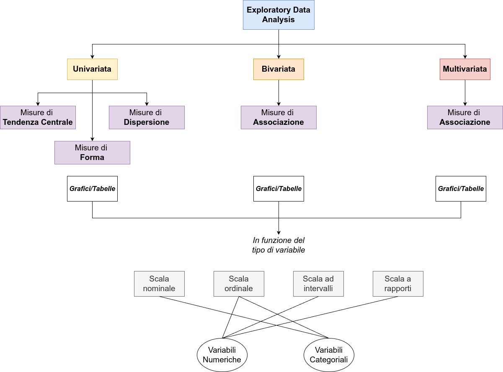
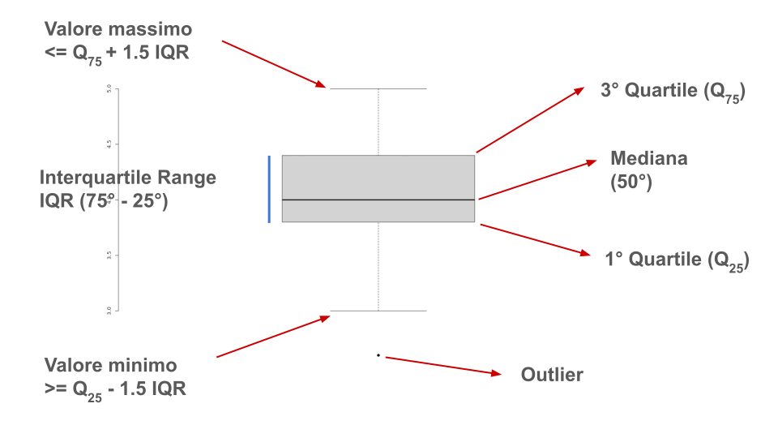
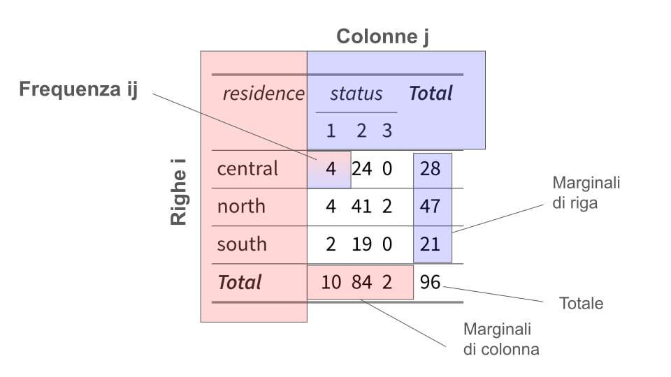
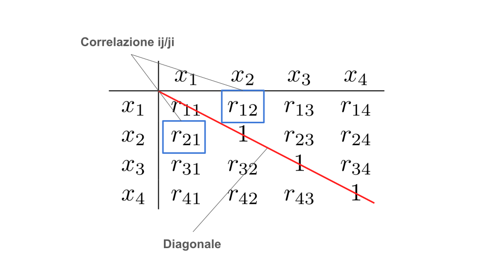
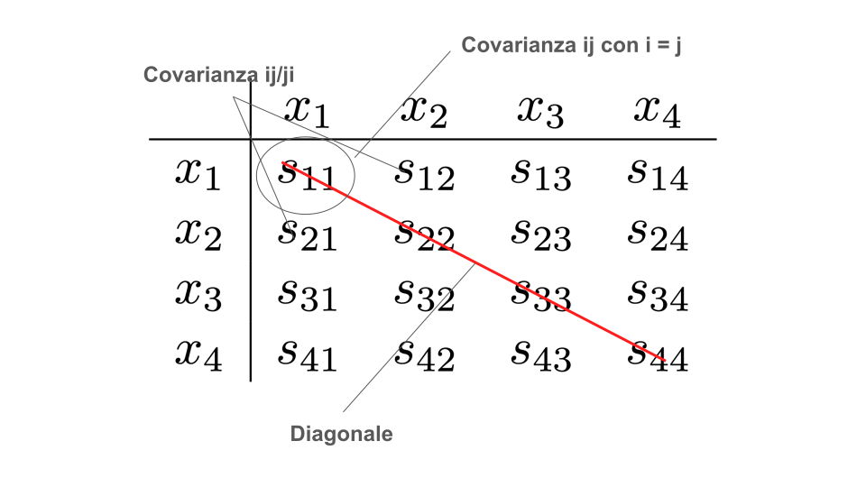
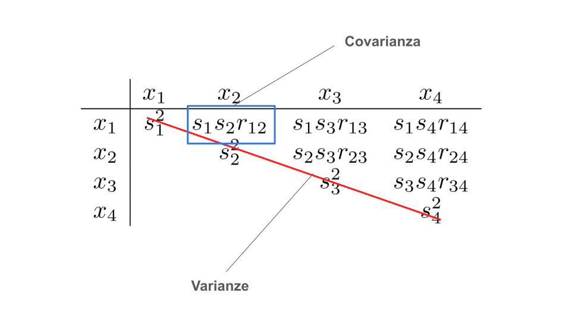

```{r}
#| label: setup
#| include: false

library(tidyverse)
library(patchwork)
library(dagitty)
library(ggdag)
library(here)
library(latex2exp)
devtools::load_all()
```

```{r}
#| include: false

knitr::knit_hooks$set(reset_par = function(before, options, envir) {
  if (before) {
    # This code runs BEFORE the chunk is executed
    par(bty = "n", 
    cex.lab = 1.1, 
    cex.axis = 1, 
    cex.main = 1.3,
    font.lab = 2,
    pch = 19,
    mfrow = c(1,1))
  }
})

knitr::opts_knit$set(reset_par = TRUE)
```



# Statistiche, parametri, popolazioni e campioni

## Popolazione e campioni

La popolazione è l'insieme di riferimento/target dal quale eventualmente estraiamo il nostro campione. La popolazione può essere infinita o finita. Nella maggior parte dei casi, pur essendo in linea di principio finita (ad esempio le persone iscritte a Unipd) si lavora comunque su un campione.

Tramite **campionamento**, il **campione** viene selezionato/estratto dalla popolazione e diventa oggetto di misurazione e analisi. Pur essendoci diversi tipi di campionamento, la caratteristica fondamentale è la **rappresentatività**.

Un campione rappresentativo viene definito come **un'immagine ridotta e fedele** della popolazione da cui è stato estratto. L'altra caratteristica importante di un campione è la **numerosità** (che indichiamo con $N$) che indica il numero di unità statistiche.

## Statistiche e parametri

La popolazione di riferimento è associata ad alcune caratteristiche *incognite* chiamate **parametri** e solitamente rappresentati con lettere greche $\mu$, $\sigma$, etc.

Una **statistica** è una caratteristica del campione. Mentre il parametro (ad esempio l'altezza media) è *incognito*, la statistica (altezza media del campione) è nota e calcolabile. Le statistiche sono stimatori dei parametri incogniti e si indicano solitamente con lettere latine minuscole ($\bar x$, $s^2$, etc.).

Il concetto di **stima** è sempre e inevitabilmente associato al concetto di errore. L'errore può essere di tipo sistematico e/o casuale. Una buona stima (fatta su un campione) non ha un errore sistematico e riduce il più possibile quello casuale.

## Esempi di statistiche

Qualsiasi operazione applicata su un campione che ne descrive una caratteristica è definita come una statistica che, con un certo grado di errore, stima il rispettivo parametro della popolazione. Ad esempio:

- media
- mediana
- massimo
- minimo
- ...

Sono tutte statistiche calcolate su un campione che descrivono parametri della popolazione.

## Statistiche come domande

Le statistiche quindi sono dei modi per **ridurre la complessità** di un certo dato ed **estrarre delle informazioni di interesse**. 

Un modo interessante di vederle è come se fossero delle **domande** fatte ai nostri dati. Queste domande sono fatte in modo molto mirato e forniscono risposte molto mirate.

La qualità, i limiti e la quantità di informazione della risposta sono funzione di quanto la domanda è adatta a quello che veramente voglio. In un certo senso possiamo parlare di *validità* delle statistiche.

## Statistiche come riduzione di complessità

Le statistiche permettono di riassumere centinaia, migliaia, milioni di dati in pochi numeri. Il prezzo da pagare è quello di capire esattamente:

- il significato di quella statistica
- i limiti e le criticità di quella statistica
- il fatto che sto perdendo informazione (ridurre la complessità = perdita informazione)
- il fatto che più statistiche sono sempre meglio di una sola (minore riduzione di complessità)

> Come analogia, un abstract o riassunto di un articolo è molto cognitivamente conveniente per avere un'idea generale. Per capire veramente l'argomento è necessario leggerlo interamente e magari leggerne più di uno.

## Un esempio

Immaginiamo di avere tutta la popolazione Padovana e di voler capire il numero di cocktails bevuti a settimana in funzione dell'età. Qui vediamo la distribuzione marginale dell'età:

```{r}
N <- 1e6
age_bins <- c("< 20", "20-30", "30-40", "40-50", "> 50")
age <- sample(age_bins, N, TRUE, prob = c(0.2, 0.4, 0.2, 0.1, 0.1))
age <- factor(age, levels = age_bins)
drinks <- c(10, 10, 5, 4, 1)
names(drinks) <- age_bins
drinks <- drinks[age] + round(rnorm(N, 0, 2))
drinks[drinks < 0] <- 0

dat <- data.frame(
  age, drinks
)

dat |> 
    count(age) |> 
    mutate(tot = sum(n),
    p = (n / tot)*100) |> 
        ggplot(aes(x = age, y = p)) +
        geom_col() +
        xlab("Età (in fascie)") +
        ylab("%")
```

## Un esempio

Qui vediamo la distribuzione marginale dei cocktails. La media è di circa `r round(mean(dat$drinks), 1)`:

```{r}
dat |> 
    count(drinks) |> 
    mutate(p = (n/sum(n))*100) |> 
    ggplot(aes(x = drinks, y = p)) +
    geom_col() +
    xlab("Cocktails (a settimana)") +
    ylab("%") |> 
    geom_vline(xintercept = mean(dat$drinks), lwd = 2, col = "dodgerblue")
```

## Un esempio

Infine vediamo la relazione tra cocktail ed età in fasce:

```{r}
ggplot(dat, aes(x = age, y = drinks, fill = age)) +
  geom_boxplot(outliers = FALSE) +
  xlab("Età (in fascie)") +
  ylab("Cocktails (a settimana)") +
  theme(legend.position = "none")
```

## Un esempio

```{r}
dats_ran <- dat[sample.int(nrow(dat), size = 500), ]
```

Ora immaginiamo di selezionare un campione di $N = 500$ da questa popolazione in modo totalmente casuale. La media è di circa `r round(mean(dats_ran$drinks), 1)`:

```{r}
p_ran <- dats_ran |> 
    count(drinks) |> 
    mutate(p = (n/sum(n))*100) |> 
    ggplot(aes(x = drinks, y = p)) +
    geom_col() +
    xlab("Cocktails (a settimana)") +
    ylab("%") +
    geom_vline(xintercept = mean(dats_ran$drinks), lwd = 2, col = "dodgerblue") +
    xlim(c(0, 20)) +
    ylim(c(0, 20))
p_ran
```

## Un esempio

```{r}
w <- c(0.45, 0.4, 0.05, 0.05, 0.05)
names(w) <- age_bins
dat$w <- w[dat$age]
dats_non_ran <- dat[rbinom(N, 1, dat$w) == 1, ]
```

Vediamo invece, campionando in modo non casuale, selezionando con più probabilità giovani (< 30 anni)La media è di circa `r round(mean(dats_non_ran$drinks), 1)`:

```{r}
p_non_ran <- dats_non_ran |> 
    count(drinks) |> 
    mutate(p = (n/sum(n))*100) |> 
    ggplot(aes(x = drinks, y = p)) +
    geom_col() +
    xlab("Cocktails (a settimana)") +
    ylab("%") +
    geom_vline(xintercept = mean(dats_non_ran$drinks), lwd = 2, col = "dodgerblue") +
    xlim(c(0, 20)) +
    ylim(c(0, 20))
p_non_ran
```

## Un esempio

```{r}
p_ran / p_non_ran + patchwork::plot_layout(axes = "collect")
```

## Un esempio

Per stimare in modo adeguato il parametro media di cocktails bevuti nella popolazione di riferimento, il campione dovrebbe essere rappresentativo per tutte quelle caratteristiche che hanno un impatto (età in questo caso).

```{r}
d1 <- dat |> 
    group_by(age) |> 
    summarise(n = n(),
              drinks = mean(drinks)) |> 
    mutate(`%` = round(n / (sum(n)), 1)) |> 
    select(age, `%`, drinks)

d2 <- dats_ran |> 
    group_by(age) |> 
    summarise(n = n(),
              drinks = mean(drinks)) |> 
    mutate(`%` = round(n / (sum(n)), 1)) |> 
    select(age, `%`, drinks)

d3 <- dats_non_ran |> 
    group_by(age) |> 
    summarise(n = n(),
              drinks = mean(drinks)) |> 
    mutate(`%` = round(n / (sum(n)), 1)) |> 
    select(age, `%`, drinks)

d1$avg <- mean(dat$drinks)
d2$avg <- mean(dats_ran$drinks)
d3$avg <- mean(dats_non_ran$drinks)

td1 <- qtab(d1, caption = "Popolazione") |> tinytable::tt_format(digits = 1)
td2 <- qtab(d2, caption = "Campione Rap.") |> tinytable::tt_format(digits = 1)
td3 <- qtab(d3, caption = "Campione non Rap.") |> tinytable::tt_format(digits = 1)
```

```{r}
#| layout-ncol: 3

td1
td2
td3
```

# Exploratory data analysis (EDA)

## EDA, the big picture

{fig-align="center"}

## EDA, principi

In generale, l'esplorazione (dovrebbe) è il primo passo quando si affronta un dataset. Anche nell'esplorazione ci sono degli step, quello che consiglio:

1. Individuare chiaramente la tipologia di variabile/i
2. Rappresentare con un grafico (*adeguato*)
3. Calcolare statistiche descrittive (*adeguate*)
4. Eventualmente integrare grafici e statistiche

## Un esempio, @Di-Marco2020-wu

```{r}
dimarco2020 <- readRDS(here("data/dimarco2020.rds"))
```

[@Di-Marco2020-wu]{.bibentry} 

@Di-Marco2020-wu esamina come le risorse psicosociali dei volontari (inclusi benessere professionale, senso di comunità ed esperienze traumatiche) siano correlate alla loro qualità della vita complessiva. I dati sono disponibili direttamente sul sito della rivista [link](https://doi.org/10.1016/j.dib.2020.105522). Ho pulito e sistemato un pochino il dataset, lo potete trovare qui [https://stat-teaching.github.io/adcom/#data](https://stat-teaching.github.io/adcom/#data) oppure al QR code.

<center>



</center>

## 0. Dataset

Intanto le prime cosa da fare sono quelle di capire quante righe e quante colonne ha il dataset. In questo caso abbiamo `r nrow(dimarco2020)` righe (osservazioni/soggetti) e `r ncol(dimarco2020)` colonne (variabili).

## Importare un dataset

Importare un dataset è il primo step e non è sempre un'operazione semplice. Ho preparato del materiale riguardo gestione dei file e importare dati in R. Trovate le slide qui:

<center>



</center>

## 1. Tipologia di variabili

Proviamo ad esplorare ed individuare qualche tipologia di variabili.

- `education`
- `age`
- `residence`
- `attachment` (in questo caso intesa come senso di comunità)

## 1. Tipologia di variabili

- `education`: è una variabile **ordinale** con **3 modalità** (o livelli) `sec_school` < `high_school` < `degree`.
- `age`: è una variabile **numerica** su **scala a rapporti**. In questo caso espressa in anni (quindi numeri interi).
- `residence`: è una variabile nominale (o categoriale) con 3 modalità (o livelli) `north`, `central` e `south`
- `attachment`: tecnicamente è una media o somma di *item* ordinali. Nella pratica (ma ci sono obiezioni) viene considerata una **scala ad intervalli**.

## Esplorazione univariata

Con esplorazione **univariata** si intende esplorare una o più variabili **singolarmente** ovvero senza considerare allo stesso tempo altre variabili. L'obiettivo è quello di:

- assicurarsi che la variabile sia stata correttamente intepretata dal software che stiamo utilizzando
- controllare la presenza di errori, valori anomali e/o impossibili
- controllare la presenza di dati mancanti
- esplorare caratteristiche della variabile usando **statistiche descrittive**

## Presenza di errori e/o valori anomali

Questo punto è molto importante. La presenza di valori anomali o errori può impattare notevolmente le analisi ed i risultati (vedremo poi un esempio). Un punto di partenza è:

- **ci sono dei limiti (in senso matematico) oggettivi nella variabile?** Ad esempio, avere nella variabile età valori molto alti (70-80) quando ho raccolto dati nelle scuole o avere valori impossibili (e.g., 200). Soprautto se i dati sono raccolti o inseriti manualmente può succedere.
- **ci sono dei valori anomali in termini di tipologia di dato?** Ad esempio lettere o stringhe dove dovrebbero esserci numeri e viceversa? Questo può essere molto problematico.

## Presenza di errori e/o valori anomali

- **Sopratutto per i questionari, il massimo e minimo sono consistenti?** Se un questionario ha 10 item con likert 1-5, il minimo è 10 ed il massimo è 50. Valori minori o maggiori sono probabilmente errori o dati mancanti.
- **Ci sono dati mancanti?** Quanti sono, dove, e se possibile capire il motivo. I partecipanti potevano non rispondere? Sono errori di salvataggio/inserimento? Possono avere un significato o sono totalmente casuali? I dati mancanti possono essere molto problematici.

## Statistiche descrittive

Una statistica descrittiva è una funzione dei dati osservati che ha lo scopo di riassumere, sintetizzare o rappresentare in modo compatto le caratteristiche principali di un insieme di dati. Quindi:

- è una funzione --> un insieme di calcoli
- riassumere/sintetizzare --> di solito 1/2 valori che rappresentano una proprieta specifica
- è di natura descrittiva, senza l'obiettivo di trarre conclusioni o inferenze

::: {.content-hidden when-profile="sharing"}

::: {.callout title="❓ Question Time"}

**Conoscete qualche statistica descrittiva?**

:::

:::

# Misure di tendenza centrale

## Misure di tendenza centrale

Le statistiche di tendenza centrale restituiscono un valore rappresentativo o *centrale* di una distribuzione di dati. Questo valore può essere posizionato al centro, rappresentare un valore tipico o quello più ricorrente. Solitamente ci sono tre principali statistiche di tendenza centrale:

- Media
- Mediana
- Moda

## Media

L' @eq-mean illustra come calcolare la media di una variabile $x$ misurata su un campione di numerosità $n$.

$$
\bar x = \frac{1}{n} \sum^n_{i = 1} x_i
$$ {#eq-mean}

Quindi prendiamo tutti ($n$) gli $x$, sommiamo i loro valori e dividuamo per il numero $n$. Quello che otteniamo è un valore che, sulla scala della variabile, rappresenta la quantità media.

## Off-topic: come leggere le formule

Useremo poche formule ma è importante avere una notazione chiara e consistente e saperla leggere. Una volta che è abbastanza chiaro, le formule sono un modo sintetico ed efficace di rappresentare un concetto complesso.

- $x$ è una variabile generica, può essere qualsiasi lettera (latina solitamente)
- La barra sopra $\bar x$ indica solitamente la media della variabile $x$
- $\sum^n_{i = 1}$ indica che facciamo la somma partendo da $i = 1$. Quindi $i = 1 \quad x_1$, poi $i = 2 \quad x_1 + x_2$, $i = 3 \quad x_1 + x_2 + x_3$ fino a $i = n \quad x_1 + x_2 + \dots + x_n$.

## Media

Secondo voi, la media di questa distribuzione di dati dove si potrebbe posizionare? Perchè?

```{r}
data.frame(x = rnorm(1e4, 100, 30)) |> 
    ggplot(aes(x = x)) +
    geom_histogram(bins = 30, fill = "dodgerblue", col = "black")
```

## Media

In R la media si calcola con la funzione `mean` oppure manualmente con la funzione `sum` e `length`:

```{r}
#| echo: true
head(dimarco2020$age, 10)
mean(dimarco2020$age)
sum(dimarco2020$age)/length(dimarco2020$age)
```

## Quantili

I quantili sono un modo per dividere in base all'ordine una certa variabile. Per calcolare un certo quantile $Q_p$ con $p \in (0, 1)$ è necessario:

- ordinare i dati in senso crescente
- calcolare la proporzione di dati minore o uguale a $p$
- il valore associato $Q$ è il $p$-esimo quantile

Di solito si utilizzano i percentili ovvero si esprimono in percentuale ma la logica è la stessa. Ad esempio $Q_{40} = x$ indica che il valore $x$ ha il 40% di dati che sono minori o uguali

## Quantili

Facciamo un esempio con la variabile $x$ che rappresenta il numero di errori in un test cognitivo:

```{r}
n <- 1e3
m <- 0.7
x <- c(rpois(n * m, 5), rpois(n * (1 - m), 12))
hist(x, 
     probability = TRUE,
     breaks = 30, 
     col = "dodgerblue", 
     xlab = "Numero di errori",
     ylim = c(0, 0.2),
     main = "")
```

## Quantili

Aggiungiamo i percentili $Q_{10}, Q_{50}, Q_{70}, Q_{90}$ direttamente sull'istogramma:

```{r}
hist(x, 
     probability = TRUE,
     breaks = 30, 
     col = "dodgerblue", 
     xlab = "Numero di errori",
     ylim = c(0, 0.2),
     main = "")
p <- c(0.1, 0.5, 0.7, 0.9)
Q <- quantile(x, p)

abline(v = Q, col = scales::alpha("black", 0.3), lwd = 2)
text(x = Q, 
     y = rep(0.2, length(Q)), 
     labels = latex2exp::TeX(sprintf("$Q_{%s} = %s$", p * 100, Q), bold = TRUE),
     cex = 1.2,
     font = 2)

segments(rep(0, 4),
         c(0.17, 0.16, 0.15, 0.14),
         Q,
         c(0.17, 0.16, 0.15, 0.14),
         1:length(p),
         lwd = 2
)

text(
    x = 15,
    y = c(0.17, 0.16, 0.15, 0.14),
    label = paste0(p * 100, "%"),
    col = 1:length(p)
)
```

## Quantili

Un modo più diretto di rappresentare e capire i quantili/percentili è il grafico della distribuzione cumulata empirica dei dati.

```{r}
plot(
    x[order(x)],
    (1:length(x))/length(x),
    pch = 19,
    col = scales::alpha("black", 0.3),
    xlab = "Numero di errori",
    ylab = "Frequenza cumulata relativa"
)

segments(
    Q, 0, Q, p,
    col = 1:4,
    lwd = 2
)

segments(
    0, p, Q, p,
    col = 1:4,
    lwd = 2
)
```

## Quantili

Per combinare quantili ed istogramma, possiamo rappresentare in questo modo. Vedete che ad ogni step è come aggiungere l'altezza dell'istogramma.

```{r}
x <- rpois(1e5, 3)
hist(x, 
     breaks = seq(min(x)-0.5, max(x)+0.5, by = 1),
     freq = FALSE,
     ylim = c(0, 1),
     col = "dodgerblue",
     main = "",
     xlab = "Numero di errori",
     ylab = "Frequenza cumulata relativa"
)

lines(x[order(x)]-0.5, cumsum(x) / sum(x), lwd = 2, col = "firebrick")
```

## Mediana

I quantili ci permettono di capire immediatamente il concetto di mediana. La mediana è il valore al di sotto (e quindi anche al di sopra) del quale abbiamo il 50% dei dati. In pratica corrisponde al 50-esimo $Q_{50}$ percentile. Vediamo in R:

```{r}
#| echo: true

# 25esimo, 50esimo e 75esimo percentile
quantile(dimarco2020$age, c(0.25, 0.5, 0.75))
median(dimarco2020$age)
```

Questo significa che il 50% dei soggetti ha un'età minore o uguale a 50 anni.

## Mediana, precisazione

Quando la numerosità $n$ è dispari la mediana è sempre un valore esistente (ad esempio 50 anni). Quando $n$ è pari, la mediana non è un valore esistente. In questo caso si prende la media dei due valori adiacenti.

$$
x = [18_1, 33_2, 35_3, 36_4, 44_5, {\color{red}\mathbf{48_6}}, 53_7, 55_8, 59_9, 60_{10}, 93_{11}] \quad n = 11
$$

$$
x = [18_1, 33_2, 35_3, 36_4, {\color{red}\mathbf{44_5, 48_6}}, 53_7, 55_8, 59_9, 60_{10}] \quad n = 10
$$

In questo secondo caso la mediana è $\frac{44 + 48}{2} = 46$

## Media e mediana

Prendiamo la variabile `age` del dataset `dimarco2020` e rappresentiamola graficamente:

```{r}
hist(dimarco2020$age, breaks = 25, main = "", xlab = "Age")
```

## Media e mediana

Ora possiamo aggiungere la media e la mediana sul grafico. I valori sono abbastanza simili perchè la distribuzione è abbastanza simmetrica.

```{r}
hist(dimarco2020$age, breaks = 25, main = "", xlab = "Age")
abline(v = c(mean(dimarco2020$age), median(dimarco2020$age)), col = 1:2, lwd = 3)
legend("topright", fill = 1:2, legend = c("Media", "Mediana"))
```

## Media e mediana

Vediamo lo stesso ma per una variabile meno simmetrica come `intrinsic`:

```{r}
hist(dimarco2020$intrinsic, breaks = 25, main = "", xlab = "Age")
abline(v = c(mean(dimarco2020$intrinsic), median(dimarco2020$intrinsic)), col = 1:2, lwd = 3)
legend("topleft", fill = 1:2, legend = c("Media", "Mediana"))
```

# Misure di variabilità

## Misure di variabilità

Per descrivere una distribuzione di dati le misure di tendenza centrale non sono (spesso) sufficienti. Queste 4 distribuzioni di dati hanno la stessa media.

```{r}
d3 <- ifelse(rbinom(100, 1, 0.7), rpois(100, 50), rpois(100, 80))
m <- mean(d3)

d1 <- exact_rnorm(100, m, 10)
d2 <- exact_rnorm(100, m, 40)
d4 <- psych::rescale(rbeta(1e5, 0.5, 0.5), mean = m, 10)[, 1]

do.call(cbind, list(d1, d2, d3, d4)) |> 
  data.frame() |> 
  pivot_longer(everything()) |> 
  ggplot(aes(x = value, y = after_stat(density))) +
  facet_wrap(~name, scales = "free") +
  geom_histogram(bins = 20, col = "black", fill = "dodgerblue") +
  geom_vline(xintercept = m, lwd = 2, col = "firebrick")
```

## Misure di variabilità

Per descrivere in modo più esaustivo i dati abbiamo bisogno di indici che ci informino sulla **dispersione** (o variabilità) attorno agli indici di tendenza centrale. Alcuni indici comunemente usati:

- Range
- Scarto interquartile (IQR, *interquartile range*)
- Deviazione standard e varianza
- Coefficiente di variazione
- Entropia di Shannon

## Range

Il range è la misura più semplice di variabilità e si calcola come la differenza tra massimo e minimo di una distribuzione di dati:

$$
R = max(x) - min(x)
$$

Ovviamente risente molto dei valori estremi prendendo semplicemente il massimo e minimo a prescindere da come sono concentrati i valori.

## Range

In R calcolare il range è molto semplice:

```{r}
#| echo: true

max(x) - min(x)
range(x)
diff(range(x))
```

## Range

Vediamo come la presenza di qualche valore estremo faccia cambiare completamente il range. Comunque è informativo della gamma dei dati.

```{r}
x <- rnorm(1e4, 100, 10)
x <- c(x, rep(180, 50))
h <- hist(x, breaks = 40, plot = FALSE)
col <- ifelse(h$mids > 160, "firebrick", "dodgerblue")
plot(h, col = col, freq = FALSE)
abline(v = c(min(x), max(x)), col = "firebrick", lwd = 2, lty = "dotted")
abline(v = c(min(x[x < 160]) - 0.3, max(x[x < 160])), col = "dodgerblue", lwd = 2, lty = "dotted")
text(x = 160, y = 0.02, label = sprintf("R = %.2f", diff(range(x))))
text(x = 160, y = 0.01, label = sprintf("R (no red) = %.2f", diff(range(x[x < 160]))))
```

## Scarto (range) interquartile (IQR)

Come la mediana, IQR è un indice più robusto di variabilità perchè si basa sui quantili. In particolare è la differenza tra il 3 e 1 quartile o 75° e 25° percentile.

$$
\mbox{IQR} = Q_{75}(x) - Q_{25}(x)
$$

Questi due quartili ci dicono dove è compreso il 50% di una certa distribuzione e la differenza ci dice quanto è ampio il range del 50% dei dati.

## Scarto (range) interquartile (IQR)

In R:

```{r}
#| echo: true

IQR(x)
q <- quantile(x, c(0.25, 0.75))
diff(q)
q[2] - q[1]
```

## Scarto (range) interquartile (IQR)

In questo caso la differenza è praticamente nulla, IQR si definisce un indice di variabilità *robusto*.

```{r}
plot(h, col = col, freq = FALSE)
abline(v = quantile(x, c(0.25, 0.75)), col = "black", lwd = 2)
abline(v = quantile(x[x < 160], c(0.25, 0.75))+0.5, col = "firebrick", lwd = 2)
text(x = 160, y = 0.02, label = sprintf("IQR = %.2f", IQR(x)))
text(x = 160, y = 0.01, label = sprintf("IQR (no red) = %.2f", IQR(x[x < 160])))
```

## Varianza

La varianza è probabilmente uno dei concetti più importanti sia dal punto di vista descrittivo che dal punto di vista del modello lineare. Vediamo direttamente la formula e poi scomponiamola:

$$
S^2_x = \frac{1}{n} \sum^n_{i = 1} (x_i - \bar{x})^2
$$

Nella maggior parte dei casi, la varianza viene calcolata usando $n - 1$ e non $n$. Questo garantisce di rimuovere un bias nella stima ma non è necessario approfondire.

$$
S^2_x = \frac{1}{n - 1} \sum^n_{i = 1} (x_i - \bar{x})^2
$$

## Devianza

Partiamo dall'elemento a destra ovvero $\sum^n_{i = 1} (x_i - \mu_x)^2$. Questa quantità viene definita devianza o somma dei quadrati ($SS$, sum of squares). L'idea è quella di calcolare la distanza di ogni valore rispetto alla sua media, fare al quadrato per togliere il segno e poi sommare.

Questo valore è compreso tra 0 (incluso) e $+ \infty$ ed aumenta all'aumentare delle distanze dei valori dalla media.

La devianza può essere intesa come la somma totale degli *errori* rispetto alla media. 

## Devianza

La devianza non ha una funzione in R direttamente implementata (ma di solito non viene calcolata come statistica descrittiva). Vediamo con la variabile `age` del dataset `dimarco2020`:

```{r}
#| echo: true

head(dimarco2020$age, 5)
SS <- sum((dimarco2020$age - mean(dimarco2020$age))^2)
SS
```

## Varianza, divisione per $n$ o $n - 1$

Se la devianza $SS_x$ è la dispersione totale, dividendo per $n$ ottengo la dispersione media ovvero la distanza media (al quadrato) dalla media.

Come per la devianza anche la varianza è compreso tra 0 (incluso) e $+ \infty$. Varianza maggiore indica una maggiore distanza media dalla media. Ovviamente essendo una media eredita le problematiche (e.g., sensibilità agli outlier) della media come tendenza centrale. Infatti la possiamo intendere come la tendenza centrale delle distanze dalla media.

## Varianza

```{r}
#| fig-width: 15
#| fig-height: 10

x <- exact_rnorm(15, 100, 10)
d <- data.frame(x, id = seq_along(x), m = mean(x))
d$r <- with(d, m - x)

p1 <- d |> 
  ggplot(aes(x = x, y = id)) +
  geom_vline(xintercept = 100) +
  geom_segment(aes(x = m, xend = x, y = id, yend = id), col = "dodgerblue") +
  geom_point(size = 5) +
  xlab("x") +
  filor::remove_axes("y", c("title", "text", "ticks")) +
  ylim(c(-1, length(x)))

p2 <- d |> 
  ggplot(aes(x = r, y = id)) +
  geom_vline(xintercept = 0) +
  geom_segment(aes(x = 0, xend = r, y = id, yend = id), col = "dodgerblue") +
  geom_point(size = 5) +
  xlab(TeX(r"($x - \bar{x}$)")) +
  filor::remove_axes("y", c("title", "text", "ticks")) +
  ylim(c(-1, length(x)))

p3 <- d |> 
  ggplot(aes(x = r^2, y = id)) +
  geom_segment(aes(x = 0, xend = r^2, y = id, yend = id), col = "dodgerblue") +
  geom_segment(x = 0, y = 0, xend = sum(d$r^2)/(nrow(d) - 1), yend = 0, col = "firebrick", lwd = 2) +
  ylim(c(-1, length(x))) +
  annotate("text", x = 200, y = 0, label = TeX(r"($S^2_x$)", output = "character"), parse = TRUE,
size = 10) +
  filor::remove_axes("y", c("title", "text", "ticks")) +
  xlab(TeX(r"($(x - \bar{x})^2$)")) +
  geom_point(size = 5)

p1 + p2 + p3 + plot_layout(axes = "collect")
```

## Varianza

Per la varianza in R abbiamo la funzione `var()`. Come vedete, di default in R è implementata la versione della varianza corretta che divide per $n - 1$:

```{r}
var(dimarco2020$age)
# in alternativa
n <- nrow(dimarco2020)

SS / (n - 1)
```

## Deviazione standard

Infine possiamo fare la radice quadrata della varianza per ottenere la deviazione standard:

$$
S_x = \sqrt{\frac{1}{n - 1} \sum^n_{i = 1} (x_i - \bar{x})^2}
$$

La deviazione standard, al contrario della varianza, è direttamente intepretabile nella scala della variabile (non al quadrato) e quindi si utilizza per descrivere la variabilità.

## Deviazione standard

Possiamo vederlo chiaramente in questo grafico. La deviazione standard torna ad essere nella metrica della variabile intesa come scarto (non al quadrato) dalla media.

```{r}
#| fig-width: 10
#| fig-height: 7
p2 <- p2 +
  geom_segment(x = 0, xend = sqrt(sum(d$r^2) / (nrow(d)-1)), y = 0, yend = 0, col = "firebrick", lwd = 2) +
  annotate("text", x = 15, y = 0, label = TeX(r"($\sqrt{S^2_x} = S_x$)", output = "character"), parse = TRUE,
size = 8)

p1 + p2
```

## Deviazione standard

In R abbiamo la funzione `sd()` che analogalmente a `var()` utilizza $n - 1$ come denominatore:

```{r}
#| echo: true

sd(dimarco2020$age)
sqrt(var(dimarco2020$age))
```

## Coefficiente di variazione

Un "problema" della varianza e deviazione standard è quello di essere legate alla scala della variabile. Sono una misura diretta di variabilità ma nell'unità di misura delle variabile. Viene calcolato come:

$$
CV = \frac{S}{|\bar{x}|}
$$

Ovvero la deviazione standard divisa per il valore assoluto della media (per evitare valori negativi). il CV rappresenta quindi la grandezza relativa della deviazione standard rispetto alla media.

::: {.callout-warning}
Attenzione che il CV è sensato solo con variabili su scala a *rapporti* quindi con zero inteso come assenza della proprietà misurata.
:::

## Coefficiente di variazione

Vediamo un esempio (banale ma utile). Abbiamo altezza in cm e m:

```{r}
altezza <- exact_rnorm(1e3, 170, 10)
data.frame(hcm = altezza) |> 
    mutate(hm = altezza/100) |> 
    pivot_longer(everything()) |> 
    mutate(name = ifelse(name == "hcm", "cm", "m")) |> 
    ggplot(aes(x = value, y = after_stat(density))) +
    facet_wrap(~name, scales = "free") +
    geom_histogram(bins = 30, col = "black", fill = "dodgerblue") +
    xlab("Altezza")
```

## Coefficiente di variazione

Se calcoliamo il CV per le due variabili (ignorando che sappiamo essere una trasformazione):

```{r}
#| echo: true
#| collapse: true

head(altezza, 5)
altezza_m <- altezza/100
head(altezza_m, 5)

sd(altezza)
sd(altezza_m)

sd(altezza) / abs(mean(altezza))
sd(altezza_m) / abs(mean(altezza_m))
```

Il coefficiente di variazione è lo stesso quindi le due variabili sono ugualmente disperse.

# Trasformazioni

## Trasformazioni

Un aspetto importante dal punto di vista univariato è quello della trasformazione delle variabili. Le trasformazioni sono operazioni che cambiano ad esempio la scala della variabile per migliorare l'intepretabilità o risolvere problemi di scala.

## Centrare

Una prima operazione comune è quella di centrare le variabili su un determinato valore. L'idea è semplice. Chiamiamo $x_t$ la variabile $x$ trasformata:

$$
x_{t_i} = x_i - c
$$

Dove $c$ è un valore sul quale si decide di centrare la variabile. Questa operazione permette di posizionare lo zero in un punto arbitrario. Di solito si utilizza la media (*mean-centering*).

## Centrare

```{r}
par(mfrow = c(1, 2))
hist(dimarco2020$burnout, main = "", xlab = "burnout")
hist(dimarco2020$burnout - mean(dimarco2020$burnout), main = "", xlab = "burnout - mean(burnout)")
```

## Centrare

```{r}
#| echo: true

head(dimarco2020$burnout)

xt1 <- dimarco2020$burnout - mean(dimarco2020$burnout)
head(xt1)

xt2 <- dimarco2020$burnout - median(dimarco2020$burnout)
head(xt2)

xt3 <- dimarco2020$burnout - mean(dimarco2020$burnout)
head(xt3)

xt4 <- dimarco2020$burnout - min(dimarco2020$burnout)
head(xt4)
```

## Standardizzare

Standardizzare invece richiede di dividere per una quantità che diventerà la nuova unità di misura della variabile. Anche qui si possono fare diverse operazioni, la più comune è quella di dividere per la deviazione standard.

$$
x_{t_i} = \frac{x_i}{s_x}
$$

La nuova variabile sarà espressa in multipli di deviazioni standard. 

```{r}
#| echo: true

sd(dimarco2020$burnout)
xt <- dimarco2020$burnout / sd(dimarco2020$burnout)
head(dimarco2020$burnout)
head(xt)
```

## Standardizzare, punti $z$

Se combiniamo la centratura rispetto alla media e la standardizzazione con la deviazione standard, otteniamo una quantità conosciuta come punti $z$. Questi non sono altro che una trasformazione dei dati grezzi in unità di deviazione standard rispetto alla media.

```{r}
#| echo: true

head(dimarco2020$burnout)
z <- (dimarco2020$burnout - mean(dimarco2020$burnout)) / sd(dimarco2020$burnout)
head(z)
```

## Standardizzare, punti $z$

```{r}
par(mfrow = c(1, 2))
m <- mean(dimarco2020$burnout)
s <- sd(dimarco2020$burnout)
index_plot(dimarco2020$burnout, xlim = c(m - 4*s, m + 4 * s))
abline(v = c(m - s, m + s))
index_plot(z, xlim = c(-4, 4))
abline(v = c(-1, 1))
```

## Standardizzare, punti $z$

Il vantaggio di esprimere i valori in punti $z$ (o valori standardizzati) è quello di avere subito un'idea di come quel valore si posizione nella distribuzione. Un valore di $\pm 1$ ci dice che quell'osservazione è 1 deviazione standard sotto o sopra la media.

Assumendo la normalità (chiaramente un'assunzione e potenzialmente un limite) sappiamo come sono i *quantili* di una distribuzione normale standard ($\mu = 0$, $\sigma^2 = 1$) e quindi sappiamo quanto *anomala* può essere un'osservazione.

## Standardizzare, punti $z$

```{r}
#| fig-heigth: 10

par(mfrow = c(2,1))

curve(dnorm(x), -4, 4, lwd = 2, xlab = "z", ylab = "", yaxt = "n", main = "Normale (media = 0, sd = 1)")
abline(v = c(-3, -2, -0.5, 0, 0.5, 2, 3), col = "dodgerblue")

curve(dnorm(x, 100, 10), 100 - 10 * 4, 100 + 10 * 4, lwd = 2, xlab = "x", ylab = "", yaxt = "n",  main = "Normale (media = 100, sd = 10)")
abline(v = 100 + c(-3, -2, -0.5, 0, 0.5, 2, 3) * 10, col = "dodgerblue")
```

## Variabili categoriali (nominali)

Abbiamo parlato principalmente di variabili numeriche intese come principalmente intervalli o rapporti (ma anche ordinali in un certo senso). Tuttavia ci sono anche statistiche descrittive che sono specifiche per le variabili categoriali.

- Frequenze assolute e relative (anche cumulate)
- Entropia di Shannon

## Frequenze

Quando abbiamo una variabile categoriale la cosa più semplice da calcolare è la frequenza per ogni modalità $j$ (livello). Se $N$ è il numero totale di osservazioni ed $n_j$ è il numero di osservazione per la modalità $j$ allora $f_j = n_j$

In R è molto semplice possiamo usare la funzione `table()`:

```{r}
#| echo: true
head(dimarco2020$residence, 5)
table(dimarco2020$residence)
```

## Frequenze relative

Le frequenze relative riscalano il totale rispetto a 1 (o 100%) semplicemente dividendo $f_j$ per il totale:

$$
p_j = \frac{f_j}{N}
$$

In R possiamo farlo manualmente o usando la funzione `prop.table()`

```{r}
#| echo: true
#| collapse: true

N <- nrow(dimarco2020)
Fa <- table(dimarco2020$residence) # frequenze assolute
Fa / N
Fr <- prop.table(Fa)
sum(Fa) # somma è N
sum(Fr) # la somma è 1
```

## Moda

La moda è semplicemente la modalità (livello) della variabile associato alla frequenza massima. Non esiste una funzione in R ma possiamo facilmente calcolarla manualmente:

```{r}
#| echo: true

# questo è un trick del fatto che table() restituisce nomi
names(which.max(table(dimarco2020$residence)))

# più "elegante"
u <- unique(dimarco2020$residence)
u # valori unici, senza ripetizione
u[which.max(table(dimarco2020$residence))]
```

## Moda

Nel caso di più modalità associate alla frequenza massima si riportano tutte le mode e la distribuzione si definisce multimodale. Attenzione che per quanto la moda sia definita anche per variabili continue/numeriche di solito è meno utilizzata.

Per gestire il caso multimodale potremmo scrivere una funzioncina di questo tipo:

```{r}
#| echo: true

moda <- function(x){
    xu <- unique(x)
    xf <- table(x)
    xu[xf == max(xf)]
}

moda(dimarco2020$residence)
```

## Entropia di Shannon

L'indice di entropia di Shannon permette di valutare la variabilità di variabili categoriali. La variabilità qui è intesa in termini di entropia ovvero grado di informazione. $p_j$ è la frequenza relativa della modalità $j$.

$$
E = - \sum^j_{i = 1} p_i \ln{(p_i)}
$$

L'idea è che entropia massima si trova quando tutte le $j$ modalità hanno lo stesso valore di probabilità mentre il valore minimo ($E = 0$) si ottiene quando la frequenza è concentrata su una sola modalità.

## Entropia di Shannon

Vediamo in R:

```{r}
#| echo: true

(p <- prop.table(table(dimarco2020$residence)))
E <- -sum(p * log(p))
E
```

Possiamo anche calcolare un indice normalizzato che va da 0 (minima entropia) a 1 (massima entropia) dividendo per $\ln(j)$ (numero di modalità):

```{r}
# echo: true

E/log(length(p))
```

## Entropia di Shannon

Vediamo graficamente:

```{r}
ggplot(dimarco2020) +
    geom_bar(aes(x = residence, fill = residence), show.legend = FALSE) +
    filor::remove_axes("x", "title") +
    ylab("Frequenza") +
    ggtitle(sprintf("N = %s", nrow(dimarco2020)))
```

## Entropia di Shannon

Vediamo qui un esempio di come l'entropia varia al concentrarsi/disperdersi delle frequenze relative tra le modalità:

```{r}
# Assumo tu abbia caricato la libreria o la funzione per calcolare l'entropia
set.seed(5027)
n <- 10

# Definiamo inizio e fine
p0 <- c(1/3, 1/3, 1/3)
pf <- c(0, 0, 1)

# 1. Creiamo la sequenza lineare di base
P_mat <- sapply(1:3, function(i) seq(p0[i], pf[i], length.out = n))

# 2. Aggiungiamo randomness agli step intermedi (escludendo il primo e l'ultimo)
livello_rumore <- 0.05 # Modifica questo valore per aumentare/diminuire la casualità

for (i in 2:(n-1)) {
    # Aggiungiamo rumore casuale
    P_mat[i, ] <- P_mat[i, ] + rnorm(3, mean = 0, sd = livello_rumore)
    
    # Evitiamo probabilità negative (tronchiamo a 0)
    P_mat[i, P_mat[i, ] < 0] <- 0
    
    # Normalizziamo per assicurarci che la somma faccia 1
    P_mat[i, ] <- P_mat[i, ] / sum(P_mat[i, ])
}

# 3. Trasformiamo in data.frame e procediamo con il tuo codice
P <- data.frame(P_mat)
names(P) <- c("k1", "k2", "k3")

# Calcolo dell'entropia (utilizzando la tua funzione preesistente)
P$E <- apply(P, 1, entropy, probs = TRUE)

P$id <- 1:nrow(P)
# Usiamo l'entropia arrotondata come label dell'asse X
P$id <- factor(P$id, labels = round(P$E, 2))

# Plot
pivot_longer(P, cols = 1:3) |>
    ggplot(aes(x = id, y = value, fill = name)) +
    geom_col(position = position_dodge()) +
    theme(legend.position = "none") +
    xlab("Entropy") +
    ylab("Frequenza Relativa")
```

# Rappresentazioni Grafiche

## Rappresentazioni Grafiche

Il modo sicuramente più efficace di affrontare un dataset è quello di rappresentare graficamente le variabili in modo univariato o multivariato (dove possibile). Qualche precisazione rispetto ai grafici:

- i grafici non sono solo soluzioni *estetiche* ma strumenti per descrivere ma anche per imparare dai dati
- non ci sono soluzioni generali e spesso servono aggiustamenti caso-specifici
- alcuni grafici possono essere fuorvianti o poco informativi
- se complessi, devono essere sempre spiegati chiaramente

## Dove partiamo?

Partiamo con un grafico molto semplice, semplicemente rappresentiamo i valori ordinati. Non è un grafico molto utile, mancano diverse informazini importanti. Abbiamo un'idea solo del range dei dati.

```{r}
plot(x = dimarco2020$perc_collective_efficacy, y = rep(0, nrow(dimarco2020)), xlab = "Perceived Collective Efficacy", yaxt = "n", ylab = "")
```

## Istogramma

Il modo più immediato per rappresentare una variabile quantitativa è l'istogramma. L'idea è quella di dividere in **bins** una variabile numerica e rappresentare la frequenza delle osservazioni comprese in quel bin.

```{r}
#| echo: true
#| output-location: slide

par(mfrow = c(1, 1))
hist(dimarco2020$perc_collective_efficacy, breaks = 5)
```

## Istogramma

Il parametro fondamentale qui è il numero di bin. All'aumentare del numero di bin l'informazione diventa più precisa ma diminuisce il numero di osservazioni per bin.

```{r}
#| echo: true
#| output-location: slide

par(mfrow = c(1, 2))
hist(dimarco2020$perc_collective_efficacy, breaks = 2)
hist(dimarco2020$perc_collective_efficacy, breaks = 25)
```

## Istogramma

Questo si vede in modo particolare per variabili con molti valori tra due interi:

```{r}
par(mfrow = c(1, 2))
x <- rnorm(50)
hist(x)
hist(x, breaks = 80)
```

## Istogramma, densità

```{r}
#| fig-width: 15
#| fig-height: 10
set.seed(2026)
mass_density_plot(100) + ggtitle("n = 100")
```

## Boxplot

Il boxplot è una rappresentazione grafica tanto "semplice" quanto informativa, soprattutto rispetto all'istogramma.

```{r}
#| echo: true
boxplot(dimarco2020$perc_collective_efficacy)
```  

## Boxplot

{fig-align="center"}

## Barplot

Il grafico a barre (o *barplot*) è la rappresentazione fondamentale per quanto riguarda variabili di tipo categoriale o ordinale. Da non confondere con l'istogramma con *bins* di larghezza variabile, il grafico a barre rappresenta la frequenza (relativa o assoluta) di una certa modalità/livello di una variabile categoriale.

```{r}
#| echo: true
#| output-location: slide

par(mfrow = c(1, 2))
barplot(table(dimarco2020$residence), ylim = c(0, nrow(dimarco2020)))
barplot(prop.table(table(dimarco2020$residence)), ylim = c(0, 1))
```

## Barplot

Il barplot può essere sensato anche per variabili quantitative ma con numeri solo interi. Se usato con numeri con la virgola, diventa sempre meno informativo e difficile da leggere.

```{r}
par(mfrow = c(1, 2))
barplot(table(dimarco2020$age), xlab = "Età")
barplot(table(dimarco2020$perc_collective_efficacy), xlab = "Perceived collective efficacy")
```

# Relazioni Bivariate

## Relazioni Bivariate

La principale tipologia di relazione bivariata è sicuramente la correlazione ma possiamo avere relazioni bivariate tra:

- variabili numeriche
- variabili categoriali
- variabili numeriche e categoriali

## Relazione tra due variabili categoriali

Il modo più semplice di rappresentare la relazione tra due variabili categoriali è una **tabella di contingenza**. Ad esempio vediamo la relazione tra `residence` e `status`:

```{r}
#| echo: false

sjPlot::tab_xtab(dimarco2020$residence, 
                 dimarco2020$status, 
                 show.summary = FALSE, 
                 show.cell.prc = FALSE)
```

Questa tabella conta la frequenza assoluta di tutti i possibili incroci tra due variabili categoriali.

## Relazione tra due variabili categoriali

{fig-align="center"}

## Relazione tra due variabili categoriali

Possiamo anche calcolare le frequenze relative. Rispetto al caso univariato però abbiamo diversi modi di farlo: per riga, per colonna o totale. Partiamo dal totale:

```{r}
#| echo: false

sjPlot::tab_xtab(dimarco2020$residence, 
                 dimarco2020$status, 
                 show.summary = FALSE, 
                 show.cell.prc = TRUE)
```

## Relazione tra due variabili categoriali

Poi possiamo vedere per riga. Di base ogni riga somma a 1 (100%) e vediamo per ogni modalità della colonna la sua percentuale.

```{r}
#| echo: false

sjPlot::tab_xtab(dimarco2020$residence, 
                 dimarco2020$status, 
                 show.summary = FALSE, 
                 show.row.prc = TRUE)
```

## Relazione tra due variabili categoriali

Per colonna, possiamo fare lo stesso:

```{r}
#| echo: false

sjPlot::tab_xtab(dimarco2020$residence, 
                 dimarco2020$status, 
                 show.summary = FALSE, 
                 show.col.prc = TRUE)
```

## Barplot

Possiamo anche rappresentare due variabili con un barplot:

```{r}
dimarco2020$status <- as.ordered(dimarco2020$status)
```

```{r}
par(mfrow = c(1, 1))
barplot(
  table(factor(dimarco2020$status), dimarco2020$residence),
  col = 1:3
)
legend("topright", fill = 1:3, legend = levels(dimarco2020$status))
```

## Barplot

Vediamo quelle relative (totale):

```{r}
par(mfrow = c(1, 1))
barplot(
  prop.table(table(factor(dimarco2020$status), dimarco2020$residence)),
  col = 1:3
)
legend("topright", fill = 1:3, legend = levels(dimarco2020$status))
```

## Barplot

Relative per colonna:

```{r}
par(mfrow = c(1, 1))
prop.table(table(dimarco2020$status, dimarco2020$residence), 2) |> 
  barplot(col = 1:3)

legend("topright", legend = levels(dimarco2020$status), fill = 1:3)
```

## Barplot

Relative per riga:

```{r}
par(mfrow = c(1, 1))
prop.table(table(dimarco2020$residence, dimarco2020$status), 2) |> 
  barplot(col = 1:3)

legend("topright", legend = unique(dimarco2020$residence), fill = 1:3)
```

## Relazione tra due variabili quantitative

Il modo più semplice per visualizzare una relazione tra due variabili quantitative è lo **scatter plot**:

```{r}
#| output-location: slide

plot(dimarco2020$burnout, dimarco2020$satisfaction)
```

## Correlazione

In questo caso vediamo chiaramente che c'è un trend. All'aumentare del `burnout` diminuisce la `satisfaction`. Un modo per quantificare questa relazione è l'indice di correlazione di Pearson $r$. La correlazione tra due variabili $x$ e $y$ è:

$$
r_{xy} = \frac{s_{xy}}{s_x s_y}
$$

Dove $s_{xy}$ è la covarianza (ora lo vediamo) e $s$ è la deviazione standard.

## Covarianza

Partiamo dalla covarianza $s_{xy}$ che viene definita come:

$$
s_{xy} = \frac{\sum^n_{i = 1} (x_i - \bar{x})(y_i - \bar{y})}{n - 1}
$$

Dove $\sum^n_{i = 1} (x_i - \bar{x})(y_i - \bar{y})$ viene definita codevianza.

## Covarianza

A livello univariato abbiamo definito la varianza come la media degli scarti al quadrato dalla media. In pratica è un modo per quantificare la dispersione dei dati attorno alla loro media.

```{r}
par(mfrow = c(1, 2))
index_plot(dimarco2020$burnout)
index_plot(dimarco2020$satisfaction)
```

## Covarianza

Se due variabili sono legate allora l'idea è che due valori di due coppie di variabili co-varino allo stesso modo rispetto alla loro media. Questo è quello che dice la codevianza $\sum^n_{i = 1} (x_i - \bar{x})(y_i - \bar{y})$. Stiamo moltiplicando lo scarto della media su $x$ con lo scarto dalla media su $y$.

## Covarianza

```{r}
par(mfrow = c(1, 1))
N <- nrow(dimarco2020)
burnout <- dimarco2020$burnout
satisfaction <- dimarco2020$satisfaction

burnout0 <- burnout - mean(burnout)
satisfaction0 <- satisfaction - mean(satisfaction)

plot(burnout0, satisfaction0, xlim = c(-2, 2), ylim = c(-2, 2), cex = 1.5)
abline(v = 0, col = "firebrick", lwd = 3)
abline(h = 0, col = "dodgerblue", lwd = 3)

segments(max(burnout0), min(satisfaction0), max(burnout0), 0, col = "dodgerblue", lty = "dotted", lwd = 2)
segments(max(burnout0), min(satisfaction0), 0, min(satisfaction0),  col = "firebrick", lty = "dotted", lwd = 2)
```

## Covarianza

La moltiplicazione degli scarti, per ogni osservazione ci restituisce un valore con un segno. Il numeratore (codevianza) cattura quindi il segno (direzione) del prodotto degli scarti dalla media.

```{r}
plot(burnout0, satisfaction0, xlim = c(-2, 2), ylim = c(-2, 2), cex = 1.5)
abline(v = 0, col = "firebrick", lwd = 3)
abline(h = 0, col = "dodgerblue", lwd = 3)

text(x = 1.5, y = -1.5, label = "+- = -", cex = 4)
text(x = 1.5, y = 1.5, label = "++ = +", cex = 4)
text(x = -1.5, y = 1.5, label = "-+ = -", cex = 4)
text(x = -1.5, y = -1.5, label = "-- = +", cex = 4)
```

## Covarianza

```{r}
par(mfrow = c(1, 3))

X <- MASS::mvrnorm(1e3, c(0, 0), Sigma = filor::rmat(0), empirical = TRUE)

plot(X, xlab = "x", ylab = "y", main = "r = 0")
abline(v = 0, col = "firebrick", lwd = 3)
abline(h = 0, col = "dodgerblue", lwd = 3)

X <- MASS::mvrnorm(1e3, c(0, 0), Sigma = filor::rmat(.7), empirical = TRUE)

plot(X, xlab = "x", ylab = "y", main = "r = 0.7")
abline(v = 0, col = "firebrick", lwd = 3)
abline(h = 0, col = "dodgerblue", lwd = 3)


X <- MASS::mvrnorm(1e3, c(0, 0), Sigma = filor::rmat(-.7), empirical = TRUE)

plot(X, xlab = "x", ylab = "y", main = "r = -0.7")
abline(v = 0, col = "firebrick", lwd = 3)
abline(h = 0, col = "dodgerblue", lwd = 3)
```

## Covarianza

Quindi la nostra codevianza può essere:

- 0: quindi i segni del prodotto degli scarti sono + e - in modo simile, in media sono 0
- positivi: quindi i segni del prodotto degli scarti sono maggiormente +, la somma è positiva
- negativi: quindi i segni del prodotto degli scarti sono maggiormente -, la somma è negativa

Come per la *devianza*, la codevianza è una somma che rappresenta la dispersione combinata di due variabili e come co-deviano assieme.

Dividendo per $n - 1$ otteniamo la covarianza che indica la forza della co-variazione di due variabili. Ovviamente dipende dalla scala della variabile e non è direttamente intepretabile se non per il segno.

## Correlazione

Per intepretare la covarianza quello che viene fatto è standardizzarla rispetto alla variazione delle singole variabili. Ovvero dividiamo la covarianza (media del prodotto degli scarti) per il prodotto delle deviazioni standard.

On in alternativa potete vederla come la covarianza di due variabili che sono state standardizzate.

## Correlazione e covarianza in R

In R possiamo usare le funzioni `cov()` e `cor()`:

```{r}
#| echo: true

# covarianza
ss <- cov(dimarco2020$burnout, dimarco2020$satisfaction)

# correlazione
cor(dimarco2020$burnout, dimarco2020$satisfaction)
ss / (sd(dimarco2020$burnout) * sd(dimarco2020$satisfaction))
```

## Correlazione

La correlazione è un indice, compreso tra -1 (perfetta correlazione negativa) e +1 (perfetta correlazione positiva). Questo indice rappresenta la relazione **lineare** tra due variabili e non una relazione generica. Due variabili potrebbero essere associate non linearmente ma avere una correlazione bassa.

## Correlazione

In questo caso la relazione è chiaramente non lineare (quadratica) e la correlazione è praticamente a zero.

```{r}
set.seed(2425)
x <- runif(100, -4, 4)
y <- 100 + 2* x^2 + rnorm(100, 0, 10)
scatter.smooth(x, y, main = sprintf("r = %.2f", cor(x, y)))
```

# Relazione tra più variabili

## Matrici di correlazione

Le matrici di correlazione sono il modo principale per rappresentare la relazione tra più di due variabili.

{fig-align="center"}

## Matrici di correlazione

Se abbiamo $p$ variabili, abbiamo una matrice quadrata $p \times p$. 

Di queste correlazioni, quelle informative (escludendo le ripetizioni) sono $(2^p - p) / 2$ perchè teniamo solo il triangolo superiore/inferiore e togliamo la diagonale.

La correlazione di una variabile con se stessa è per definizione 1 quindi la diagonale non è informativa.

## Matrici di correlazione

In R possiamo sempre usare la funzione `cor()` su più variabili (solitamente colonne di un dataframe):

```{r}
#| echo: true

R <- cor(dimarco2020[, c("bonds", "burnout", "satisfaction", "trauma")])
round(R, 2) # solo per visualizzazione
```

## Matrici di correlazione

Possiamo anche visualizzare graficamente con il pacchetto `corrplot`:

```{r}
#| echo: true
library(corrplot)
corrplot.mixed(R, order = 'AOE')
```

## Matrici di correlazione

Possiamo anche visualizzare degli scatterplot a coppie:

```{r}
#| echo: true
pairs(dimarco2020[, c("bonds", "burnout", "satisfaction", "trauma")], )
```

## Matrici di varianza-covarianza

La matrice di correlazione non deve essere confusa con quella di varianza-covarianza. La struttura è la stessa ovvero una matrice quadrata $p \times p$ dove $p$ è il numero di variabili. Però la diagonale non è 1 (la covarianza di una variabile con se stessa non è 1) e gli elementi fuori dalla diagonale non sono la correlazione (> 1 o < -1).

{fig-align="center"}

## Matrici di varianza-covarianza

In R possiamo sempre usare la funzione `cov()` su più variabili (come per `cor()`):

```{r}
#| echo: true

S <- cov(dimarco2020[, c("bonds", "burnout", "satisfaction", "trauma")])
round(S, 2)
round(R, 2)
```

## Matrici di varianza-covarianza

Il primo punto da capire è la diagonale. La correlazione di una variabile con se stessa è 1. La covarianza di una variabile con se stessa cosa rappresenta? Vediamolo:

$$
\begin{aligned}
s_{xx} &= \frac{1}{n - 1} \sum^n_{i = 1} (x_i - \bar{x}) (x_i - \bar{x}) \\
&= \frac{1}{n - 1} \sum^n_{i = 1} (x_i - \bar{x})^2 \\
\end{aligned}
$$

Vi ricorda qualcosa? E' esattamente la formula della varianza. Nella diagonale di una matrice di varianza covarianza abbiamo le varianze delle $p$ variabili.

## Matrici di varianza-covarianza

Gli altri elementi (sempre simmetrici) sono le covarianze. Anche qui, possiamo scomporre la formula per renderla più chiara e legarla alla matrice di correlazione. La correlazione è:

$$
r_{xy} = \frac{s_{xy}}{s_x s_y}
$$

Quindi, la covarianza può essere espressa (risolvendo l'equazione per $s_{xy}$) come il prodotto della correlazione e delle due deviazioni standard.

$$
s_{xy} = r_{xy} s_x s_y
$$

## Matrici di varianza-covarianza

La matrice di covarianza quindi contiene molta più informazione ed è sufficiente anche per calcolare quella di correlazione. Senza avere le deviazioni standard invece, non è possibile passare da quella di correlazione a quella di covarianza.

{fig-align="center"}

## Matrici di varianza-covarianza {.smaller}

Tornando a R, vediamo che possiamo passare da una all'altra:

```{r}
#| echo: true

round(R, 2)
round(cov2cor(S), 2)

# correlazione tra bonds e burnout
r12 <- R[1, 2]

r12 * sd(dimarco2020$bonds) * sd(dimarco2020$burnout)
S[1, 2]
```

## Qualche esempio

Qui riportano una matrice di correlazione:

[@Kelada2023-ew]{.bibentry}

Conoscendo anche le varianze possiamo costruire una matrice di varianza covarianza e quindi avere in una matrice tutta (più o meno) l'informazione necessaria.

## Correlazione e covarianza, disclaimer

Attenzione che, nonostante le matrici che abbiamo visto possano essere usate per riportare e visualizzare le relazioni tra $p$ variabili sono comunque **relazioni bivariate**. Nel senso che la correlazione $r_{xy}$ sta considerando solo $x$ e $y$ ignorando la presenza di altre variabili.

Quindi la matrice di varianza-covarianza non rappresenta delle relazioni multivariate ma sempre bivariate. Vi ricordo il *third-variable* problem.

Una certa correlazione potrebbe cambiare o sparire quando viene considerata una terza (o quarta) variabile. Questo è quello che vedremo con la regressione lineare.

## References