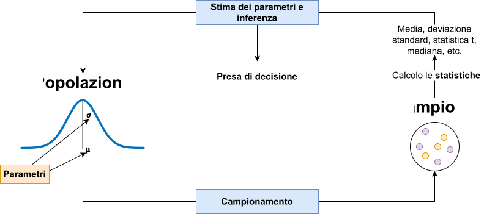
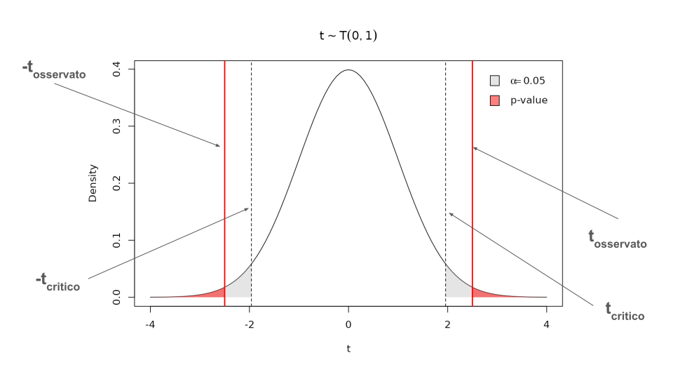
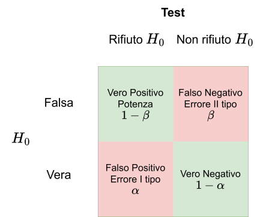

```{r}
#| label: setup
#| include: false

library(tidyverse)
library(patchwork)
library(dagitty)
library(ggdag)
library(here)
library(latex2exp)
devtools::load_all()
```

```{r}
#| include: false

knitr::knit_hooks$set(reset_par = function(before, options, envir) {
  if (before) {
    # This code runs BEFORE the chunk is executed
    par(bty = "n", 
    cex.lab = 1.1, 
    cex.axis = 1, 
    cex.main = 1.3,
    font.lab = 2,
    pch = 19,
    mfrow = c(1,1))
  }
})

knitr::opts_knit$set(reset_par = TRUE)
```

```{r}
dat <- readRDS(here("data/adcom.rds"))
```



## Inferenza, the big picture

{fig-align="center"}

## Inferenza

L'inferenza è un aspetto legato al concetto di **stima**. L'inferenza riguarda un processo **decisionale** rispetto ad un **parametro stimato**.

Fare inferenza quindi significa *prendere una decisione basandosi su una o più stime campionarie di parametri*. Essendo l'inferenza basata su stime, la decisione inferenziale ha, per definizione, una componente d'errore.

In altri termini, quando si prende una decisione inferenziale (e.g., il trattamento funziona di più nel gruppo sperimentale, la correlazione è diversa da zero, etc.) è sempre necessario essere consapevoli della componente d'errore.

## Approcci di inferenza statistica

L'inferenza statistica è caratterizzata sia storicamente ma anche attualmente da approcci diversi che possiamo riassumere in:

- Approccio **Fisheriano**
- Approccio di **Neyman & Pearson**
- Approccio basato sulla **Likelihood** (*verosimiglianza*)
- Approccio **Bayesiano**

Diciamo che in Psicologia, viene utilizzato un ibrido tra l'approccio Fisheriano e quello di Neyman & Pearson chiamato Null Hypothesis Significance Testing (NHST) e in minoranza l'approccio Bayesiano.

::: aside
Noi ci baseremo sull'approccio di Neyman e Pearson, anche se non introdurremo formalmente tutti gli aspetti.
:::

## Per approfondire [#extra]

Per approfondire i problemi legati all'inferenza in Psicologia:

[@Gigerenzer1993-cr]{.bibentry}

`r papers[["@Gigerenzer1993-cr"]]$file`

[@Gigerenzer2018-cj]{.bibentry} 

`r papers[["@Gigerenzer2018-cj"]]$file`

# Errore di stima

## Errore di stima

Il concetto principale per capire l'inferenza è quello di **errore di stima**. Possiamo distinguere due tipologie principali di errori di stima:

- **errore sistematico**: la mia stima è sistematicamente minore o maggiore rispetto al valore vero (*parametro*) che voglio stimare
- **errore casuale**: la mia stima è *in media* corretta ma qualche volta risulta maggiore, qualche volta minore in modo casuale

Tendenzialmente quando si analizzano dati, si cerca di usare metodi che evitino l'errore di tipo sistematico e riducano il più possibile quello casuale. Quando abbiamo detto che la misurazione (o stima) di qualcosa è $D = M + E$ (dati osservati = modello + errore), l'errore $E$ che consideriamo è di tipo casuale.

## Errore di stima

Possiamo dire che il valore atteso (la media) in caso di errore casuale è zero mentre negli altri casi no.

```{r}
par(mfrow = c(1, 2))

hist(
    rnorm(1e5), 
    breaks = 30,
    col = scales::alpha("dodgerblue", 0.3),
    main = latex2exp::TeX(r"(Errore Casuale $\bar{E} = 0$)"),
    xlab = "E"
)
abline(v = 0, col = "firebrick", lwd = 2, lty = "dotted")

hist(
    rnorm(1e5, 1, 1), 
    breaks = 30,
    col = scales::alpha("dodgerblue", 0.3),
    main = latex2exp::TeX(r"(Errore Sistematico $\bar{E} \neq 0$)"),
    xlab = "E"
)
abline(v = 0, col = "firebrick", lwd = 2, lty = "dotted")
```

## Le 3 distribuzioni

In tema inferenza è facile confondere i piani. Ogni volta che facciamo inferenza dobbiamo tenere a mente 3 tipologie di *distribuzioni* chiaramente distinte:

- La **popolazione**: l'insieme completo di tutti gli elementi, detti unità statistiche definita da *parametri* ignoti
- Distribuzione dei dati (**campione**): un sottoinsieme estratto dalla popolazione dove calcoliamo le *statistiche*
- **Distribuzione campionaria**: distribuzione che descrive l'incertezza nella stima di un parametro della popolazione tramite una statistica calcolata su un campione.

Ora vedremo chiaramente questi concetti.

## Dataset

Per capire al meglio il concetto di errore standard, facciamo un esempio con dei dati veri. Usiamo i dati del questionario fatto il primo giorno.

</br>
</br>
</br>

<center>

Trovate il dataset su Moodle o su [https://stat-teaching.github.io/adcom/#data](https://stat-teaching.github.io/adcom/#data).

</center>

::: aside
Per rendere l'esempio ancora più efficace ho esteso il dataset moltiplicando le righe.
:::

## Dataset

```{r}
#| eval: false
#| echo: true
library(readxl)
dat <- read_xlsx("data/adcom.xlsx")
```

```{r}
#| echo: true
nrow(dat)
ncol(dat)
head(dat)
```

## Stima, popolazione e campione

Ritornando a parametri e statistiche, ogni statistica è una stima (con errore) del rispettivo parametro della popolazione.

Quando calcoliamo una media, una deviazione standard, etc. su un campione ricordiamoci sempre che, in ottica di stima, c'è una quota di incertezza. In modo generico definiamo $\theta$ come il parametro incognito che stiamo stimando e $t$ la sua stima fatta sul campione.

L'errore di stima ovvero una quantità che determina la precisione con cui $t$ è una stima di $\theta$ viene definita **errore standard**.

## Errore standard

Più formalmente ed in modo generico, possiamo dire che l'errore standard di una statistica è:

$$
SE = \sqrt{\frac{\sigma^2}{n}} = \frac{\sigma}{\sqrt{n}}
$$

Sostanzialmente quindi l'errore standard dipende dalla variabilità intrinseca di un fenomeno $\sigma^2$ e dal numero di osservazioni $n$ utilizzate per stimare questo fenomeno.

## Errore standard

Facciamo un esempio. Se prendiamo due variabili del nostro dataset e vediamo la variabilità (con coefficiente di variazione):

```{r}
#| echo: true

sd(dat$scarpe) / abs(mean(dat$scarpe))
sd(dat$coffee) / abs(mean(dat$coffee))
```

Vediamo che la variabilità del numero di caffè bevuti è molto maggiore rispetto al numero di scarpe. Quindi, a parità di campione, la stima del numero di caffè bevuti sarà sempre più incerta. Tuttavia, aumentando il denominatore ($n$) possiamo diminuire il nostro errore casuale facendo variare meno la stima. Questo rapporto tra variabilità e numerosità è fondamentale per capire la qualità delle stime.

## Errore standard della media

Abbiamo visto dallo script che l'errore standard della media si calcola (esattamente) così come la formulazione generica:

$$
SE = \sqrt{\frac{\sigma^2}{n}} = \frac{\sigma}{\sqrt{n}}
$$

Ovviamente $\sigma^2$ (la varianza della popolazione) viene stimata anch'essa dal campione. E' importante capire che ogni statistica ha un suo errore standard che segue sempre questa logica. Le formule possono essere diverse (e non è necessario saperle) ma è sempre un rapporto tra varianza del fenomeno e numero di osservazioni usate per la stima.

## Errore standard, nella pratica

A cosa serve l'errore standard nella pratica? Fondamentalmente a due processi:

- **quantificare e quindi comunicare l'errore di stima** di un certo parametro stimato con un campione
- **prendere una decisione inferenziale** riguardo il parametro, partendo dalla stima fatta sul campione. Non prendiamo una decisione sul campione (quello è noto, non incerto) ma sul parametro della popolazione.

## Distribuzione campionaria

L'errore standard è anche la deviazione standard della distribuzione che si ottiene applicando una certa statistica $t$ a tutti i campioni possibili.

Questa distribuzione si chiama **distribuzione campionaria** e contiene tutta l'informazione necessaria per quantificare l'incertezza di stima. Tendenzialmente:

1. la media di $t$ applicata a tutti i campioni possibili coincide con $\theta$
2. la deviazione standard  di $t$ applicata a tutti i campioni possibili rappresenta l'errore standard.

Chiaramente la stima in questo caso **non ha errore sistematico** (altrimenti 1 non sarebbe vero).

## Distribuzione campionaria

Possiamo indicare in modo generico la distribuzione campionaria di una statistica $t$ come:

$$
t \sim \mathcal{D}(\boldsymbol{\nu})
$$

Dove $\sim$ significa *distribuita come*, $\mathcal{D}$ è una certa distribuzione (esempio la Normale) e $\boldsymbol{\nu}$ è un vettore di uno o più parametri (nel caso della Normale, $\mu$ e $\sigma$).

Questa formulazione generica è solo utile a chiarire che il concetto di distribuzione campionaria è lo stesso ma $\mathcal{D}$ può essere diverse cose. Nel t-test, ad esempio, $\mathcal{D}$ è una t di Student.

## Teorema del limite centrale

In alcuni casi, vale un teorema che si chiama **teorema del limite centrale (TLC)**. Il teorema dice che con una numerosità campionaria sufficientemente grande^[Solitamente, e ci sono motivi statistici la numerosità viene minima viene indicata a 30. Ma diffidate sempre delle soglie arbitrarie.], la distribuzione campionaria di una statistica si può approssimare come una Normale:

$$
t \sim \mathcal{N}(\theta, \mbox{SE}_t)
$$

Questo si legge come:

> La distribuzione campionaria di $t$ (una statistica generica, e.g., media) è distribuita come ($\sim$) una Normale con media $\theta$ (il parametro) e deviazione standard l'errore standard.

## Teorema del limite centrale

In particolare, nell'esempio pratico con i dati del corso abbiamo visto che il TLC vale e ci dimostra come la distribuzione campionaria della media sia distribuita come:

$$
\bar{x} \sim \mathcal{N}(\mu, \text{SE}_{\bar{x}})
$$

Dove $\mu$ è la media vera della popolazione e $\text{SE}_{\bar{x}}$ l'errore standard della stima della media ovvero $\text{SE}_{\bar{x}} = \sigma / \sqrt{n}$ ($s$ viene usato come stima di $\sigma$).

## Intervallo di confidenza

Un ultimo concetto importante è quello di intervallo di confidenza (CI). Una volta compresa la distribuzione campionaria, l'intervallo di confidenza non è altro che un modo di riassumerla, oltre che con la media ma soprattutto con l'errore standard.

Formalmente, l'intervallo di confidenza si calcola come:

$$
\mbox{CI} = t \pm q \times SE_t
$$

$t$ è la stima, $SE_t$ è l'errore standard. $q$ è un moltiplicatore dell'errore standard. $q$ non è altro che il quantile associato ad una certa probabilità cumulata.

## Intervallo di confidenza

Per capire $q$ dobbiamo ripensare alla normale (dato il TLC). In particolare alla distribuzione normale standard ($\mu = 0$ e $\sigma = 1$):

```{r}
u <- ggplot() +
    stat_function(fun = dnorm, n = 1e3) +
    xlab("q") +
    ylab("Density") +
    scale_x_continuous(n.breaks = 10, limits = c(-4, 4))

u
```

## Intervallo di confidenza

Ogni distribuzione (normale) può essere convertita alla normale standard tramite la standardizzazione. Ad esempio, una normale con $\mu = 100$ e $\sigma = 15$:

```{r}
d <- ggplot() +
    stat_function(fun = dnorm, n = 1e3, args = list(mean = 100, sd = 15)) +
    xlab("x") +
    ylab("Density") +
    scale_x_continuous(breaks = seq(40, 160, 15), limits = c(100 - 15 * 4, 100 + 15 * 4))

u/d
```

## Intervallo di confidenza

Quindi ad esempio, un valore $q = 2$ corrisponde a $x = \mu + q \sigma = 100 + 2 \times 15 = 130$:

```{r}
(u + geom_vline(xintercept = 2)) / (d + geom_vline(xintercept = 100 + 15 * 2))
d <- d + geom_vline(xintercept = 100 + 15 * 2)
```

## Intervallo di confidenza

Ora, esattamente come per i quantili ($q$ sono quantili infatti) possiamo sapere quale $q$ è associato ad una certa probabilità cumulata. Solitamente l'intervallo di confidenza si riporta al 95%. Dobbiamo trovare $q$ che è associato a $1 - 0.95 = 0.05$ di probabilità cumulata. Distribuiamo il 0.05 tra le due code simmetriche della normale.

```{r}
#| echo: true
q <- qnorm(0.05/2, lower.tail = FALSE)
q
```

Con $q$ di ~1.96 abbiamo una probabilità cumulata (a destra di $q$ e a sinistra di $-q$) del 2.5%.

## Intervallo di confidenza

Vediamolo sul grafico, evidenziamo l'area.

```{r}
ggplot() +
    stat_function(fun = dnorm, n = 1e3) +
    xlab("q") +
    ylab("Density") +
    scale_x_continuous(n.breaks = 10, limits = c(-4, 4)) +
    stat_function(
        geom = "area",
        fun = dnorm,
        xlim = c(-q, q),
        fill = "firebrick",
        alpha = 0.3
    ) +
    geom_segment(aes(x = -q, xend = q, y = 0, yend = 0), lwd = 3)
```

## Intervallo di confidenza

Tornando al nostro esempio pratico, il CI è l'intervallo sulla distribuzione campionaria che contiene una certa percentuale (e.g., 95%) di valori.

Più formalmente:

> L'intervallo di confidenza al $p\%$ è quell'intervallo che, se ripetessi la misurazione un numero infinito di volte e calcolassi l'intervallo di confidenza, il $p\%$ delle volte l'intervallo conterrebbe il valore vero $\theta$.

## Prendiamo una decisione

Fino ad ora abbiamo quantificato l'incertezza nella stima di un parametro usando lo standard error e l'intervallo di confidenza. Ora possiamo provare a prendere una *decisione inferenziale*.

Ad esempio, immaginiamo di conoscere l'altezza media della popolazione generale italiana $\mu_p = 163$. Raccogliamo un campione e ci vogliamo chiedere se la popolazione da cui proviene il campione abbia una media uguale o diversa da $\mu_p = 163$. Possiamo definire due mondi distinti:

- Mondo *nullo* dove la popolazione generale e quella da cui è estratto il campione hanno 
la stessa media. $\mu_p = \mu_c = 163$.
- Mondo *alternativo* dove la popolazione generale e quella da cui è estratto il campione hanno medie diverse $\mu_p \neq \mu_c$.

## Prendiamo una decisione

Quello che possiamo fare è prendere un campione di numerosità $n$, calcolare l'altezza media e cercare di *inferire* cosa succede a livello della popolazione. Selezioniamo casualmente un campione dal dataset^[Ricordo che noi sappiamo la media *vera* in questo caso, ma stiamo simulando una situazione di inferenza reale.]:

```{r}
#| include: false

set.seed(8528)
n <- 30
idx <- sample(1:nrow(dat), n)
camp <- dat[idx, ]
head(camp)
```

```{r}
#| echo: true
#| eval: false

n <- 30
idx <- sample(1:nrow(dat), n)
camp <- dat[idx, ]
head(camp)
```

## Prendiamo una decisione

Più formalmente abbiamo abbozzato un sistema di verifica d'ipotesi. Abbiamo definito un'ipotesi nulla:

$$
H_0: \mu_p = \mu_c \quad\quad \mu_p - \mu_c = 0
$$

E anche un'ipotesi alternativa $H_1$:

$$
H_0: \mu_p \neq \mu_c \quad\quad \mu_p - \mu_c \neq 0
$$

In questo caso $H_1$ dice semplicemente che le due medie sono diverse, non fa riferimento alla direzione maggiore o minore. Questa è un'ipotesi alternativa *bidirezionale*.

## Prendiamo una decisione

Calcoliamo le statistiche sul campione:

```{r}
#| echo: true

m <- mean(camp$altezza) # media del campione
s <- sd(camp$altezza) # deviazione standard del campione
se <- s / sqrt(n) # errore standard
c(m, s, se)
```

## Normale, disclaimer

Una precisazione riguarda utilizzare la distribuzione campionaria Normale. In realtà, quando si utilizza $s$ come stima di $\sigma$ (il nostro caso) è necessario utilizzare la distribuzione $t$ di Student.

L'idea è dovendo stimare sia $\mu$ (la media della popolazione) con $\bar{x}$ che $\sigma$ (la deviazione standard della popolazione) con $s$ abbiamo più incertezza che assumere $\sigma$ come nota.

Per tenere conto di questa incertezza utilizziamo una distribuzione campionaria più *conservativa* rispetto alla Normale, ovvero la $t$ di Student.

## Normale, disclaimer

Mentre la Normale (quella standard) è fissa una volta definiti $\mu$ e $\sigma$, la $t$ di Student può variare in funzione di un'altro parametro $\nu$ ovvero i gradi di libertà.

I gradi di libertà sono un concetto complesso ma fondamentale. L'idea è che ogni volta che stimiamo un parametro ad esempio la media $\mu$ usiamo (e quindi spendiamo) informazione dal campione di numerosità $n$.

Nel caso del nostro esempio, noi stimiamo la media con $\bar{x}$ e anche la deviazione standard $s$ (che dipende dalla media). Quindi abbiamo $\nu = n - 1$ gradi di libertà.

## Normale, disclaimer

Vediamolo con un esempio piccolo, immaginiamo di avere 5 valori e calcolare la media:

```{r}
#| echo: true
x <- c(2, 3, 4, 1, 5)
mean(x)
```

Sappiamo che $\sum^{n}_{i = 1} x_i - \bar{x} = 0$:

```{r}
#| echo: true

x - mean(x)
sum(x - mean(x))
```

## Normale, disclaimer

Ora, se immaginiamo di sapere che $\sum^{n}_{i = 1} x_i - \bar{x} = 0$ e vi dicessi il valore dei primi 4 scarti dalla media:

```{r}
#| echo: true
r <- x - mean(x)
r[1:4]

# per forza deve essere 2 per dare la somma 0
sum(r[1:4])
```

L'ultimo valore (il quinto, $n - 1$) è vincolato. Deve essere per forza $x_5 - \bar{x} = 2$. Si sono ridotti i gradi di libertà nel momento in cui abbiamo stimato la media.

## Normale, disclaimer

Qui vediamo delle $t$ di Student con $\nu$ diversi e poi la Normale. Come vedete, all'aumentare di $\nu$ le due sono sempre più simili.

```{r}
n <- c(4, 10, 50)

curve(dt(x, n[1] - 1), 
      -5, 5, 
      ylim = c(0, 0.45), col = 1, ylab = "Density", main = "t di student con n diversi")
curve(dt(x, n[2] - 1), add = TRUE, col = 2)
curve(dt(x, n[3] - 1), add = TRUE, col = 3)
curve(dnorm(x), add = TRUE, lty = "dotted", col = "black", lwd = 2)

legend(
    "topright",
    legend = c(
        latex2exp::TeX(sprintf(r"($\nu = %s$)", n - 1)),
        "Normale"
    ),
    lwd = 2,
    col = 1:length(n),
    lty = c(rep("solid", length(n)), "dotted")
)
```

## Prendiamo una decisione

Tornando al nostro campione e assumendo la normalità possiamo visualizzare la distribuzione campionaria. In blu vediamo l'intervallo di confidenza al 95%.

```{r}
m0 <- 163
q <- abs(qnorm(0.05/2)) # teniamolo positivo
ci <- c(
    m - se * q,
    m + se * q
)

curve(dnorm(x, m, se), m - 6 * se, m + 6 * se, xlab = "Altezza media", ylab = "Density", main = latex2exp::TeX(r"($\bar{x} \sim N(\bar{x}, SE_{\bar{x}})$)"))
abline(v = m0, lwd = 2, col = "firebrick")
text(x = m0+1, y = 0.15, label = latex2exp::TeX(r"($H_0$)"))
abline(v = m, lwd = 1)
text(x = m + 0.5, y = 0.15, label = latex2exp::TeX(r"($\bar{x}$)"))
abline(v = ci, lwd = 2, col = "dodgerblue", lty = "dotted")
```

## Prendiamo una decisione

Cosa notiamo?

- la media del campione $\bar{x}$ (che è una stima di $\mu_c$) è diversa da $\mu_p$ (ovviamente)
- la distribuzione campionaria costruita attorno a $\bar{x}$ ci fa capire che l'ipotesi $H_0$ è poco probabile. Infatti $\mu_p = 163$ è un valore che è sulle code estreme della distribuzione.
- questo è chiaro anche guardando l'intervallo di confidenza. Il valore $\mu_p$ è ampiamente fuori dall'intervallo. Possiamo dire che la probabilità di ottenere valori minori o uguali a $\mu_p$ è minore di $1 - 0.95$ quindi minore di $0.05$.

## Prendiamo una decisione

Ora ribaltiamo il discorso. Immaginiamo di costruire la stessa distribuzione campionaria ma assumendo come vera $H_0$. L'idea è la stessa, semplicemente la distribuzione sarà centrata su $\mu_p$.

```{r}
curve(dnorm(x, m0, se), (m0+m)/2 - 6 * se, (m0+m)/2 + 5 * se, xlab = "Altezza media", ylab = "Density", main = latex2exp::TeX(r"($\bar{x}_0 \sim N(\bar{x}_0, SE_{\bar{x}_0})$)"))
abline(v = m0, lwd = 2, col = "firebrick")
text(x = m0-0.5, y = 0.15, label = latex2exp::TeX(r"($H_0$)"))

abline(v = m, lwd = 1)
text(x = m + 0.5, y = 0.15, label = latex2exp::TeX(r"($\bar{x}$)"))
abline(v = ci, lwd = 2, col = "dodgerblue", lty = "dotted")
```

## Prendiamo una decisione

Perchè fare questo? Perchè $H_0$ e quindi $\mu_p = 163$ è definita (nota come nel caso di un punteggio normativo o assunta). Possiamo quindi assumerla come vera e vedere la consistenza dei dati rispetto a questa ipotesi.

Siccome siamo in grado di lavorare con le distribuzioni normali (teoriche), possiamo ad esempio calcolare la probabilità assumendo $H_0$ come vera, di avere un campione con $\bar{x}$ maggiore o minore (ricordate la bidirezionalità) rispetto a quella osservata.

```{r}
#| echo: true
#| collapse: true

(p_minore <- pnorm(163 - (m - 163), mean = 163, sd = se))
(p_maggiore <- (1 - pnorm(m, mean = 163, sd = se)))
p_minore + p_maggiore
```

Questa probabilità che abbiamo calcolato, si chiama **p value**.

## Prendiamo una decisione

Graficamente possiamo chiaramente vederlo:

```{r}
curve(dnorm(x, m0, se), (m0+m)/2 - 6 * se, (m0+m)/2 + 5 * se, xlab = "Altezza media", ylab = "Density", main = latex2exp::TeX(r"($\bar{x}_0 \sim N(\bar{x}_0, SE_{\bar{x}_0})$)"))
abline(v = m0, lwd = 2, col = "firebrick")
text(x = m0-0.5, y = 0.15, label = latex2exp::TeX(r"($H_0$)"))

abline(v = m, lwd = 1)
text(x = m + 0.5, y = 0.15, label = latex2exp::TeX(r"($\bar{x}$)"))
abline(v = ci, lwd = 2, col = "dodgerblue", lty = "dotted")
abline(v = m0 - (m - m0), lwd = 1)
# Calcolo del punto speculare per la coda sinistra
distanza <- m - m0
m_left <- m0 - distanza

# --- CODA DESTRA ---
x_right <- seq(m, (m0+m)/2 + 5 * se, length = 100)
y_right <- dnorm(x_right, m0, se)
polygon(c(m, x_right, max(x_right)), c(0, y_right, 0), 
        col = rgb(1, 0, 0, 0.3), border = NA)

# --- CODA SINISTRA ---
x_left <- seq((m0+m)/2 - 6 * se, m_left, length = 100)
y_left <- dnorm(x_left, m0, se)
polygon(c(min(x_left), x_left, m_left), c(0, y_left, 0), 
        col = rgb(1, 0, 0, 0.3), border = NA)
```

## Statistica test

Nel nostro esempio, stiamo lavorando con la media $\bar{x}$ del campione e la media della popolazione $\mu_p$ assumendo $H_0$ come vera.

C'è un modo più intuitivo di lavorare e riguarda sempre la standardizzazione. Proviamo a standardizzare la nostra $\bar{x}$ usando la distribuzione campionaria. Calcoliamo una nuova statistica che chiamiamo genericamente $t$:

$$
t = \frac{\bar{x} - \mu_p}{\text{SE}_{\bar{x}}}
$$

La $t$ non è altro che la differenza tra la media del campione e quella della popolazione (sotto $H_0$) standardizzata con l'errore standard. E' quindi espressa in unità di errore standard.

## Statistica test

Nel nostro caso quindi possiamo facilmente calcolarla. L'interpretazione è come un punto $z$ ma siamo in unità di errore standard e non di deviazione standard.

```{r}
#| echo: true
(t <- (m - 163)/se)
m
```

Quindi il nostro campione è ~2.3 errori standard maggiore rispetto alla media della popolazione se fosse vera $H_0$. 2.3 è un valore decisamente grande e ci suggerisce che la media sia abbastanza distante dall'ipotesi nulla.

## Statistica test

Solitamente non si lavora con le statistiche grezze ma si calcola una statistica test (come la statistica $t$ ad esempio). Questa statistica test, come tutte le altre, ha una distribuzione campionaria e quindi un errore standard. Ad esempio:

$$
t = \frac{\bar{x} - \mu}{SE_{\bar{x}}}
$$

Questa statistica test semplicemente standardizza la differenza tra la media del campione e la media della popolazione che ipotizziamo (per il confronto) dividendo per l'errore standard.

## Prendiamo una decisione

Il vantaggio è che, a prescindere da $\bar{x}$ e $\mu$, questa statistica test standardizzata ha sempre la stessa distribuzione campionaria. Assumendo la normalità, questa diventa una distribuzione normale standard:

$$
t \sim \mathcal{N}(0, 1)
$$

Se usassimo la distribuzione $t$ di Student (lasciamola stare per il momento) allora:

$$
t \sim \mathcal{T}(\nu)
$$

Dove $\nu = n - 1 = 29$

## Prendiamo una decisione

Vediamo la distribuzione campionaria in questo caso.

```{r}
curve(dnorm(x), -4, 4, ylab = "Density", xlab = "t", main = latex2exp::TeX(r"($t \sim T(0, 1)$)"))
abline(v = c(-t, t))
text(x = t+0.2, y = 0.15, label = latex2exp::TeX(r"($t$)"))
text(x = -t-0.2, y = 0.15, label = latex2exp::TeX(r"(-$t$)"))
abline(v = 0)
# Definiamo la risoluzione delle aree
asse_x <- seq(-4, 4, length = 200)
asse_y <- dnorm(asse_x)

# --- CODA DESTRA (x > t) ---
x_right <- seq(t, 4, length = 100)
y_right <- dnorm(x_right)
polygon(c(t, x_right, 4), c(0, y_right, 0), 
        col = rgb(1, 0, 0, 0.3), border = NA) # Verde trasparente

# --- CODA SINISTRA (x < -t) ---
x_left <- seq(-4, -t, length = 100)
y_left <- dnorm(x_left)
polygon(c(-4, x_left, -t), c(0, y_left, 0), 
        col = rgb(1, 0, 0, 0.3), border = NA)
```

## Prendiamo una decisione

Possiamo calcolare il nostro p-value con la stessa logica ma ora possiamo fare riferimento direttamente alla distribuzione normale standard:

```{r}
#| echo: true
pnorm(-t) + (1 - pnorm(t))
```

La cosa utile è che possiamo esprimere tutto in termini di normale standard.

## Errori decisionali

Quello che abbiamo fatto *artigianalmente* è un processo inferenziale:

- Abbiamo definito un'ipotesi nulla $H_0$ ($\mu_0 = 163$, popolazione). 
- Basandoci su $n$ e su $s$ del campione abbiamo costruito la distribuzione campionaria (assumendo che $H_0$ sia vera)
- Abbiamo calcolato la probabilità di trovare un risultato uguale o maggiore di quello campionario, ovvero il p value.

Possiamo intuire che tanto più il p value è piccolo tanto più il risultato del campione è *sorprendente* assumendo $H_0$ come vera. Ma quanto piccolo deve essere il p value per rifiutare $H_0$?

## Errori decisionali

Prendiamo una soglia che chiamiamo $\alpha$. Questa soglia determina la nostra decisione. Se il p-value è minore di $\alpha$ prendiamo una decisione, altrimenti no.

In termini pratici:

- Rifiutiamo $H_0$ quando $p \leq \alpha$
- Non rifiutiamo $H_0$ quando $p > \alpha$

Il *non rifiutiamo* è importante perchè stiamo assumendo $H_0$ come vera. Possiamo solo dire che i nostri dati sono poco consistenti con $H_0$.

## Errori decisionali

Dove stanno possibili errori? Riprendiamo la distribuzione campionaria:

```{r}
z_alpha <- abs(qnorm(0.05/2))
# 1. Disegno della curva base
curve(dnorm(x), -4, 4, ylab = "Density", xlab = "t", 
      main = latex2exp::TeX(r"($t \sim T(0, 1)$)"))

# 2. AREA ALPHA (0.025 per coda) - Colore Grigio Chiaro
# Coda destra Alpha
x_a_r <- seq(z_alpha, 4, length = 100)
polygon(c(z_alpha, x_a_r, 4), c(0, dnorm(x_a_r), 0), col = rgb(0.8, 0.8, 0.8, 0.5), border = NA)
# Coda sinistra Alpha
x_a_l <- seq(-4, -z_alpha, length = 100)
polygon(c(-4, x_a_l, -z_alpha), c(0, dnorm(x_a_l), 0), col = rgb(0.8, 0.8, 0.8, 0.5), border = NA)

# 3. AREA P-VALUE (Coda osservata) - Colore Rosso Trasparente
# Coda destra P-value
x_p_r <- seq(t, 4, length = 100)
polygon(c(t, x_p_r, 4), c(0, dnorm(x_p_r), 0), col = rgb(1, 0, 0, 0.5), border = NA)
# Coda sinistra P-value
x_p_l <- seq(-4, -t, length = 100)
polygon(c(-4, x_p_l, -t), c(0, dnorm(x_p_l), 0), col = rgb(1, 0, 0, 0.5), border = NA)

# 4. Linee e Etichette
abline(v = c(-z_alpha, z_alpha), col = "black", lty = 2) # Limiti Alpha
abline(v = c(-t, t), col = "red", lwd = 2)      # Limiti P-value

legend("topright", legend=c(latex2exp::TeX(r"($\alpha = 0.05$)"), "p-value"), 
       fill=c(rgb(0.8, 0.8, 0.8, 0.5), rgb(1, 0, 0, 0.5)), bty = "n")
text(x = t+0.2, y = 0.15, label = latex2exp::TeX(r"($t$)"))
text(x = -t-0.2, y = 0.15, label = latex2exp::TeX(r"(-$t$)"))
```

## $\alpha$ p value e valore critico

Un'altro modo di prendere la stessa decisione è quello di usare i valori critici e non $\alpha$. Se ci pensate, $\alpha$ è una probabilità cumulata che quindi è associata ad un certo quantile (i nostri $t$).

L'area grigia che rappresenta una probabilità di $\alpha$ (0.05 in questo caso) è associata ad un certo valore di $t$. Questo valore si chiama valore critico. In R si calcola con `qnorm()`^[`qnorm(p, mean, sd)` vi ricordo che vi restituisce il valore che è associato ad una probabilità cumulata di `p` per una normale con media `mean` e deviazione standard `sd`.]

```{r}
#| echo: true
alpha <- 0.05
# divido a metà perchè la mia ipotesi è bidirezionale
abs(qnorm(alpha/2))
```

## $\alpha$ p value e valore critico



## $\alpha$ p value e valore critico

Quindi dire che $p \leq \alpha$ è equivalente a dire che $t_{\text{oss}}$ (osservato) è maggiore di $t_{\text{crit}}$ (critico). $t_{\text{crit}}$, nella normale standard dipende solo da $\alpha$.

```{r}
curve(qnorm(x), xlab = latex2exp::TeX(r"($\alpha$)"),
      ylab = latex2exp::TeX(r"($t_{crit}$)"))
abline(v = c(0.1, 0.90), col = "firebrick", lwd = 2)
```

## $\alpha$ p value e valore critico

Siccome valori $\alpha > 0.1$ sono poco probabili, facciamo zoom sul grafico:

```{r}
par(mfrow = c(1, 2))
curve(qnorm(x), xlab = latex2exp::TeX(r"($\alpha$)"),
      ylab = latex2exp::TeX(r"($t_{crit}$)"),
      0, 0.15)
abline(v = 0.1,col = "firebrick", lwd = 2)
curve(qnorm(x), xlab = latex2exp::TeX(r"($\alpha$)"),
      ylab = latex2exp::TeX(r"($t_{crit}$)"),
      0.85, 1)
abline(v = 0.9,col = "firebrick", lwd = 2)
```

## $\alpha$ p value e intervallo di confidenza

Un ultimo modo per prendere la decisione (esattamente equivalente) è quello di basarsi sull'intervallo di confidenza costruito attorno alla stima $\bar{x}$.

```{r}
#| echo: true
c(
    m - se * q,
    m + se * q
)
```

Se l'intervallo di confidenza contiene il valore sotto $H_0$ equivale a dire che il p value è maggiore di $\alpha$ e il valore maggiore è minore del valore osservato.

## $\alpha$ p value e intervallo di confidenza

$\alpha$ e intervallo di confidenza sono legati. Se $\alpha = 0.05$ l'intervallo di confidenza è a livello $1 - \alpha$.

```{r}
curve(dnorm(x, m0, se), (m0+m)/2 - 6 * se, (m0+m)/2 + 5 * se, xlab = "Altezza media", ylab = "Density", main = latex2exp::TeX(r"($\bar{x}_0 \sim N(\bar{x}_0, SE_{\bar{x}_0})$)"))
abline(v = m0, lwd = 2, col = "firebrick")
text(x = m0-0.5, y = 0.15, label = latex2exp::TeX(r"($H_0$)"))

abline(v = m, lwd = 1)
text(x = m + 0.5, y = 0.15, label = latex2exp::TeX(r"($\bar{x}$)"))
abline(v = m0 - (m - m0), lwd = 1)
# Calcolo del punto speculare per la coda sinistra
distanza <- m - m0
m_left <- m0 - distanza

# --- CODA DESTRA ---
x_right <- seq(m, (m0+m)/2 + 5 * se, length = 100)
y_right <- dnorm(x_right, m0, se)
polygon(c(m, x_right, max(x_right)), c(0, y_right, 0), 
        col = rgb(1, 0, 0, 0.3), border = NA)

# --- CODA SINISTRA ---
x_left <- seq((m0+m)/2 - 6 * se, m_left, length = 100)
y_left <- dnorm(x_left, m0, se)
polygon(c(min(x_left), x_left, m_left), c(0, y_left, 0), 
        col = rgb(1, 0, 0, 0.3), border = NA)

ci_low  <- m - (1.96 * se)
ci_high <- m + (1.96 * se)

# Disegniamo l'intervallo come segmento orizzontale ad un'altezza fissa (es. y = 0.01)
segments(x0 = ci_low, y0 = 0.01, x1 = ci_high, y1 = 0.01, 
         col = "dodgerblue", lwd = 3)

# Aggiungiamo dei "cap" (barrette verticali) agli estremi dell'intervallo
segments(x0 = c(ci_low, ci_high), y0 = 0.005, x1 = c(ci_low, ci_high), y1 = 0.015, 
         col = "dodgerblue", lwd = 2)

# Un punto per marcare la media osservata sull'intervallo
points(m, 0.01, pch = 21, bg = "white", col = "dodgerblue", cex = 1.2)

# Opzionale: etichetta per chiarezza
text(x = ci_high, y = 0.02, labels = "95% CI", col = "dodgerblue", pos = 4, cex = 0.8)

# --- ZONE DI RIFIUTO (ALPHA) ---
# Calcoliamo i valori critici sulla distribuzione nulla
rifiuto_dx <- m0 + 1.96 * se
rifiuto_sx <- m0 - 1.96 * se

# Disegniamo i confini di Alpha (linee tratteggiate nere o grigie)
abline(v = c(rifiuto_sx, rifiuto_dx), lty = 2, col = "grey40", lwd = 1.5)

# Aggiungiamo un'ombreggiatura leggera per Alpha (opzionale, per contrasto)
# Coda destra Alpha
x_alpha_dx <- seq(rifiuto_dx, (m0+m)/2 + 5 * se, length = 100)
polygon(c(rifiuto_dx, x_alpha_dx, max(x_alpha_dx)), c(0, dnorm(x_alpha_dx, m0, se), 0), 
        col = rgb(0, 0, 0, 0.1), border = NA)

# Coda sinistra Alpha
x_alpha_sx <- seq((m0+m)/2 - 6 * se, rifiuto_sx, length = 100)
polygon(c(min(x_alpha_sx), x_alpha_sx, rifiuto_sx), c(0, dnorm(x_alpha_sx, m0, se), 0), 
        col = rgb(0, 0, 0, 0.1), border = NA)

legend("topright", legend=c(latex2exp::TeX(r"($\alpha = 0.05$)"), "p-value"), 
       fill=c(rgb(0.8, 0.8, 0.8, 0.5), rgb(1, 0, 0, 0.5)), bty = "n")
```

## Test monodirezionali e bidirezionali

Questa distinzione è fondamentale nel momento in cui costruiamo un test per la verifica d'ipotesi. Il punto è che una volta deciso $\alpha$ questo deve essere indipendente dal tipo di test.

```{r}
# Impostiamo il layout 1 riga e 3 colonne
par(mfrow = c(1, 3))
alpha <- 0.05
col_alpha <- rgb(0, 0, 0, 0.1)

# --- 1. MONODIREZIONALE MINORE (Coda Sinistra) ---
z_crit_left <- qnorm(alpha) # -1.64
curve(dnorm(x), -4, 4, main = latex2exp::TeX(r"(Monodirezionale $H_1: \; \mu_c < \mu_p$)"), ylab = "Density")
x_poly <- seq(-4, z_crit_left, length = 100)
polygon(c(-4, x_poly, z_crit_left), c(0, dnorm(x_poly), 0), col = col_alpha, border = NA)
abline(v = z_crit_left, lty = 2)

# --- 2. BIDIREZIONALE (Due Code) ---
z_crit_two <- qnorm(1 - alpha/2) # 1.96
curve(dnorm(x), -4, 4, main = latex2exp::TeX(r"(Bidirezionale $H_1: \; \mu_p \neq \mu_c$)"), ylab = "")
# Coda Sinistra
x_poly_l <- seq(-4, -z_crit_two, length = 100)
polygon(c(-4, x_poly_l, -z_crit_two), c(0, dnorm(x_poly_l), 0), col = col_alpha, border = NA)
# Coda Destra
x_poly_r <- seq(z_crit_two, 4, length = 100)
polygon(c(z_crit_two, x_poly_r, 4), c(0, dnorm(x_poly_r), 0), col = col_alpha, border = NA)
abline(v = c(-z_crit_two, z_crit_two), lty = 2)

# --- 3. MONODIREZIONALE MAGGIORE (Coda Destra) ---
z_crit_right <- qnorm(1 - alpha) # 1.64
curve(dnorm(x), -4, 4, main = latex2exp::TeX(r"(Monodirezionale $H_1: \; \mu_c > \mu_p$)"), ylab = "")
x_poly <- seq(z_crit_right, 4, length = 100)
polygon(c(z_crit_right, x_poly, 4), c(0, dnorm(x_poly), 0), col = col_alpha, border = NA)
abline(v = z_crit_right, lty = 2)
```

## Test monodirezionali e bidirezionali

Il grafico ci fa capire che anche il valore critico cambia in base al test. Essendo $\alpha$ fisso, spartire $\alpha$ tra due code o metterlo tutto in una coda fa aumentare o diminuire il valore critico. Possiamo farlo anche in R:

```{r}
#| echo: true

alpha <- 0.05

# monodirezionale sinistro
qnorm(alpha)

# monodirezionale destro
qnorm(1 - alpha)

# bidirezionale, valore assoluto perchè simmetrico rispetto a 0
# considero - e +

abs(qnorm(alpha/2))
```

## Test monodirezionali e bidirezionali

Emergono diverse cose:

- il valore critico espresso con la statistica test $t$ è simmetrico rispetto allo zero (ovviamente)
- il valore critico per un'ipotesi monodirezionale è più piccolo rispetto a quello bidirezionale
- a parità di $\text{SE}$ e $\bar{x}$ è più probabile rifiutare $H_0$ all'interno di un test monodirezionale.

Dal punto di vista teorico, la direzione del test è funzione di quello che sappiamo sul fenomeno. Il test bidirezionale non richiede di esplicitare la direzione ma è più conservativo e quindi penalizza la nostra mancanza di informazioni.

## Errori decisionali

Nel nostro caso il p value è minore di $\alpha$. Ma nonostante questo, essendo che stiamo assumendo $H_0$ come vera, anche valori che sono associati ad un p value $< \alpha$ sono comunque possibili (i.e., probabilità $> 0$).

In termini pratici significa che, nonostante il mio campione sia sulle code della distribuzioni campionaria, comunque proviene da quella popolazione.

Quindi potrei rifiutare $H_0$ perchè la mia soglia decisionale è stata passata ma prendere la decisione sbagliata nel caso $H_0$ sia effettivamente vera.

Questo si chiama **errore di primo tipo** o falso positivo.

## Errori decisionali

C'è solo questo tipo di errore? Rifiutare $H_0$ quando questa è vera? No, ci sono anche altri tipi di errore. Ci serve però spostarci nell'altro mondo ovvero quello dove $H_0$ è effettivamente falsa e $H_1$ è vera.

Inoltre, non basta definire $H_1$ come maggiore, minore o diverso ma dobbiamo definire un valore puntuale che il parametro assume in questo altro mondo.

$$
\begin{aligned}
H_0: \mu_p &= = \mu_c = 163 \quad \quad \mu_c - \mu_p = 0 \\
H_1: \mu_c &= 165
\end{aligned}
$$

Stiamo ipotizzando che, se $H_0$ è falsa allora il nostro campione proviene da una popolazione con media $\mu_c = 165$.

## Errori decisionali

Avendo due ipotesi con valori puntuali che possiamo assumere come vere in modo alternato (sono mutuamente esclusive) possiamo anche costruire:

- distribuzione campionaria della statistica test quando $H_0$ è vera (e quindi $H_1$ è falsa)
- distribuzione campionaria della statistica test quando $H_1$ è vera (e quindi $H_0$ è falsa)

Entrambe le distribuzioni campionarie avranno $\text{SE}$ come deviazione standard ma saranno centrate su valori diversi come media.

## Errori decisionali

```{r}
par(mfrow = c(2, 1), mar = c(3, 4, 1, 2))

mu0 <- 163
mu1 <- 165
m <- 166
s <- 7.997773
n <- 30
alpha <- 0.05
se <- s / sqrt(n)
d <- (mu1 - mu0)/s
z <- abs(qnorm(alpha/2))
mid <- (mu0 + mu1)/2

crit <- c(
    qnorm(alpha/2, mu0, se),
    qnorm(1 - alpha/2, mu0, se)
)

curve(dnorm(x, mu0, se), mid - 4 * se, mid + 4 * se, ylab = "Density", main = latex2exp::TeX(r"($H_0$)"), xaxt = "n", xlab = "")
abline(v = crit, lty = "dotted")
x_left <- seq(mid - 4 * se, crit[1], length = 100)
y_left <- dnorm(x_left, mu0, se)
polygon(c(x_left, crit[1]), c(y_left, 0), col = rgb(0, 0, 0, 0.1), border = NA)
abline(v = mu0)
text(x = mu0 + 0.5, y = 0.15, label = latex2exp::TeX(r"($\mu_p$)"))

x_right <- seq(crit[2], mid + 4 * se, length = 100)
y_right <- dnorm(x_right, mu0, se)
polygon(c(crit[2], x_right), c(0, y_right), col = rgb(0, 0, 0, 0.1), border = NA)
legend("topright", legend = c(latex2exp::TeX(r"($\alpha = 0.05$)")), fill = rgb(0, 0, 0, 0.1))

# H1

curve(dnorm(x, mu1, se), mid - 4 * se, mid + 4 * se, ylab = "Density", xlab = "Altezza media", main = latex2exp::TeX(r"($H_1$)"))
x_left <- seq(mid - 4 * se, crit[1], length = 100)
y_left <- dnorm(x_left, mu1, se)
polygon(c(x_left, crit[1]), c(y_left, 0), col = "lightgreen", border = NA)

x_right <- seq(crit[2], mid + 4 * se, length = 100)
y_right <- dnorm(x_right, mu1, se)
polygon(c(crit[2], x_right), c(0, y_right), col = "lightgreen", border = NA)
# Area centrale (tra i valori critici)
x_mid <- seq(crit[1], crit[2], length = 100)
y_mid <- dnorm(x_mid, mu1, se)
polygon(c(crit[1], x_mid, crit[2]), c(0, y_mid, 0), col = "lightblue", border = "NA")
abline(v = crit, lty = "dotted")
text(x = mu1 + 0.5, y = 0.15, label = latex2exp::TeX(r"($\mu_c$)"))
```

## Errori inferenziali

Quindi:

- L'area <span style="display: inline-block; width: 20px; height: 20px; background-color: grey; vertical-align: middle;"></span> rappresenta la probabilità di rifiutare $H_0$ quando questa è vera. Questa è chiamato errore di primo tipo o $\alpha$
- L'area <span style="display: inline-block; width: 20px; height: 20px; background-color: lightblue; vertical-align: middle;"></span> rappresenta la probabilità di non rifiutare $H_0$ quando questa è falsa. Questa è chiamato errore di secondo tipo o $\beta$
- L'area <span style="display: inline-block; width: 20px; height: 20px; background-color: lightgreen; vertical-align: middle;"></span> rappresenta la probabilità di rifiutare $H_0$ quando questa è falsa. Questa è chiamata potenza statistica o $1 - \beta$

## Errori inferenziali

Quindi possiamo riassumere questo sistema in una tabella di contingenza 2x2:

{fig-align="center"}

## Errori inferenziali e potenza

Potete trovare una visualizzazione interattiva di queste probabilità a questo link:

<center>

[https://stat-teaching.github.io/statshiny/shiny/inference.html](https://stat-teaching.github.io/statshiny/shiny/inference.html)

</center>

## Esempio con @Di-Marco2020-wu

Lavoriamo con il solito dataset @Di-Marco2020-wu:

```{r}
dat <- readRDS(here("data/dimarco2020.rds"))
dat <- data.frame(dat)
```

```{r}
#| eval: false
#| echo: true
dat <- readxl::read_xlsx("dimarco2020.xlsx")
```

```{r}
#| echo: true

head(dat)
```

## Esempio con @Di-Marco2020-wu

Quello che abbiamo fatto fino ad ora si chiama **test ad un campione**. Ovvero abbiamo un campione di numerosità $n$ che viene confrontato con una popolazione con una certa media $\mu$.

Lavoriamo con i punteggi di `perc_self_efficacy` e ipotizziamo che la media normativa di questi punteggi sia $\mu = 3.5$.

Vogliamo stimare la media del campione, quantificare l'incertezza e testare se questo campione sia consistente con la popolazione di riferimento.

## Esempio con @Di-Marco2020-wu

```{r}
mu <- 3.5
hist(dat$perc_self_efficacy, main = latex2exp::TeX(sprintf(r"($\mu = %s$, $\bar{x} = %.2f$)", mu, mean(dat$perc_self_efficacy))
))
abline(v = mu, lwd = 3, col = "firebrick")
```

## Esempio con @Di-Marco2020-wu

Facciamo quello che già sappiamo:

```{r}
#| echo: true

# media popolazione
mu0 <- 3.5
# numerosità
n <- nrow(dat)
# media
m <- mean(dat$perc_self_efficacy)
# deviazione standard
s <- sd(dat$perc_self_efficacy)
# errore standard
se <- s / sqrt(n)
# statistica test
t <- (m - mu0) / se
pnorm(-t) + (1 - pnorm(t))
```

## Esempio con @Di-Marco2020-wu

Chiaramente il p value in questo caso è molto piccolo essendo la statistica test decisamente poco consistente con la distribuzione campionaria.

```{r}
curve(dnorm(x), -8, 8)
abline(v = c(-1.96, 1.96), lty = "dotted")
points(x = t, y = 0, pch = 19, cex = 2, col = "firebrick")
```

## Test a 2 campioni

Un test più comune di quello ad un campione è quello dove si confrontano due campioni. La logica è la stessa:

- Definiamo $H_0$ e $H_1$
- Definiamo la statistica test
- Definiamo la distribuzione campionaria assumendo $H_0$ come vera
- Calcoliamo il p value

## Test a 2 campioni

Vogliamo vedere l'effetto di `education` su `perc_self_efficacy`. Quindi abbiamo due campioni di numerosità $n_h$ e $n_d$ (`high school` e `degree`).

$$
H_0: \mu_{\text{h}} = \mu_{\text{d}} \quad \mu_{\text{h}} - \mu_{\text{d}} = 0
$$

$$
H_1: \mu_{\text{h}} \neq \mu_{\text{d}} \quad \mu_{\text{h}} - \mu_{\text{d}} \neq 0
$$

Quindi, stiamo facendo inferenza sulle popolazioni da cui provengono i due campioni. L'ipotesi nulla è che i due campioni provengano da una popolazione con la stessa media, e quindi che non ci siano differenze.

## Test a 2 campioni

Vediamo i dati per prima cosa, togliamo le osservazioni con `sec_school` così abbiamo 2 gruppi:

```{r}
#| echo: true
#| output-location: slide

# togliamo sec_school cosi abbiamo 2 gruppi
dat2 <- dat[dat$education != "sec_school", ]
boxplot(perc_self_efficacy ~ education, data = dat2)
```

## Test a 2 campioni

Vediamo anche un grafico con le medie (rombi) e i singoli punti:

```{r}
#| echo: true

# calcolo la media per ogni gruppo
(m <- tapply(dat2$perc_self_efficacy, dat2$education, mean))
```

```{r}
#| echo: true
#| output-location: slide

stripchart(perc_self_efficacy ~ education, data = dat2, method = "jitter", vertical = TRUE, pch = 19, cex = 2)
points(x = 1:2, y = m, pch = 18, cex = 4, col = "red")
```

## Test a 2 campioni

Per quanto riguarda la statistica test, il discorso è leggermente più complesso. Rispetto al caso ad un campione, qui stiamo ragionando su una differenza tra due medie (e non una media vs un valore). Quindi la statistica test è una differenza:

$$
\begin{aligned}
\zeta = \mu_h - \mu_d \\
b = \bar{x}_{d} - \bar{x}_h
\end{aligned}
$$

Dove $\zeta$ è il parametro differenza tra medie e $b$ la sua stima al livello del campione. Dobbiamo quindi calcolare l'errore standard di $b$.

## Test a 2 campioni

La formula è più complessa di quella di una singola media ma la logica è la stessa. Ricordo che l'errore standard quantifica l'incertezza di stima combinando variabilità del fenomeno e numerosità campionaria. In questo caso abbiamo una doppia incertezza legata alla stima di due medie. Quindi:

$$
\text{SE}_{b} = \sqrt{\frac{s^2_{d}}{n_d} + \frac{s^2_{h}}{n_h}}
$$

Sostanzialmente sommiamo l'incertezza nella stima di entrambe le medie.

## Test a 2 campioni

Assumendo che $\sigma^2_d = \sigma^2_h$ possiamo usare $s_p$ ($p$ per pooled/combinata) calcolata come:

$$
s_p = \sqrt{\frac{s^2_d (n_d - 1) + s^2_h (n_h - 1)}{n_d + n_h - 2}}
$$

Questa è una media pesata delle due varianze che viene calcolata assumendo che le due popolazioni abbiano la stessa varianza. Lo standard error diventa quindi:

$$
\text{SE}_b = s_p \sqrt{\frac{1}{n_d} + \frac{1}{n_h}}
$$

## Test a 2 campioni

Possiamo infine calcolare la statistica test come nel caso ad un campione:

$$
t = \frac{b}{\text{SE}_b} = \frac{\bar{x}_{d} - \bar{x}_h}{s_p \sqrt{\frac{1}{n_d} + \frac{1}{n_h}}}
$$

La distribuzione campionaria di $t$ è una $t$ di Student con $\nu = n_d + n_h - 2$ gradi di libertà. Potremmo anche assumere una distribuzione normale ma questo è quello che solitamente si fa.

## Test a 2 campioni

Possiamo anche visualizzarla. Il punto rosso è la statistica test, le linee tratteggiate sono i valori critici con $\alpha = 0.05$

```{r}
tt <- t.test(perc_self_efficacy ~ education, var.equal = TRUE, data = subset(dat, education != "sec_school"))
tc <- abs(qt(0.05/2, tt$parameter))
curve(dt(x, tt$parameter), -4, 4, ylab = "Density", xlab = "t", main = latex2exp::TeX(r"($t \sim T(\nu = 89)$)"))
abline(v = c(-tc, tc), lty = "dotted")
points(x = tt$statistic, y = 0, pch = 19, cex = 2, col = "firebrick")
```

## Test a 2 campioni

Ovviamente per fare tutto esistono delle funzioni già predisposte. Ad esempio in R:

```{r}
#| echo: true

t.test(perc_self_efficacy ~ education, data = dat2, var.equal = TRUE)
```

## Test a 2 campioni

In questo caso quindi la statistica test è negativa, quindi `perc_self_efficacy` è maggiore per il campione con `high_school`.

Inoltre, il p value è minore di $\alpha$ e quindi, rischiando di sbagliarci con una probabilità $\alpha$, possiamo rifiutare l'ipotesi $H_0$ di uguaglianza delle medie delle popolazioni.

In altri termini, se $H_0$ fosse vera, sarebbe poco probabile (p value) ottenere una differenza tra le medie $b$ tra i due campioni.

## Bibliografia