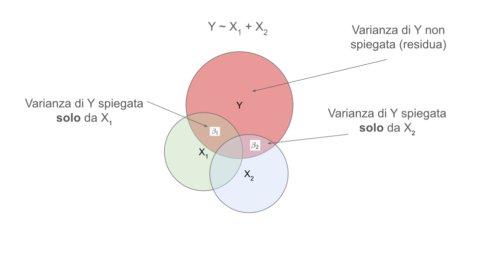
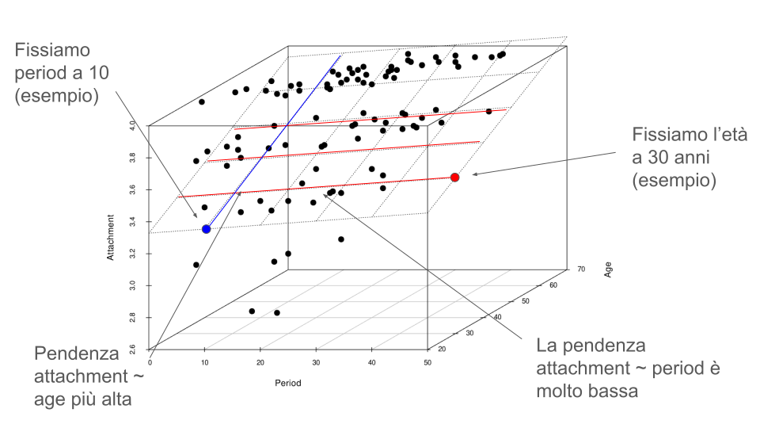

```{r}
#| label: setup
#| include: false

library(tidyverse)
library(patchwork)
library(dagitty)
library(ggdag)
library(here)
library(latex2exp)
library(plotly)
library(scatterplot3d)
devtools::load_all()
TeX <- latex2exp::TeX
```

```{r}
#| include: false

knitr::knit_hooks$set(reset_par = function(before, options, envir) {
  if (before) {
    # This code runs BEFORE the chunk is executed
    par(bty = "n", 
    cex.lab = 1.1, 
    cex.axis = 1, 
    cex.main = 1.3,
    font.lab = 2,
    pch = 19,
    mfrow = c(1,1))
  }
})

knitr::opts_knit$set(reset_par = TRUE)
filor::set_filter_output()
```

```{r}
dat <- readRDS(here("data/adcom.rds"))
```



## Dataset

Lavoriamo sempre sul dataset @Di-Marco2020-wu:

```{r}
dat <- readxl::read_xlsx(here("data/dimarco2020.xlsx"))
dat <- data.frame(dat)
```

```{r}
#| eval: false
#| echo: true
dat <- readxl::read_xlsx("dimarco2020.xlsx")
```

```{r}
head(dat)
```

## Relazione lineare

Quando abbiamo parlato di *correlazione*, abbiamo chiarito che due variabili sono correlate se la loro relazione è di tipo *lineare*. Lineare significa che la relazione può essere descritta da una retta. **Ma come disegniamo questa retta?**

```{r}
plot(dat$burnout, dat$satisfaction, pch = 19, cex = 1.5)
```

## Infinite rette

In uno spazio bidimensionale come questo grafico, possiamo disegnare infinite rette:

```{r}
fit <- lm(satisfaction ~ burnout, data = dat)

b0 <- fit$coefficients[1]
b1 <- fit$coefficients[2]

b0 <- rnorm(10, b0, 0.1)
b1 <- rnorm(10, b1, 0.2)

plot(dat$burnout, dat$satisfaction, pch = 19, cex = 1.5)
for(i in 1:10) abline(b0[i], b1[i])
```

## Come scegliere la retta migliore?

Intuitivamente, l'idea è di prendere una retta che *approssima meglio* la relazione tra le due variabili. Prendiamo come metrica di bontà della retta la distanza dai punti:

```{r}
fit <- lm(satisfaction ~ burnout, data = dat)

b0 <- fit$coefficients[1]
b1 <- fit$coefficients[2]
plot(dat$burnout, dat$satisfaction, type = "n")
abline(a = b0, b = 0.5*b1)
segments(x0 = dat$burnout, 
         y0 = dat$satisfaction, 
         x1 = dat$burnout, 
         b0 + 0.5*b1*dat$burnout,
         lty = "dotted", 
         col = "firebrick")
points(dat$burnout, 
       dat$satisfaction,
       pch = 19, cex = 1.5)
```

## Come scegliere la retta migliore?

Per quantificare in un numero questa metrica, eleviamo al quadrato (togliamo il segno) e facciamo la somma. Calcoliamo quindi la devianza o Sum of Squares (SS):

```{r}
lp <- (b0 + b1*0.5* dat$satisfaction)
SS <- sum((dat$satisfaction - lp)^2)

plot(dat$burnout, dat$satisfaction, type = "n", main = sprintf("SS = %.2f", SS))
abline(a = b0, b = 0.5*b1)
segments(x0 = dat$burnout, 
         y0 = dat$satisfaction, 
         x1 = dat$burnout, 
         b0 + 0.5*b1*dat$burnout,
         lty = "dotted", 
         col = "firebrick")
points(dat$burnout, 
       dat$satisfaction,
       pch = 19, cex = 1.5)
```

## Come scegliere la retta migliore?

Questo valore di per se non ci dice molto ma riassume la somma delle distanze (al quadrato) dalla retta. Facciamolo per diverse rette.

```{r}
#| fig-width: 10
#| fig-height: 8

b1l <- rnorm(4, b1, 0.3)
b0l <- rnorm(4, b0, 0.5)

par(mfrow = c(2, 2))
for(i in 1:length(b1l)) {
    lp <- (b0l[i] + b1l[i]* dat$burnout)
    SS <- sum((dat$satisfaction - lp)^2)
    plot(dat$burnout, dat$satisfaction, type = "n", main = sprintf("SS = %.2f", SS))
    abline(a = b0l[i], b = b1l[i])
    segments(x0 = dat$burnout, 
            y0 = dat$satisfaction, 
            x1 = dat$burnout, 
            b0l[i] + b1l[i]*dat$burnout,
            lty = "dotted", 
            col = "firebrick")
    points(dat$burnout, 
        dat$satisfaction,
        pch = 19, cex = 1.5)
}
```

## Come scegliere la retta migliore?

Come vediamo, diverse rette producono una diversa SS. Ovviamente, più piccola è la SS e più vicini sono i punti alla retta. Questo è il nostro criterio, dobbiamo trovare la retta che *minimizza* la distanza dei punti (al quadrato).

Questo metodo, dal punto di vista algoritmico, si chiama **metodo dei minimi quadrati** perchè appunto permette di trovare quella retta che minimizza la distanza dai punti (al quadrato).

## Come disegnare una retta?

Prima di tutto però è necessario capire come una retta viene definita. Abbiamo detto che per un piano bidimensionale passano infinite rette. Allora intanto ancoriamoci ad un punto:

```{r}
plot(dat$burnout, dat$satisfaction, pch = 19, cex = 1)
points(x = min(dat$burnout), y = 4, pch = 19, cex = 2, col = "firebrick")
```

## Come disegnare una retta?

Ora immaginiamo che tutte le rette (ancora infinite) passino da quel punto. Di base ci serve solo definire l'inclinazione della retta.

```{r}
b0 <- 4.48
burnout0 <- dat$burnout - min(dat$burnout)
plot(burnout0, dat$satisfaction, pch = 19, cex = 1, xlab = "burnout")
for(i in 1:10) abline(a = b0, b = rnorm(10, -0.5, 0.3))
points(x = 0, y = b0, pch = 19, cex = 2, col = "firebrick")
```

## Come disegnare una retta?

Quindi abbiamo bisogno di soli 2 elementi per disegnare una retta. Un punto di *ancoraggio* e un valore che indichi la pendenza della retta. Questi due valori sono chiamati rispettivamente **intercetta** e **pendenza** o coefficiente angolare (*slope*).

Più formalmente, una retta è definita come:

$$
y_i = \beta_0 + \beta_1 x_i
$$

Dove $\beta_0$ è l'intercetta e $\beta_1$ è la pendenza. Nella pratica è una funzione con due parametri che dato un input $x$ fornisce il valore di $y$. Il valore di $y$ dipenderà dai valori di $\beta_0$ e $\beta_1$.

## Intercetta

Nella pratica, l'intercetta sposta verticalmente la retta. Qui la pendenza è la stessa ma sto spostando verticalmente tutta la retta.

```{r}
set.seed(8453)
plot(burnout0, dat$satisfaction, pch = 19, cex = 1, xlab = "burnout")
b0l <- rnorm(5, 4, 0.8)
for(i in 1:5) abline(a = b0l[i], b = -0.5)
points(x = rep(0, 5), y = b0l, pch = 19, cex = 1.5, col = "firebrick")
```

## Disegnare la retta, migliore

Quindi come disegniamo la retta migliore? L'idea è quella di trovare un modo per *minimizzare* la distanza della retta dai punti. In questo modo siamo in grado di stimare i parametri $\beta_0$ e $\beta_1$. In particolare, $\beta_1$:

$$
\beta_1 = \frac{\sum^n_{i = 1} (x - \bar{x})(y - \bar{y})}{\sum^n_{i = 1}{(x - \bar{x})^2}}
$$

Invece $\beta_0$:

$$
\beta_0 = \bar{y} - \beta_1 \bar{x}
$$

::: aside
Il metodo dei minimi quadrati dimostra che questo modo di calcolare $\beta_0$ e $\beta_1$ è quello che minimizza le distanze (errori). La dimostrazione è fuori dallo scopo del corso.
:::

## Disegnare la retta, migliore

Proviamo a fare il calcolo, con le nostre due variabili:

```{r}
#| echo: true

x <- dat$burnout
y <- dat$satisfaction

b1 <- sum((x - mean(x)) * (y - mean(y))) / sum((x - mean(x))^2)
b0 <- mean(y) - b1 * mean(x)

b0
b1
```

Anche senza sapere bene come interpretarli, proviamo a disegnare la retta. Per disegnarla riprendiamo la formula generale della retta $y = \beta_0 + \beta_1 x$.

## Disegnare la retta, migliore

Per disegnarla prendiamo una serie di valori $x$ e su ogni $x$ applichiamo la formula. Usiamo direttamente i valori di `burnout` (salvati in `x`)

```{r}
#| echo: true

head(x)
yn <- b0 + b1 * x

# questi sono i valori per disegnare la retta
head(yn)
```

## Disegnare la retta, migliore

```{r}
#| echo: true

plot(x, yn)
```

## Cosa sono effettivamente $\beta_0$ e $\beta_1$?

Li abbiamo calcolati e visualizzato la retta, ma cosa vogliono dire quei numeri?

- $\beta_0$ (intercetta) è il valore di $y$ (outcome) quando $x = 0$. E' il punto dove la retta interseca l'asse $y$
- $\beta_1$ (pendenza, slope) è l'incremento di $y$ per ogni incremento unitario di $x$

Mentre $\beta_0$ è molto semplice, vediamo meglio $\beta_1$. L'idea è questa, prendiamo un intervallo di valori sulla $x$, tramite la retta proiettiamo quell'intervallo sulla $y$. La proiezione su $y$ è il nostro $\beta_1$.

## Cosa sono effettivamente $\beta_0$ e $\beta_1$?

Più formalmente, prendiamo due punti $a$ e $b$ sulla retta $x$ e calcoliamo la differenza, chiamiamolo $\Delta_x$. Poi proiettiamo questa differenza su $y$ e calcoliamo la differenza, chiamiamolo $\Delta_y$. Il rapporto tra queste due differenze è $\beta_1$:

$$
\beta_1 = \frac{y_a - y_b}{x_a - x_b} = \frac{\Delta_y}{\Delta_x}
$$

Quindi, quando $x_a - x_b = 1$ allora:

$$
\begin{aligned}
y &= \beta_0 + \beta_1 x \\
y^{\star} &= \beta_0 + \beta_1 (x + 1) \\
y^{\star} &= \beta_0 + \beta_1x + \beta_1 \\
y^{\star} &= y + \beta_1
\end{aligned}
$$

## Cosa sono effettivamente $\beta_0$ e $\beta_1$?

```{r}
fit <- lm(dat$satisfaction ~ burnout0)
b0 <- coef(fit)[1]
b1 <- coef(fit)[2]
plot(burnout0, dat$satisfaction, pch = 19, cex = 1.5, xlab = "Burnout", col = scales::alpha("black", 0.1), ylab = "Satisfaction")
abline(fit, lwd = 2, col = "dodgerblue")
abline(v = 0, lty = "dotted")
points(x = 0, y = b0, cex = 2, pch = 19, col = "firebrick")
text(x = 0, y = b0-0.2, label = latex2exp::TeX(r"($\beta_0$)"), cex = 1.5)
segments(x0 = c(1, 2), y0 = c(0, 0), x = c(1, 2), b0 + b1 * c(1, 2))
segments(x0 = c(-1, -1), y0 =  b0 + b1 * c(1, 2), x = c(1, 2), b0 + b1 * c(1, 2))
text(x = 1.5, y = 2.25, label = TeX(r"($\Delta_x = 1$)"), cex = 1.5)
text(x = 0.25, y = 3.75, label = TeX(r"($\Delta_y = -0.51$)"), cex = 1.5)
text(x = 1.5, y = 4.25, label = TeX(r"($\beta_1 = \frac{\Delta_y}{\Delta_x} = \frac{-0.51}{1}$ = -0.51)"), cex = 1.5)
```

## Cosa sono effettivamente $\beta_0$ e $\beta_1$?

Quindi in termini pratici:

- $\beta_0$ (intercetta) è la stima di `satisfaction` (*outcome*) quando il `burnout` (*predittore*) è zero.
- $\beta_1$ (slope) è l'incremento di `satisfaction` per un incremento unitario di `burnout`. Essendo che $\beta_1$ è negativo, questo è un decremento.

Ci sono due punti importanti per l'interpretazione dei valore di $\beta_0$ e $\beta_1$:

- `burnout` messo a zero potrebbe non essere sensato. Immaginate di avere l'età al posto di burnout. $\beta_0$ sarebbe il valore di `satisfaction` quando l'età è zero.
- L'incremento unitario di `burnout` deve essere sensato. Se siamo 1 punto in più nella scala di burnout è un valore sensato, allora $\beta_1$ diventa direttamente intepretabile.

## Cosa stiamo effettivamente facendo?

A prescindere dall'aspetto geometrico, cosa significa tracciare una retta e quindi trovare (stimare) i parametri $\beta_0$ e $\beta_1$. Per farlo partiamo da un caso particolare ovvero una retta con $\beta_1 = 0$.

Se riprendiamo le formule:
$$
\begin{aligned}
\beta_0 &= \bar{y} - \beta_1 \bar{x} \\
\beta_0 &= \bar{y}
\end{aligned}
$$

Quindi quando $\beta_1 = 0$, $\beta_0$ corrisponde alla media di $y$ (`satisfaction` nel nostro caso).

## Cosa stiamo effettivamente facendo?

Questa retta sta ignorando `burnout` ($\beta_1 = 0$). Possiamo calcolare la SS sommando i segmenti rossi (al quadrato). Chiamiamo questa SS, SSE (errore):

```{r}
fit0 <- lm(dat$satisfaction ~ 1)
lp0 <- predict(fit0)
SSE <- sum((dat$satisfaction - lp0)^2)
plot(burnout0, dat$satisfaction, type = "n", xlab = "Burnout", ylab = "Satisfaction", main = TeX(sprintf("$SS_E$ = %.2f", SSE)))
abline(fit0, lwd = 2, col = "dodgerblue")
segments(burnout0, dat$satisfaction, burnout0, lp0, lty = "dotted", col = "firebrick")
points(x = burnout0, y = dat$satisfaction, pch = 19, cex = 1.5)
```

## Cosa stiamo effettivamente facendo?

Ora se invece che fissare $\beta_1 = 0$, usiamo `burnout` e vediamo se la retta si sposta:

```{r}
fit <- lm(dat$satisfaction ~ burnout0)
lp <- predict(fit)
SSE <- sum((dat$satisfaction - lp)^2)
plot(burnout0, dat$satisfaction, type = "n", xlab = "Burnout", ylab = "Satisfaction", main = TeX(sprintf("$SS_E$ = %.2f", SSE)))
abline(fit0, lwd = 1, col = "firebrick")
abline(fit, lwd = 2, col = "dodgerblue")
segments(burnout0, dat$satisfaction, burnout0, lp, lty = "dotted", col = "firebrick")
points(x = burnout0, y = dat$satisfaction, pch = 19, cex = 1.5)
```

## Cosa stiamo effettivamente facendo?

In pratica la distanza tra la retta e i punti è, in media, ridotta. Vediamo per un punto in particolare. Spostare la retta (dalla rossa alla blu) *spiega* una parte della distanza (varianza).

```{r}
hg <- burnout0 == max(burnout0)
fit <- lm(dat$satisfaction ~ burnout0)
lp <- predict(fit)
SSE <- sum((dat$satisfaction - lp)^2)
plot(burnout0, dat$satisfaction, type = "n", xlab = "Burnout", ylab = "Satisfaction", main = TeX(sprintf("$SS_E$ = %.2f", SSE)))
segments(burnout0[hg], dat$satisfaction[hg], burnout0[hg], lp[hg], lwd = 3, col = "firebrick")
segments(burnout0[hg], lp[hg], burnout0[hg], lp0[hg], lwd = 3, col = scales::alpha("dodgerblue", 0.5), lty = "dotted")
segments(burnout0[hg]-0.1, dat$satisfaction[hg], burnout0[hg]-0.1, lp0[hg], lwd = 3, col = scales::alpha("darkgreen", 0.5))
points(x = burnout0, y = dat$satisfaction, pch = 19, cex = 1.5, col = ifelse(hg, "black", scales::alpha("black", 0.2)))
abline(fit, lwd = 2, col = "dodgerblue")
abline(fit0, lwd = 2, col = "firebrick")
```

## Cosa stiamo effettivamente facendo?

Quindi se chiamiamo $SS_E$ la somma dei quadrati rimasta dopo aver spostato la retta possiamo chiamare $SS_T$ (totale, riga verde) quella prima di spostare la retta. Invece chiamiamo $SS_R$ (regressione) quella che abbiamo tolto (in gergo, *spiegato*, blu). Possiamo quindi scrivere che:

$$
\textcolor{green}{SS_T} = \textcolor{blue}{SS_R} + \textcolor{red}{SS_E}
$$

Quindi i parametri $\beta_0$ e $\beta_1$ vengono stimati (tramite il metodo dei minimi quadrati) in modo da minimizzare $\textcolor{red}{SS_E}$ (o anche per massimizzare $\textcolor{blue}{SS_R}$).

## $R^2$

Inoltre, se $\textcolor{green}{SS_T}$ è il nostro totale, possiamo esprimere il quale percentuale $\textcolor{blue}{SS_R}$ spiega. Chiamiamo $R^2$ questa percentuale. Formalmente:

$$
R^2 = 1 - \frac{\textcolor{red}{SS_E}}{\textcolor{green}{SS_T}}
$$

Chiaramente maggiore è la riduzione di $\textcolor{red}{SS_E}$ (la retta si avvicina molto ai punti) maggiore è $R^2$.

## Intuizione

Un'altro modo di vedere la questione è, partendo dalla retta con $\beta_1 = 0$ (quella orizzontale). Senza un predittore $x$ (`burnout`) la retta che minimizza $\textcolor{red}{SS_E}$ è fondamentalmente la media.

```{r}
y <- dat$satisfaction
ybar <- mean(y)
id <- seq_along(dat$satisfaction)

par(mfrow = c(1, 3))

plot(y = y, x = id, pch = 19, cex = 1.5, main = sprintf("SSE = %.2f", sum((y - (ybar+0.8))^2)))
abline(h = ybar + 0.8, lwd = 2)
abline(h = ybar, lwd = 2, col = "firebrick")
segments(id, y, id,  ybar + 0.8)

plot(y = y, x = id, pch = 19, cex = 1.5, main = sprintf("SSE = %.2f", sum((y - (ybar))^2)))
abline(h = ybar, lwd = 2, col = "firebrick")
segments(id, y, id, ybar)

plot(y = y, x = id, pch = 19, cex = 1.5, main = sprintf("SSE = %.2f", sum((y - (ybar-0.2))^2)))
abline(h = ybar - 0.2, lwd = 2)
abline(h = ybar, lwd = 2, col = "firebrick")
segments(id, y, id, ybar - 0.2)
```

## Intuizione

Quando inseriamo un predittore `burnout` stiamo implicitamente dicendo che la media di $y$ (`satisfaction`) si può spostare in funzione di `burnout`. Quindi la retta che minimizza è sempre la media ma spostata in funzione di `burnout`:

```{r}
plot(burnout0, dat$satisfaction, pch = 19, cex = 1.5)
abline(h = ybar, lwd = 2, col = "firebrick")
segments(burnout0, dat$satisfaction, burnout0, lp)
abline(fit, lwd = 2, col = "dodgerblue")
```

## Più formalmente

Ora che abbiamo idea di cosa sta succedendo, defininiamo meglio l'equazione della retta tenendo conto anche dell'errore:

$$
\textcolor{green}{y_i} = \textcolor{blue}{\beta_0 + \beta_1 x_i} + \textcolor{red}{\epsilon_i}
$$

Dove $y_i$ è il valore *osservato* (di `satisfaction`). La parte $\textcolor{blue}{\beta_0 + \beta_1 x_i}$ viene anche chiamata componente sistematica perchè definisce semplicemente la retta una volta stimati $\beta_0$ e $\beta_1$, senza errore. Il valore osservato è quindi formato dalla parte sistematica e dall'errore.

## Errori

Ora, mentre la parte sistematica $\textcolor{blue}{\beta_0 + \beta_1 x_i}$ per definizione è senza errore è importante ora capire di più riguardo a $\textcolor{red}{\epsilon_i}$.

Abbiamo definito nel modulo di inferenza, che quando stimiamo dei parametri c'è sempre una quota d'errore. Inoltre questo **errore**, idealmente, dovrebbe essere di tipo **casuale** e non sistematico.

Quindi gli errori $\textcolor{red}{\epsilon_i}$, attorno alla retta (parte sistematica) dovrebbero distribuirsi in modo casuale. In termini pratici i punti dovrebbero essere certe volte maggiori, altre volte minori della retta. La media degli errori quindi dovrebbe essere zero.

## Errori

Più formalmente possiamo dire che:

- La media degli errori dovrebbe essere $\mu_{\epsilon} = 0$
- La dispersione degli errori $\sigma_{\epsilon}$ (la varianza/deviazione standard) è per definizione diversa da zero (c'è sempre una quota d'errore) ma aumenta/diminuisce in base a quanto la retta è vicina ai punti.

Quindi un buon modo di descrivere gli errori (idealmente) potrebbe essere quello di immaginare una distribuzione $\epsilon \sim \mathcal{D}(\mu = 0, \sigma_{\epsilon})$.

## Errori

Una buona distribuzione potrebbe essere proprio quella **Normale**. Infatti essendo simmetrica le deviazioni dalla media sono per definizione casuali. Deviazioni positive e negative sono bilanciate attorno al centro, ovvero la media.

```{r}
curve(dnorm(x), -4, 4, lwd = 2, xlab = TeX(r'($\epsilon$)'), ylab = "Density")
abline(v = 0, lwd = 2, lty = "dotted")
text(x = 0.2, y = 0.05, label = TeX(r'($\mu$)'))
text(x = 0.3, y = 0.3, label = TeX(r'($\sigma_{\epsilon}$)'))
```

## Errori

Quindi possiamo dire che costruiamo una retta che, tramite $\beta_0$ e $\beta_1$ minimizza le distanze dai punti. Le distanze *residue* sono distribuite in modo casuale come una distribuzione normale con $\mu = 0$ e deviazione standard $\sigma_{\epsilon}$.

$$
y_i = \beta_0 + \beta_1 x_i + \epsilon_i
$$

$$
\epsilon_i \sim \mathcal{N}(0, \sigma_{\epsilon_i})
$$

Definiamo anche $\hat{y}$ (ovvero $y$ stimato) come:

$$
\hat{y_i} = \beta_0 + \beta_1 x_i
$$

Ovvero il valore che la retta prevede per l'osservazione $i$.

## Errori, graficamente

Stiamo assumendo che per ogni $\hat{y_i}$, gli errori intorno siano distribuiti come una normale con $\mu = 0$ e deviazione standard $\sigma_{\epsilon}$.

```{r}
x <- dat$burnout - min(dat$burnout)
y <- dat$satisfaction
fit <- lm(y ~ x)
plot(x, y, pch = 19, ylim = c(1, 6), xlab = "burnout", ylab = "satisfaction")
abline(fit, col = "dodgerblue", lwd = 2)

sigma_res <- summary(fit)$sigma 
x_points <- mean(x) + c(-1.5, -0.5, 0.5, 1.5) * sd(x)
scale_factor <- 0.3

# 5. Disegno delle distribuzioni
for (xi in x_points) {
    # Calcola il valore predetto y-hat (la media della distribuzione in quel punto)
    y_hat <- predict(fit, newdata = data.frame(x = xi))
    
    # Genera una sequenza di valori Y attorno alla media (+/- 3 deviazioni standard)
    y_seq <- seq(y_hat - 3 * sigma_res, y_hat + 3 * sigma_res, length.out = 100)
    
    # Calcola la densità della normale per quei valori
    dens <- dnorm(y_seq, mean = y_hat, sd = sigma_res)
    
    # Trasla e scala la densità per posizionarla come una curva orizzontale
    x_curve <- xi + dens * scale_factor
    
    # # Opzionale: disegna un'area ombreggiata (poligono) per riempire la campana
    # polygon(c(rep(xi, length(y_seq)), rev(x_curve)), 
    #         c(y_seq, rev(y_seq)), 
    #         col = rgb(0.2, 0.5, 0.8, alpha = 0.3), border = NA)
    
    # Disegna il contorno della curva della normale
    lines(x_curve, y_seq, lwd = 1)
    
    # # Disegna la linea di base verticale della distribuzione
    # lines(rep(xi, length(y_seq)), y_seq, col = "blue", lty = 2)
}
```

## Perche $\mu = 0$?

Se provate a sottrarre (*centrare*) da ogni dato osservato $y_i$ il dato previsto dalla retta $\hat{y_i}$ otteniamo questo. La deviazione standard di $y - \hat{y}$ è una stima di $\sigma_{\epsilon}$.

```{r}
ri <- residuals(fit)
x <- burnout0
y <- dat$satisfaction
par(mfrow = c(1, 2), mar = c(5, 5, 4, 4) + 0.1)
plot(x, y, pch = 19, xlab = "Burnout", ylab = "Satisfaction (y)")
points(x, ri, pch = 19)
abline(fit, col = "dodgerblue", lwd = 2)
segments(x, y, x, predict(fit), lty = "dotted")
plot(x, ri, pch = 19, xlab = "Burnout", ylab = TeX(r'($y - \hat{y}$)'))
abline(h = 0)
segments(x, ri, x, rep(0, length(x)), lty = "dotted")
```

## Riassumendo

Abbiamo *scomposto* ogni dato osservato $y_i$ come:

$$
\textcolor{green}{y_i} = \textcolor{blue}{\beta_0 + \beta_1 x_i} + \textcolor{red}{\epsilon_i}
$$

Se definiamo $\textcolor{blue}{\hat{y}} = \beta_0 + \beta_1 x_i$ allora:

$$
\textcolor{green}{y_i} = \textcolor{blue}{\hat{y_i}} + \textcolor{red}{\epsilon_i}
$$

Inoltre, definiamo come **residui**:

$$
\textcolor{red}{\epsilon_i} = \textcolor{green}{y_i} - \textcolor{blue}{\hat{y_i}}
$$

Infine, quando $\beta_1 = 0$ abbiamo visto che:

$$
\textcolor{green}{y_i} = \textcolor{blue}{\beta_0} + \textcolor{red}{\epsilon_i}  = \textcolor{blue}{\bar{y}} + \textcolor{red}{\epsilon_i}
$$

## Riassumendo

Inoltre abbiamo definito gli errori come casuali ($\mu = 0$) e distribuiti normalmente con deviazione standard $\sigma_{\epsilon}$. Possiamo quindi definire queste quantità:

$$
\begin{aligned}
\textcolor{green}{SS_{T}} &= \textcolor{blue}{SS_{R}} + \textcolor{red}{SS_{E}} \\
\textcolor{green}{SS_{T}} &= \sum^{n}_{i = 1} (y_i - \bar{y})^2 \\
\textcolor{blue}{SS_{R}} &= \sum^{n}_{i = 1} (\hat{y_i} - \bar{y})^2 \\
\textcolor{red}{SS_{E}} &= \sum^{n}_{i = 1} (y_i - \hat{y})^2 \\
R^2 &= 1 - \frac{\textcolor{red}{SS_{E}}}{\textcolor{green}{SS_{T}}}
\end{aligned}
$$

## Riassumendo

Questo che abbiamo definito è un modello lineare. Ogni modello lineare ha una parte sistematica $\beta_0 + \beta_1 x$ e una parte casuale $\epsilon$. I parametri da stimare in questo caso sono quindi $\beta_0$, $\beta_1$ e $\sigma_{\epsilon}$.

Quindi, una relazione tra due variabili, si può approssimare con una retta della quale dobbiamo stimare i parametri. Inoltre, i punti possono essere più o meno dispersi attorno alla retta stimata determinando più o meno errore di stima.

## Stesso $\beta_1$, diversa $\sigma_{\epsilon}$

Vediamo dei casi dove la pendenza/slope della retta è la stessa ma la deviazione standard dei residui cambia. Dove è più forte la relazione secondo voi?

```{r}
sim_lm <- function(b0, b1, sigma, n = NULL, x = NULL){
  if(is.null(x)) x <- rnorm(n)
  if(is.null(n)) n <- length(x)
  z <- rnorm(n)
  xz <- residuals(lm(z ~ x))
  y <- b0 + b1 * x + xz * sigma
  data.frame(y, x)
}
n <- 100
x <- runif(n, 0, 10)

y1 <- sim_lm(2, 0.5, 0.2, x = x)
y2 <- sim_lm(2, 0.5, 1, x = x)
y3 <- sim_lm(2, 0.5, 2, x = x)

fit1 <- lm(y ~ x, data = y1)
fit2 <- lm(y ~ x, data = y2)
fit3 <- lm(y ~ x, data = y3)

ylim <- range(c(y1$y, y2$y, y3$y))

fitl <- list(fit1, fit2, fit3)

par(mfrow = c(1, 3))

for(i in 1:3){
    plot(x, 
         fitl[[i]]$model[, 1], 
         ylim = ylim, 
         main = TeX(sprintf(r"($\hat{\beta}_1 = %.2f$, $\hat{\sigma}_{\epsilon} = %.2f$)", 
                            coef(fitl[[i]])[2], 
                            sigma(fitl[[i]]))),
         xlab = "x",
         ylab = "y",
         pch = 19)
    abline(fitl[[i]], col = "dodgerblue", lwd = 2)
    text(2, ylim[2], labels = TeX(sprintf(r"($R^2 = %.2f$)", summary(fitl[[i]])$r.squared)))
}
```

## Stesso $\beta_1$, diversa $\sigma_{\epsilon}$

E' chiaro che la forza della relazione, in termini di pendenza è la stessa ma è chiaramente più intensa la relazione nel primo grafico. Il problema è che la variazione di $y$ e $x$ cambia da un grafico all'altro. Forse possiamo *standardizzare* in qualche modo.

Partiamo standardizzando (trasformare in punti $z$) $x$, `burnout` nel nostro caso. Ora cambiamo l'unità di misura che diventa una deviazione standard.

Quindi $\beta_1$ diventa l'incremento di `satisfaction` quando `burnout` cresce di una deviazione standard.

## Stesso $\beta_1$, diversa $\sigma_{\epsilon}$

Quindi, all'aumentare di una deviazione standard di `burnout`, `satisfaction` diminuisce di 0.29.

```{r}
burnout0 <- (dat$burnout - mean(dat$burnout)) / sd(dat$burnout)
y <- dat$satisfaction

fit <- lm(y ~ burnout0)

plot(burnout0, y, pch = 19, main = TeX(sprintf(r'($\beta_1 = %.2f$)', coef(fit)[2])), ylab = "Satisfaction", xlab = "Burnout (z)")
abline(fit, lwd = 2, col = "dodgerblue")
```

## Stesso $\beta_1$, diversa $\sigma_{\epsilon}$

Vediamolo in pratica, vi ricordo la formula:

$$
\beta_1 = \frac{\sum^n_{i = 1} (x - \bar{x})(y - \bar{y})}{\sum^n_{i = 1}{(x - \bar{x})^2}}
$$

```{r}
#| echo: true

# standardizzo il burnout e metto su x per comodità
x <- (dat$burnout - mean(dat$burnout)) / sd(dat$burnout)

# metto su y per comodità
y <- dat$satisfaction

sum((x - mean(x)) * (y - mean(y))) / 
  sum((x - mean(x))^2)
```

## Stesso $\beta_1$, diversa $\sigma_{\epsilon}$

Ora proviamo a *standardizzare* anche `satisfaction`. $\beta_1$ ci dirà di quante deviazioni standard aumenta `satisfaction` all'aumentare di una deviazione standard di `burnout`.

```{r}
x <- (dat$burnout - mean(dat$burnout)) / sd(dat$burnout)
y <- (dat$satisfaction - mean(dat$satisfaction)) / sd(dat$satisfaction)

fit <- lm(y ~ x)

plot(x, y, pch = 19, main = TeX(sprintf(r'($\beta_1 = %.2f$)', coef(fit)[2])), ylab = "Satisfaction (z)", xlab = "Burnout (z)")
abline(fit, lwd = 2, col = "dodgerblue")
```

## Stesso $\beta_1$, diversa $\sigma_{\epsilon}$

Vediamolo in R:

```{r}
#| echo: true

# standardizzo il burnout e metto su x per comodità
x <- (dat$burnout - mean(dat$burnout)) / sd(dat$burnout)

# metto su y per comodità
y <- (dat$satisfaction - mean(dat$satisfaction)) / sd(dat$satisfaction)

sum((x - mean(x)) * (y - mean(y))) / 
  sum((x - mean(x))^2)
```

Calcoliamo anche la correlazione:

```{r}
#| echo: true

cor(x, y)
```

## Stesso $\beta_1$, diversa $\sigma_{\epsilon}$

Come vedete, standardizzando le variabili $\beta_1$ equivale alla correlazione. Esiste infatti una relazione diretta:

$$
\beta_1 = r_{xy} \frac{\sigma_y}{\sigma_x}
$$

Trovare la miglior retta che minimizza la SS equivale a calcolare il coefficiente di correlazione.

Chiaramente nei tre grafici con $\sigma_{\epsilon}$ diversa essendo fissa la parte sistematica $\beta_0 + \beta_1 x$ allora la varianza di $y$ è maggiore. Se $\sigma_y$ aumenta per mantenere lo stesso rapporto (abbiamo fissato $\beta_1$) necessariamente $r_{xy}$ deve scendere. Per questo se calcoliamo la correlazione, questa diminuisce (a parità di $\beta_1$) all'aumentare della dispersione attorno alla retta ($\sigma_{\epsilon}$).


## Riassumendo

- Il metodo dei minimi quadrati ci permette di disegnare, stimando $\beta_0$ e $\beta_1$ la miglior retta
- I coefficienti sono rispettivamente la media di $y$ quando $x = 0$ e l'incremento di $y$ per incremento unitario di $x$
- Una volta definita la retta, abbiamo una componente sistematica $\beta_0 + \beta_1x$ e una componente d'errore (casuale) $\epsilon$
- Minore è la distanza dei punti dalla retta, minore è la $SS_E$ e quindi maggiore è $R^2$
- La dispersione dei punti attorno alla retta stimata viene catturata dal parametro $\sigma_{\epsilon}$

## Modello statistico

Quello che abbiamo costruito passo per passo è un **modello di regressione lineare**. Ma cosa si intende per modello statistico?

Un modello statistico è un **modello matematico che descrive, in modo semplificato, la relazione tra variabili**. Quello che viene definito processo generativo dei dati (data-generating process).

Ogni modello statistico ha una parte **sistematica** e una parte d'**errore (casuale)**. L'obiettivo è quindi, tramite un campione, **stimare** la componente sistematica.

Ogni modello statistico, per definizione, fa delle **assunzioni**. Queste assunzioni sono necessarie per trarre conclusioni appropriate. Il modello statistico quindi non scopre la realtà ma cerca di capire se i dati (e di conseguenza la popolazione) possono essere approssimati tramite le assunzioni/vincoli del modello stesso.

## Modello statistico

In generale, possiamo descrivere un modello statistico come:

$$
y = f(\mathbf{X}) + \epsilon
$$

Dove $y$ è la variabile *outcome*, $\mathbf{X}$ sono i predittori (grassetto per indicare uno o più predittori, $x_1$, $x_2$, etc.) $\epsilon$ è l'errore e $f(\cdot)$ è la parte sistematica del modello.

Nel nostro caso $\epsilon \sim \mathcal{N}(0, \sigma_{\epsilon})$ e $f() = \beta_0 + \beta_1 x$ è uno dei modelli possibili e queste sono *assunzioni*. Assumendo che la relazione sia lineare e che gli errori siano distribuiti normalmente, $f() = \beta_0 + \beta_1 x$ descrive i dati.

## Esempio

Immaginiamo di avere dei dati di questo tipo. E' chiaro che la relazione non è *lineare*. Se stimiamo la nostra retta qui otteniamo questo:

```{r}
x <- runif(100, 0, 100)
y <- 5 + 0.05 * x + 0.001 * x^2 + 0.001 * x^3 + rnorm(100, 0, 50)
plot(x, y, pch = 19, cex = 1.5)
fit <- lm(y ~ x)
abline(fit, lwd = 2, col = "dodgerblue")
segments(x, y, x, predict(fit))
```

## Esempio

Proviamo a rappresentare graficamente $\epsilon$ (i residui) vs i valori stimati dal modello (retta blu del grafico precedente).

```{r}
plot(fitted(fit), residuals(fit), pch = 19, ylab = latex2exp::TeX(r"(Residui $\hat{y} - y$)"), xlab = latex2exp::TeX(r"(Valori Stimati $\hat{y}$)"))
abline(h = 0, lwd = 2, col = "dodgerblue")
```

## Esempio

E' chiaro che pur avendo stimato la retta che minimizza la $SS_E$ questa non sia una buona approssimazione dei dati. Ci serve un modello più complesso:

```{r}
fit <- lm(y ~ poly(x, 3))
pp <- data.frame(x, y, p = predict(fit))
pp <- pp[order(pp$x), ]
plot(pp$x, pp$y, xlab = "x", ylab = "y", pch = 19)
lines(pp$x, pp$p, lwd = 2, col = "dodgerblue")
segments(x, y, x, predict(fit))
```

## Esempio

Questi sono i residui in questo caso. La retta non era una buona approssimazione.

```{r}
plot(fitted(fit), residuals(fit), pch = 19, ylab = latex2exp::TeX(r"(Residui $\hat{y} - y$)"), xlab = latex2exp::TeX(r"(Valori Stimati $\hat{y}$)"))
abline(h = 0, lwd = 2, col = "dodgerblue")
```

## Esempio

Questi due modelli differiscono per $f()$. Uno è più semplice (la retta) ma evidenti problematiche. L'altro è più complesso ($\beta_2$ e $\beta_3$) da stimare ma approssima meglio.

```{r}
par(mfrow = c(1, 2))
plot(x, y, main = TeX(r"($\beta_0 + \beta_1 x$)"),pch = 19)
abline(lm(y ~ x), lwd = 2, col = "dodgerblue")

plot(pp$x, pp$y, xlab = "x", ylab = "y", main = TeX(r"($\beta_0 + \beta_1 x + \beta_2 x^2 + \beta_3 x^3$)"), pch = 19)
lines(pp$x, pp$p, lwd = 2, col = "dodgerblue")
```

## Messaggio finale

> All models are wrong, but some are useful. </br> -- *George Box*

Quindi, i modelli statistici sono semplificazioni matematiche della realtà tramite assunzioni e vincoli.

Il modello lineare ad esempio, assume che una retta sia una buona approssimazione della realtà. Modelli più complessi possono approssimare meglio ma richiedono anche più parametri.

I parametri vengono *stimati* (con errore) e la qualità della stima è funzione della variabilità del fenomeno e del numero di osservazioni.

Modelli complessi richiedono maggior numero di informazione (soggetti) per essere stimati in modo affidabile.

# Modello lineare

## Modello lineare

Ora ci focalizziamo sul modello lineare con la consapevolezza che $f()$ possa essere molte cose. Formalmente:

$$
\mathbf{y}_{n\times1} = \mathbf{X}_{n \times p}\boldsymbol{\beta}_{p \times 1} + \boldsymbol{\epsilon}_{n \times 1}
$$

Il grassetto (o matrix formulation) è un modo compatto per scrivere anche modelli lunghi. Infatti possiamo avere:

$$
y_i = \beta_0 + \beta_1 x_{1_i} + \beta_2 x_{2_i} + \epsilon_i
$$

## Modello lineare semplice

Quello che abbiamo usato fino ad ora $\beta_0 + \beta_1 x$ è definito **modello lineare semplice** perchè abbiamo un solo predittore $x$. Ovviamente i modelli possono avere anche molti predittori, in quel caso si chiamano **modelli lineari multipli**.

## Terminologia

Definiamo della terminologia utile:

- con **valori osservati** $y_i$ intendiamo la combinazione di componente sistematica $\mathbf{X}\boldsymbol{\beta}$ ed errore $\epsilon$.
- con **valori predetti** $\mu_i$ intendiamo la sola componente sistematica $\mathbf{X}\boldsymbol{\beta}$ (senza errore). Sono i valori esattamente sulla retta.
- con **residui** intendiamo la componente di errore $\epsilon_i$ ovvero la differenza $y_i - \mu_i$

## Predittore categoriale

```{r}
adcom <- readRDS(here::here("data", "adcom.rds"))
```

Proviamo ad inserire un predittore categoriale a due livelli `sex`. L'outcome è l'`altezza` (per vedere una chiara differenza)^[Stiamo usando in nostri dati del questionario]:

```{r}
#| echo: true
#| output-location: slide

boxplot(altezza ~ sex, data = adcom)
```

## Predittore categoriale

```{r}
stripchart(altezza ~ sex,
           vertical = TRUE,
           xlim = c(0, 3),
           method = "jitter",
           data = adcom,
           pch = 19,
           col = 3:2)
```

## Predittore categoriale

Proviamo a farlo direttamente in R:

```{r}
#| echo: true

fit <- lm(altezza ~ sex, data = adcom)
summary(fit)
```

## Predittore categoriale

Per capire quello che sta succedendo prima dobbiamo capire cosa succede a `sex` quando entra in un modello lineare.

L'idea è che nonostante la variabili categoriali siano non numeriche (superficialmente) possiamo rappresentare la stessa informazione usando $k - 1$ (dove $k$ è il numero di modalità) variabili numeriche.

In questo caso, `sex` ha due livelli quindi $k = 2$ e ci servono $k - 1 = 1$ variabili numeriche. Di base si usano quelle che si chiamano **dummy-variables** ovvero variabili con valore 0 o 1.

## Dummy variables

La funzione `lm` crea automaticamente queste variabili quando inseriamo dei predittori categoriali. Per vedere quello che succede possiamo usare la funzione `model.matrix()`:

```{r}
#| echo: true

model.matrix(~ sex, data = adcom)
```

## Dummy variables

Possiamo lasciare stare l'intercetta per il momento, la colonna `sexMaschile` è la versione *dummy* della variabile categoriale `sex`. Possiamo anche crearla manualmente:

```{r}
#| echo: true
head(adcom$sex, 15)
adcom$sex_dummy <- ifelse(adcom$sex == "Maschile", 1, 0) # o l'inverso
head(adcom$sex_dummy, 15)
```

Non è necessario farlo manualmente, ma è importante capire cosa fa il software. A prescindere da R, tendenzialmente tutti i software lavorano così.

## Dummy variables

Quindi quando inseriamo una variabile categoriale con $k$ livelli, vengono create $k - 1$ variabili *dummy*. Sono variabili numeriche a tutti gli effetti, quindi i coefficienti si intepretano come tali. Riprendiamo (concetriamoci sui parametri):

```{r lines = "^Coefficients|^Signif"}
#| echo: true

summary(fit)
```

## Dummy variables

- `(Intercept)` è il valore di $y$ (`altezza`) quando $x = 0$ (`sex`). `sex` = 0 per la variabile *dummy* è il sesso femminile. Quindi è l'altezza media delle femmine.
- `sexMaschile` ($\beta_1$) è l'incremento di `altezza` per incremento unitario in `sex`.

Essendo che sono variabili dummy, dire *aumento unitario* equivale a dire mi sposto da una categoria all'altra. Quindi $\beta_1$ è la **differenza di altezza tra maschi e femmine**.

## T-test {.smaller}

In altri termini, abbiamo fatto sostanzialmente un t-test. Infatti possiamo confrontare i risultati. Notate i valori della statistica $t$ e $p$ value:

```{r}
#| echo: true

t.test(altezza ~ sex, var.equal = TRUE, data = adcom)
```

```{r lines = "^Coefficients|^Signif"}
#| echo: true

summary(fit)
```

## Scriviamo l'equazione

Con i modelli lineari, scrivere l'equazione (componente sistematica) è molto importante e fa capire molte cose.

$$
\hat{\mbox{altezza}} = \beta_0 + \beta_1 \mbox{sex} \quad \mbox{sex} = \{0, 1\}
$$
$$
\begin{aligned}
\hat{\mbox{altezza}} &= \beta_0 + \beta_1 \times 1 \quad \mbox{sex} = 1 \\
\hat{\mbox{altezza}} &= \beta_0 + \beta_1 \times 0 \quad \mbox{sex} = 0 \\
                     &= \beta_0
\end{aligned}
$$

## Graficamente

```{r}
sex2 <- paste(adcom$sex, ifelse(adcom$sex == "Maschile", 1, 0))
stripchart(altezza ~ sex2, data = adcom, 
           vertical = TRUE, 
           xlim = c(0, 3), 
           method = "jitter", 
           pch = 19)

intercept <- coef(fit)[1]
slope <- coef(fit)[2]

segments(x0 = 1, y0 = intercept, 
         x1 = 2, y1 = intercept + slope, 
         col = "red", lwd = 2)

         # 1. Add the text for b0 (Intercept)
# We place it slightly to the left of the first group (x = 1)
text(x = 0.7, y = intercept, 
     labels = latex2exp::TeX(r"($\beta_0$)"), cex = 2)

# 2. Add the text for b1 (Slope/Difference)
# A good spot is usually the midpoint between x=1 and x=2
mid_x <- 1.5
mid_y <- intercept + (slope / 2)

text(x = mid_x, y = mid_y, 
     labels = latex2exp::TeX(r"($\beta_1$)"),
     pos = 3, cex = 2)
```

## Inferenza

Da dove vengono quelle statistiche test $t$ e p value? Vengono calcolati esattamente come già sappiamo. Dobbiamo definire $H_0$ e $H_1$ anche nel caso di modelli di regressione lineare dove:

$$
H_0: \beta_j = 0
$$

$$
H_1: \beta_j \neq 0
$$

Dove $\beta_j$ è uno dei possibili coefficienti di regressione che siamo interessati a valutare. Ovviamente possiamo anche fare dei test monodirezionali.

## Inferenza

Ogni coefficiente di regressione ha la sua stima campionaria $\hat \beta_j$ e quindi ha anche il suo errore standard $\text{SE}_{\hat \beta_j}$ che indica quanto è precisa la stima del coefficiente di regressione. Quindi possiamo definire una statistica test standardizzata come:

$$
t = \frac{\hat \beta_j}{\text{SE}_{\beta_j}}
$$

Questa statistica test sotto $H_0$ si distribuisce come una $t$ di Student con $\nu = n - p$ gradi di libertà dove $p$ è il numero totale di coefficienti stimati dal modello. Nel caso dell'altezza, $p = 2$ ($\beta_0$ e $\beta_1$) quindi $\nu = n - p = 396 - 2 = 394$.

## $R^2$ aggiustato

Nella tabella di regressione vedete anche il valore di $R^2$ aggiustato.

$$
R^2_{\text{adj}} = 1 - \frac{(1 - R^2)(n - 1)}{n - p}
$$

Dove $n$ è la numerosità campionaria e $p$ il numero di coefficienti stimati. Sostanzialmente questa formula riduce il valore di $R^2$ in funzione del numero dei parametri stimati. A parità di $R^2$ (non aggiustato), quello aggiustato sarà minore se sono serviti più parametri per arrivare alla stessa varianza spiegata.

## Assunzioni

Il modello lineare funziona correttamente nel momento in cui alcune assunzioni sono rispettate:

- **Linearità.** Si assume che la relazione tra $x$ e $y$ sia lineare, sia nella regressione semplice sia in quella multipla.
- **Indipendenza.** I residui devono essere indipendenti tra loro. In sostanza, non devono esserci strutture sistematiche o fattori non misurati che li rendano dipendenti.
- **Normalità.** Si assume che i residui siano distribuiti normalmente. Non è necessario che $x$ e $y$ siano normali, purché lo siano i residui.
- **Omoscedasticità.** La varianza dei residui deve essere costante. In pratica, la dispersione dei residui deve rimanere simile per tutti i valori predetti $\mu$ e, idealmente, per tutti i valori dei predittori $x$.

## Linearità

Questa assunzione riguarda la **componente sistematica** del modello. In regressione lineare, “lineare” significa **lineare nei parametri**.

Ad esempio, questi sono modelli lineari:

$$
y = \beta_0 + \beta_1 x
$$
$$
y = \beta_0 + \beta_1 x + \beta_2 x^2
$$

è un modello lineare. Pur non rappresentando una retta, resta lineare perché i coefficienti $\beta_0$, $\beta_1$ e $\beta_2$ compaiono linearmente.

$$
y = \beta_0 + x^{\beta_1}
$$

non è un modello lineare, perché il parametro $\beta_1$ compare come esponente e quindi non entra in forma lineare.

## Indipendenza

Questa assunzione è *by-design* nel senso che dipende dal tipo di dato. In termini pratici significa che le righe del nostro dataset devono essere indipendenti. Indipendenza in questo caso significa, sostanzialmente, che ogni riga appartiene ad un soggetto diverso. Ad esempio:

- 100 soggetti dove misuro $p$ variabili (questionari, socio-anagrafiche, etc.) -> dataset con righe indipendenti
- 100 soggetti misurati prima/dopo un trattamento. Il valore pre e post sono correlati (dipendenti) perchè sono appartenenti allo stesso soggetto

In questo secondo caso è necessario usare dei modelli che tengano conto della dipendenza, come quelli multilivello. In tutti gli altri casi, il modello lineare che stiamo usando è adeguato.

## Normalità dei residui

La normalità dei residui, come dice il nome significa che i residui (e non la variabile dipendente) devono essere distribuiti normalmente. In linea teorica, i residui devono avere media $\mu = 0$ e $\sigma = \sigma_{\epsilon}$ (quella stimata dal modello). Nella pratica devono avere una forma normale e non contenere pattern e/o deviazioni dalla media $\mu = 0$.

Questa assunzione si vede principalmente a livello grafico e guardando statistiche descrittive dei residui. Alcuni propongono di usare dei test per valutare la normalità (tipo Shapiro-Wilk). Tuttavia il metodo migliore è quello grafico.

## Normalità dei residui

La cosa più semplice da fare è rappresentare graficamente i residui con un istogramma e/o un QQ-plot.

Riprendiamo un modello lineare semplice:

```{r}
fit <- lm(satisfaction ~ burnout, data = dat)
summary(fit)
```

## Normalità dei residui

Come vedete su R c'è una sezione specifica riguardo i residui che vi fornisce alcune statistiche descrittive in particolare minimo, primo quartile, mediana, terzo quartile e massimo. Già qui possiamo farci un'idea del pattern:

- i residui devono essere simmetrici attorno a zero, vediamo che la mediana è molto vicina a zero
- se i residui sono normali, 1 e 3 quartile dovrebbero essere lo stesso valore (o molto simile) semplicemente con segno diverso
- lo stesso vale anche per massimo e minimo ma questi sono estremamente sensibili a valori anomali

## Normalità dei residui

Vediamo con un'istogramma. Le linee rosse sono i quantili che sono riportati nel summary del modello:

```{r}
hist(residuals(fit))
abline(v = quantile(residuals(fit), c(0.25, 0.5, 0.75)), lwd = 2, col = "firebrick")
```

## Normalità dei residui

Un modo però ancora più efficace è quello del QQ plot perchè ci fa vedere direttamente delle deviazioni dalla normalità:

```{r}
qqnorm(residuals(fit), ylab = "Residui")
qqline(residuals(fit))
```

## Normalità dei residui

In questo caso sulle code abbiamo della deviazione dalla normalità ma in generale possiamo dire che il modello è abbastanza adeguato. Deviazioni importanti dalla normalità sicuramente devono essere evidenziate. Solitamente la principale motivazione di non normalità dei residui è legata al fatto che il modello lineare non è il modello adeguato per quella tipologia di dato. In particolare, la variabile outcome può avere bisogno di un'altro modello.

## Omoscedasticità dei residui

Oltre alla normalità, il modello lineare richiede che la varianza dei residui $\sigma_{\epsilon}$ sia costante per ogni valore di $\mu$. In termini pratici, la dispersione attorno alla retta di regressione stimata deve essere costante.

Ovviamente questo è legato al fatto che stimando un solo parametro di varianza dei residui, questo per essere informativo non deve variare in funzione di $x$, altrimenti $\sigma_{\epsilon}$ diventa meno informativo.

Anche questo criterio è facilmente verificabile a livello grafico e quindi consiglio di evitare i test statistici per questo tipo di cose.

## Omoscedasticità dei residui

L'Omoscedasticità dei residui si intende condizionata rispetto al valore stimato dal modello. In altri termini, per ogni valore stimato ci si aspetta che la varianza dei residui (attorno al valore stimato) sia normale (assunzione precedente) con varianza costante.

```{r}
plot(fit, which = 1)
```

## Omoscedasticità dei residui

In questo grafico le cose da osservare sono:

- se la linea rossa (una sorta di stima non lineare della relazione) è orizzontale. In questo caso significa che non c'è un pattern nella relazione. Il caso ideale è la linea rossa il più simile possibile a quella tratteggiata orizzontale.
- se la dispersione dei punti attorno alla linea rossa (idealmente quella tratteggiata) è costante. Ovvero non ci sono incrementi o decrementi di variabilità.

Nel grafico precedente la dispersione sembra abbastanza costante a parte agli estremi dove aumenta a sinistra e si riduce a destra. Attenzione che con poche osservazioni è difficile vedere chiaramente eventuali problemi.

## Un caso ideale (positivo e negativo)

Vi mostro dei dati simulati per vedere dei casi prototipici di deviazioni rispetto a questi assunti. Questi sono dei dati simulati seguendo esattamente gli assunti. Relazione lineare tra `x` e `y`.

```{r}
n <- 1e4
b0 <- 30
b1 <- 0.3
x <- runif(n, 0, 100)
y <- b0 + b1 * x + rnorm(n, 0, 10)
plot(x, y, main = "n = 10000")
```

## Un caso ideale (positivo e negativo)

Fittiamo il modello lineare e vediamo i residui:

```{r}
fit <- lm(y ~ x, data = dat)
summary(fit)
```

## Un caso ideale (positivo e negativo)

A prescindere da coefficienti ed intepretazione, possiamo vedere che i residui sono chiaramente normali guardando solo i quantili riportati. Vediamo comunque un grafico:

```{r}
par(mfrow = c(1, 2))
hist(residuals(fit))
qqnorm(residuals(fit))
qqline(residuals(fit))
```

## Un caso ideale (positivo e negativo)

Vediamo adesso i valori predetti vs i residui per vedere pattern nella relazione e la dispersione attorno ai valori predetti:

```{r}
plot(fit, which = 1, labels.id = FALSE)
```

## Un caso ideale (positivo e negativo)

Vediamo adesso un caso dove gli assunti sono chiaramente violati:

```{r}
n <- 1e4
b0 <- 30
b1 <- 0.3
x <- runif(n, 0, 100)
y <- b0 + b1 * x + 0.01 * x^2 + rnorm(n, 0, log(5) + log(1.2) * x)
plot(x, y)
```

## Un caso ideale (positivo e negativo)

Anche qui facciamo il modello lineare:

```{r}
fit <- lm(y ~ x, data = dat)
summary(fit)
```

## Un caso ideale (positivo e negativo)

A parte la forma chiaramente non lineare e la dispersione non costante, i quantili dei residui non sono estremamente problematici, vediamo il grafico. E' presente un'asimmetria positiva essendoci dei valori estremi grandi che non sono bilanciati attorno allo zero.

```{r}
par(mfrow = c(1, 2))
hist(residuals(fit))
qqnorm(residuals(fit))
qqline(residuals(fit))
```

## Un caso ideale (positivo e negativo)

Vediamo ora i valori predetti rispetto ai residui:

```{r}
plot(fit, which = 1, labels.id = FALSE)
```

## Un caso ideale (positivo e negativo)

Nel grafico vediamo chiaramente:

- un pattern che rimane (linea rossa non orizzontale) quindi il valore atteso (media) dei residui calcolata per ogni valore predetto dal modello non è sempre zero
- la dispersione dei punti attorno ai valori predetti dal modello non è costante ed anzi ha un pattern crescente in questo caso

## Qualche precisazione

Un'aspetto fondamentale rispetto alla verifica delle assunzioni, in particolare normalità e omoschedasticità riguarda il fatto che le assunzioni devono essere verificate sui residui e non sull'outcome $y$ "grezzo".

In altri termini, la variabile $y$ potrebbe sembrare non-normale ma una volta ripulita dalla componente sistematica, quindi calcolando i residui, questi risultano normali e con varianza costante.

# Regressione Multipla

## Regressione Multipla

Tutto quello che abbiamo visto fino ad ora era riferito al modello lineare semplice ovvero un predittore e un outcome. 

Abbiamo visto che nel caso di un predittore categoriale a 2 livelli questo si riduca ad un t-test mentre nel caso di un predittore numerico questo diventi sostanzialmente una correlazione.

Il vero vantaggio di un modello lineare però è quello di includere più di un predittore (categoriale o numerico) all'interno dello stesso modello.

## Regressione Multipla

La formula rimane la stessa, semplicemente si allunga:

$$
y_i = \beta_0 + \beta_1 x_{1_i} + \beta_2 x_{2_i} + \dots \beta_p x_{p_i} + \epsilon_i
$$

Quindi possiamo aggiungere in modo additivo predittori $x_p$. Come vedete la struttura è sempre la stessa, abbiamo una componente sistematica che rispetto a prima contiene più componenti $\beta_0 + \beta_1 x_{1_i} + \dots$ e la componente casuale (residua) $\epsilon_i$ che rappresenta sempre la parte non spiegata del modello.

## Regressione Multipla

Tutto quello che abbiamo visto nel caso semplice, vale anche nel caso multiplo. La difficoltà però riguarda principalmente la visualizzazione. La relazione tra $y$ e $x$ è facilmente rappresentabile in un piano (2 dimensioni). Quella tra $y$ e $x_1$ e $x_2$ richiede un cubo (3 dimensioni). Dopo le 3 dimensioni non è più possibile rappresentare graficamente i concetti.

```{r}
dat <- sdag(
  y ~ 0.5 * x1 + 0.1 * x2,
  n = 100,
  empirical = TRUE
)

par(mfrow = c(1, 2))
plot(y ~ x1, data = dat, pch = 19, cex = 1.5)
plot(y ~ x2, data = dat, pch = 19, cex = 1.5)
```

## Regressione Multipla

Quelle del grafico precendente sono due relazioni bivariate (due modelli lineari semplici). Mettiamo però tutto assieme. Ora il modello non stima la retta ma il piano che minimizza le distanze.

```{r}
fit <- lm(y ~ x1 + x2, data = dat)

s3d <- scatterplot3d(x = dat$x1, y = dat$x2, z = dat$y, 
                     pch = 16, 
                     type = "p",
                     cex.symbols = 1.5,
                     xlab = "Predittore x1",
                     ylab = "Predittore x2",
                     zlab = "Outcome y",
                     angle = 45) # Puoi cambiare l'angolo per ruotare la visuale

s3d$plane3d(fit, lty.box = "solid", col = "blue")
```

## Regressione Multipla

La logica è la stessa, le distanze (residui) ora sono su 3 dimensioni e non più su due:

```{r}
s3d <- scatterplot3d(x = dat$x1, y = dat$x2, z = dat$y, 
                     pch = 16, 
                     type = "p",
                     cex.symbols = 1.5,
                     xlab = "Predittore x1",
                     ylab = "Predittore x2",
                     zlab = "Outcome y",
                     angle = 45) # Puoi cambiare l'angolo per ruotare la visuale

# 4. Aggiungiamo il piano
s3d$plane3d(fit, col = "black", lty = "dotted")

coords <- s3d$xyz.convert(x = dat$x1, y = dat$x2, z = dat$y)
coords_pred <- s3d$xyz.convert(dat$x1, dat$x2, predict(fit))

segments(coords$x, coords$y, coords_pred$x, coords_pred$y, 
         col = "red", lwd = 1.5)
```

## Regressione Multipla

Vediamo come cambia l'intepretazione dei parametri. Proviamo a stimare questo modello `attachment ~ period` dove `attachment` indica il senso di appartenenza e legame affettivo con l’organizzazione e `period` indica il numero di anni di "anzianità" di volontariato.

```{r}
dat <- readRDS(here("data/dimarco2020.rds"))
dat$attachment0 <- scale(dat$attachment)
dat$period0 <- scale(dat$attachment)
```

```{r, lines = "^Coefficients|^Signif"}
#| echo: true

fit <- lm(attachment ~ period, data = dat)
summary(fit)
```

Vediamo che all'aumentare di un anno di "anzianità" aumenta l'attaccamento di 0.01 con un p value significativo.

## Regressione Multipla

Quindi possiamo concludere che all'aumentare dell'esperienza di volontariato, maggiore sarà il mio attaccamento all'associazione che frequento attualmente. Tuttavia mi viene il dubbio che anche l'età anagrafica possa essere rilevante. Magari persone con età maggiore hanno sistematicamente meno o più attaccamento. Includo anche l'età nel modello:

```{r, lines = "^Coefficients|^Signif"}
#| echo: true

fit2 <- lm(attachment ~ period + age, data = dat)
summary(fit2)
```

## Regressione Multipla

Vediamo che il coefficiente di `period` è drasticamente diminuito e il p value non è più inferiore ad $\alpha$. Inoltre, `age` è associata ad un coefficiente di 0.01 con un p-value significativo. Cosa è successo?

Intanto, i coefficienti si intepretano sempre allo stesso modo del caso semplice, ma con una piccola aggiunta:

- `period` (0.002) è l'incremento di `attachment` quando `period` aumenta di 1, controllando per `age`
- `age` (0.012) è l'incremento di `attachment` quando `age` aumenta di 1, controllando per `period`

L'aggiunta riguarda quindi il *controllando per*. Cosa stiamo facendo quindi?

## Regressione Multipla

Ragionando in ottica bivariata (con regressione semplice o correlazione) noi vediamo la relazione tra `attachment ~ period` e `attachment ~ age`. 

Quello che però vogliamo realmente vedere, in ottica multivariata è il **contributo unico** di `period` e di `age` nello spiegare la varianza di `attachment`.

In termini pratici questo significa prendere soggetti con la stessa `age` ma che variano in `period` (e viceversa) e vedere l'effetto su `attachment`.

Se tenendo fisso `period`, `age` è comunque legato ad `attachment` significa che `age` sta spiegando qualcosa che `period` non spiegava.

## Regressione Multipla

Graficamente questo è quello che stiamo facendo, individuare la varianza spiegata unicamente da quella variabile.

{fig-align="center"}

## Regressione Multipla

Quello che emerge nel nostro caso è simile al *third-variable problem*. `age` è legato sia a `attachment` che a `period` mentre `period` e `attachment` sono poco o nulla legati. Se ometto `age` allora `period` e `attachment` sembrano apparentemente legati.

```{r}
mdag(
    y ~ z,
    x ~ z,
    labels = list(
        y = "Attachment",
        x = "Period",
        z = "Age"
    ),
    outcome = "y"
)
```

## Regressione Multipla

Quindi, inserire `age` come controllo ci permette di capire che non è tanto l'anzianità di volontariato ad aumentare l'attaccamento quanto l'età.

Due persone con la stessa età ma con anzianità diversa tendono tendono ad avere punteggi simili di `attachment`. Due persone con età diversa ma stessa anzianità, tendono ad avere invece maggiore `attachment` all'aumentare dell'età.

## Regressione Multipla

Vediamolo in 3D (di solito non si fa ma in questo caso utile).

```{r}
#| fig-height: 8
s3d <- scatterplot3d(x = dat$period, y = dat$age, z = dat$attachment, 
                     pch = 16, 
                     type = "p",
                     cex.symbols = 1.5,
                     xlab = "Period",
                     ylab = "Age",
                     zlab = "Attachment",
                     angle = 45) # Puoi cambiare l'angolo per ruotare la visuale

s3d$plane3d(fit2, col = "black", lty = "dotted")
```

## Regressione Multipla

{fig-align="center"}

## Regressione Multipla

Per darvi un'idea, ecco dei dati simulati dove l'effetto di `period` è zero vs diverso da zero.

```{r}
dat_ex <- sdag(
    attachment ~ 0.5 * age,
    period ~ 0.8 * age,
    attachment ~ 0 * period,
    empirical = TRUE
)

dat_ex2 <- sdag(
    attachment ~ 0.5 * age,
    period ~ 0.8 * age,
    attachment ~ 0.3 * period,
    empirical = TRUE
)


par(mfrow = c(1, 2))

fit_ex <- lm(attachment ~ period + age, data = dat_ex)

# 2. Crea il grafico 3D di base con i punti
s3d <- scatterplot3d(dat_ex$period, dat_ex$age, dat_ex$attachment, 
                     pch = 19, color = "lightgray",
                     xlab = "Period", ylab = "Age", zlab = "Attachment",
                     main = "Effetto period = 0")

# 3. Aggiungi il piano del modello RIDOTTO (solo period)
# Lo coloriamo in Rosso per distinguerlo
s3d$plane3d(fit_ex, col = "red", lty.box = "solid", lwd = 2)

fit_ex2 <- lm(attachment ~ period + age, data = dat_ex2)

# 2. Crea il grafico 3D di base con i punti
s3d <- scatterplot3d(dat_ex2$period, dat_ex2$age, dat_ex2$attachment, 
                     pch = 19, color = "lightgray",
                     xlab = "Period", ylab = "Age", zlab = "Attachment",
                     main = "Effetto period > 0")

# 3. Aggiungi il piano del modello RIDOTTO (solo period)
# Lo coloriamo in Rosso per distinguerlo
s3d$plane3d(fit_ex2, col = "red", lty.box = "solid", lwd = 2)
```

## Regressione Multipla

Quello che si fa solitamente è rappresentare le singole relazioni stimate dal modello (quindi aggiustate). Le bande colorate sono gli intervalli di confidenza. Quello che viene fatto è vedere la retta stimata per un certo predittore, fissando gli altri sul valore medio.

```{r}
library(effects)
plot(allEffects(fit2))
```

## Regressione Multipla

Un'ultima intepretazione utile di cosa succede nel modello di regressione multiplo riguarda la residualizzazione. Noi vogliamo vedere la relazione `attachment ~ period` ripulendo per `age`. Quindi togliere l'effetto di `age` sia da `attachment` che da `period`.

Possiamo quindi fare due modelli di questo tipo:

```{r}
#| echo: true
att_age <- lm(attachment ~ age, data = dat)
period_age <- lm(period ~ age, data = dat)
```

I residui di questi due modelli saranno i valori di `attachment` e `period` togliendo l'effetto di `age`.

## Regressione Multipla

Possiamo ora fare un terzo modello dove usiamo `period` (pulito da `age`) che predice `attachment` (pulito da `age`):

```{r, lines = "^Coefficients|^r_period"}
#| echo: true

options(scipen = 999)
r_attachment <- residuals(att_age)
r_period <- residuals(period_age)
fit_res <- lm(r_attachment ~ r_period)
summary(fit_res)
```

Il coefficiente è lo stesso di quando facciamo il modello completo `attachment ~ period + age`. Internamente il modello vede la relazione tra predittore e outcome, residualizzata per gli altri predittori.

## Bibliografia