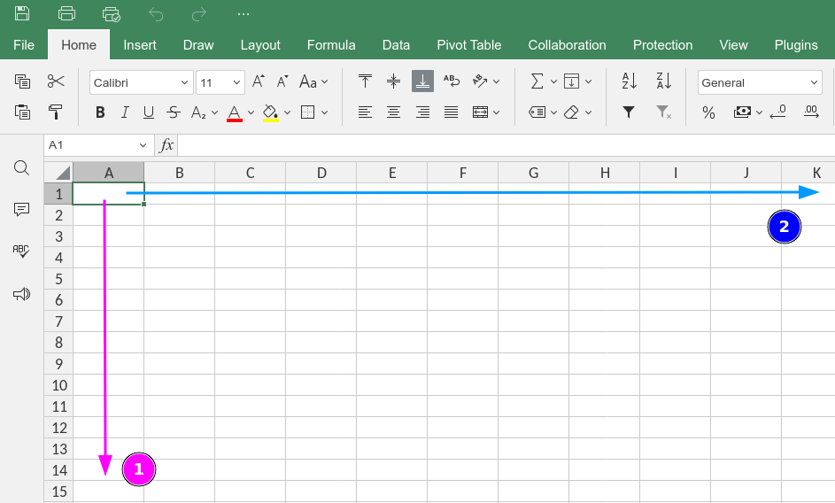
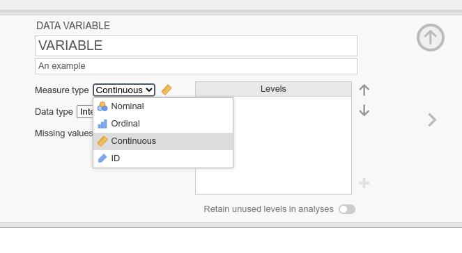

# Campionamento

## Popolazione e campione

## Rappresentatività del campione

Parleremo del campionamento anche quando parleremo di inferenza. Per il momento l'aspetto più importante del campionamento è la rappresentatività. Un campione rappresentativo rispecchia al meglio le caratteristiche della popolazione.

## Rappresentatività del campione, un esempio

Immaginate di voler vedere se ci sono differenze legate al sesso in una certa abilità (tipo matematica) e di raccogliere studentə. Raccogliete 100 studentə, somministrate la prova di matematica e poi guardate i risultati:

```{r}
N <- 500

sex <- c("m", "f")
dep <- c("psi", "ing")

dat <- data.frame(
  id = 1:N,
  dep = rep(dep, each = N/2)
)

dat$sex <- ifelse(
  dat$dep == "psi",
  rep(sex, c(N/2 * 0.3, N/2 * 0.7)),
  rep(sex, c(N/2 * 0.7, N/2 * 0.3))
)

dat$math  <- round(with(dat, 90 + 40 * ifelse(dep == "psi", 0, 1)) + rnorm(N, 0, 10))

ggplot(dat, aes(x = sex, y = math)) +
  geom_boxplot()
```

## Rappresentatività del campione, un esempio

Il test di matematica è affidabile e valido e la numerosità campionaria è adeguata ($n = 500$). Quali potrebbero essere le problematiche? Quali informazioni vorreste in aggiunta per capire meglio?

. . .

La domanda fondamentale riguarda il tipo di campione raccolto. Sono studenti e studentesse, ma sono *rappresentativi* (vedremo meglio questo concetto)?.

## Rappresentatività del campione, un esempio

Vediamo, ad esempio, il corso di studi da cui provengono:

```{r}
dat |> 
    group_by(sex, dep) |> 
    summarise(math = round(mean(math), 1),
              n = n()) |> 
    qtab()
```

- Il livello di matematica tra maschi e femmine è identico ma il livello di matematica tra studenti e studentesse di ingegneria vs psicologia è molto diverso.
- Il campione di studentesse è stato raccolto principalmente nel dipartimento di psicologia e quello dei maschi da quello di ingegneria

## Rappresentatività del campione, un esempio

In altri termini, un campione costruito in modo non adeguato, anche al netto di misure valide e affidabili ed una sufficiente numerosità campionaria può portare a conclusioni non valide.

```{r}
dat |> 
    ggplot(aes(x = dep, y = math, fill = sex)) +
    geom_boxplot()
```

# Dataset

## Dataset

Il *dataset* è l'insieme delle variabili che sono state raccolte in uno specifico esperimento. Contiene tutte o una parte delle variabili che verranno utilizzate nei vari modelli statistici.

Per intenderci, possiamo immaginare un classico dataset come un foglio Excel composto da un certo numero di righe e colonne:



## Righe e colonne

Il dataset è una struttura dati *bidimensionale* formata da $n$ righe e $p$ colonne. La dimensione totale è $n \times p$ (il numero di celle). La convenzione è di indicare:

- $n$ come le unità statistiche o osservazioni
- $p$ le variabili quindi le proprietà misurate su quelle specifiche unità statistiche

Quindi, per ogni riga $n$ noi abbiamo tutte le caratteristiche dell'osservazione $n$. In ogni colonna $p$ abbiamo tutte le osservazioni per quella specifica caratteristica.

## Dataset come principale struttura dati

Tutti i principali software per eseguire analisi dei dati come R, SPSS, Jamovi o JASP utilizzano di base questa struttura dati bidimensionale.

Solitamente, i dati vengono raccolti tramite software ad esempio Google Form, Qualtrics, etc. che producono in output un database, ad esempio un foglio Excel.

## Colonne come variabili

**Ogni colonna in un dataset è indipendente nel senso che può essere di tipologia diversa**. Possiamo avere una colonna che indica il nome (quindi stringhe di testo), una che indica l'età in anni (quindi numeri interi) e una che indica il peso in kg (quindi numeri con la virgola).

. . .

In alcuni software inoltre le variabili possono anche essere indicate usando la tassonomia **NOIR**. Quindi possiamo avere numeri o stringhe di testo che hanno un ordine oppure sono delle semplici categorie.

## Colonne come variabili, Jamovi



## Colonne come variabili, R

In R abbiamo diverse tipologie di dato:

```{r}
#| eval: false
#| echo: true

integer()    # numeri interi (senza virgola)
numeric()    # numeri (con la virgola)
character()  # stringhe di testo ~ categoriali
ordered()    # stringhe di testo ordinate ~ ordinali
```

## Colonne come variabili

In realtà, possiamo codificare le variabili nel modo che vogliamo, è sufficiente avere una regola. Possiamo indicare ad esempio 4 categorie come il colore degli occhi con i numeri da 1 a 4.

La media dei numeri da 1 a 4 è permessa ovviamente MA il risultato non ha senso rispetto alla variabile originale.

Costruite un dataset sempre con il tipo di variabile con il tipo che più si avvicina a quello originale, in modo da limitare questo tipo di errori.

## Esempi di dataset

metti qui qualche link a fogli google con esempi di dataset. Metti i link in lettura e tu come editor.

## (cattivi) Esempi di dataset

qui metti qualche esempio a dataset con dei problemi:

- stringhe non consistenti
- nessun nome di variabile
- tipi delle variabili non rispettati


## distribuzione campionaria

fare il sondaggio e analizzare i dati in diretta



## Un pochino di notazione

## Stima

La popolazione di riferimento può essere definita con dei parametri. I parametri non possono essere direttamente osservati e misurati ma vengono stimati.

Il parametro viene stimato tramite una statistica (ad esempio la media). La popolazione ha un parametro **media** e io sono interessato a stimare questa quantità. Quindi raccolgo un campione di numerosità $n$ ($n < N$) e calcolo la statistica di interesse (ad esempio la media).

Essendo $n < N$ la stima della media non sarà *esattamente* quella della popolazione ma avrà una componente di **errore**.

## Bias e varianza

La mia stima quindi può essere definita da due proprietà, entrambe fondamentali ma con significati diversi:

- **bias**: la differenza *sistematica* tra la stima (statistica) ed il valore vero del parametro
- **varianza**: il grado di incertezza nella stima (statistica)

Quindi posso avere stime incerte ma tendenzialmente senza bias come stime molto precise ma biased. Entrambe queste proprietà sono essentiali per valutare un processo di stima.

## Bias e varianza esempio

Immaginate di avere un termometro e dovete misurarvi la temperatura corporea. Immaginiamo anche di sapere che il termometro, al netto di errori o variabilità nel modo di misurarla, non ha difetti di misura.

## Bias e varianza esempio

Quindi, uno stimatore *unbiased* permette di avere *in media* una stima consistente con il parametro vero MA lo stesso stimatore potrebbe essere associato a più o meno precisione.

Nell'esempio del nostro sondaggio, la media campionaria è uno stimatore *unbiased* nel momento in cui il campionamento è casuale ma può essere molto incerta (e quindi fuorviante) se calcolata su un campione di bassa numerosità.

Sempre la stessa media campionaria può diventare uno stimatore *biased* se calcolata su uno specifico sottoinsieme della popolazione non casuale ed essere però molto precisa perchè ho a disposizione un campione di elevata numerosità.

## Bias e varianza esempio

E' importante notare che aspetti diversi della mia ricerca ovvero il numero di soggetti ed il campionamento impattano in modo diverso la stima di un parametro.

Entrambi questi aspetti quindi devono essere scelti accuratamente o presi in considerazione quando si valutano i risultati di una ricerca dove vengono stimati dei parametri.

## history of inference

https://plato.stanford.edu/entries/statistics/#Aca

## Inferenza

L'inferenza è un aspetto distinto ma legato al concetto di stima. L'inferenza riguarda un processo **decisionale** rispetto ad un parametro stimato.

Fare inferenza quindi significa prendere una decisione basandosi su una o più stime campionarie di parametri. Essendo l'inferenza basata su stime, la decisione inferenziale ha, per definizione, una componente d'errore.

## Approcci di inferenza statistica

L'inferenza statistica è caratterizzata sia storicamente ma anche attualmente da approcci diversi che possiamo riassumere in:

- Approccio **Fisheriano**
- Approccio di **Neyman & Pearson**
- Approccio basato sulla **Likelihood** (*verosimiglianza*)
- Approccio **Bayesiano**

Diciamo che in Psicologia, viene utilizzato un ibrido tra l'approccio Fisheriano e quello di Neyman & Pearson chiamato Null Hypothesis Significance Testing (NHST) e in minoranza l'approccio Bayesiano.

## Per approfondire [#extra]

- @Gigerenzer1993-cr
- @Gigerenzer2018-cj

## Quali sono i problemi?

- p value non rappresenta evidenza dell'effetto ne indicazione su quanto sia grande
- p value con campione piccolo, sovrastima effetto. magari fai un riferimento alla regression to the mean qui
- campioni piccoli ed effetti piccoli, poca potenza paragone con il test diagniostico
- usare sempre lo stesso $\alpha$ non ha senso (magari qualche cenno a decision theory, tipi di errore)

## Campioni piccoli ed effetti piccoli

Se vi dicessi di fare un test per una malattia che risulta positivo (quando avete la malattia) solo il 50% delle volte, sareste tranquilli?

Se vi dicessi di fare un test per una malattia che, in caso foste positivi, comporterebbe un cambiamento drastico nella vostra vita ma che risulta positivo il 20% delle volte anche se non avete la malattia sareste tranquilli?

## Campioni piccoli ed effetti piccoli

qui qualche lavoro che fa vedere effetti medi, potenza, etc. in psicologia sociale

## Cosa faremo qui?

Diciamo che l'approccio di Neyman e Pearson è quello che viene più utilizzato. Inoltre le raccomandazioni per good practice in ricerca moderna suggeriscono di pianificare e giustificare il campione utilizzato.

Questo richiede di ipotizzare un effetto (quindi $H_1$ in un certo senso) e anche un livello di $\alpha$.

## Attenti a non cadere però nel null ritual

@Gigerenzer2012-ne

# Inferenza, the big picture

## Inferenza the big picture

immagine del workflow qui

## Popolazione

Il concetto di popolazione statistica è uno dei più complessi e non sempre chiari. Tecnicamente intendiamo la popolazione come l'entita generalmente infinita o comunque non direttamente osservabile della quale vogliamo stimare alcune proprietà.

Queste proprietà vengono definite parametri e descrivono delle caratteristiche della popolazione come la sua media, mediana, varianza, etc.

Per quanto sia infinita o non direttamente osservabile la popolazione di riferimento deve essere sempre chiara. Al netto di tutto (assunzioni, campionamento, etc.) le mie analisi statistiche mi permettono di stimare caratteristiche della popolazione e prendere decisioni. In altri termini, ciò che osservo nel mio campione viene generalizzato alla popolazione di riferimento:

- studio sull'impatto dei social media nella salute mentale degli adolescenti
- studio riguardo il benessere di studenti universitari a Padova
- valutare inserimento lavorativo prima e dopo l'introduzione delle PPV pre-lauream

Provate a definire quale sia (e quale non sia) la popolazione di riferimento.

## Dal campione alla popolazione

# Errori inferenziali

## Errori inferenziali, test diagnostico

Il modo migliore per capire il concetto di errore inferenziale è il paragone con i test diagnostici. Immaginiamo di avere una condizione misurata da un test diagnostico. Questo test è un buon test ma non misura sempre perfettamente.

Immaginiamo di avere $N = 100$ persone, 50 di queste hanno la malattia e 50 non hanno la malattia.

Immaginiamo poi di fare il test e in base al cut-off (> o < di una certa soglia) classifichiamo le persone come malate o non malate.

## Errori inferenziali, test diagnostico

Abbiamo 4 possibili esiti di classificazione:

tabella di contingenza

## Errori inferenziali, inferenza statistica

