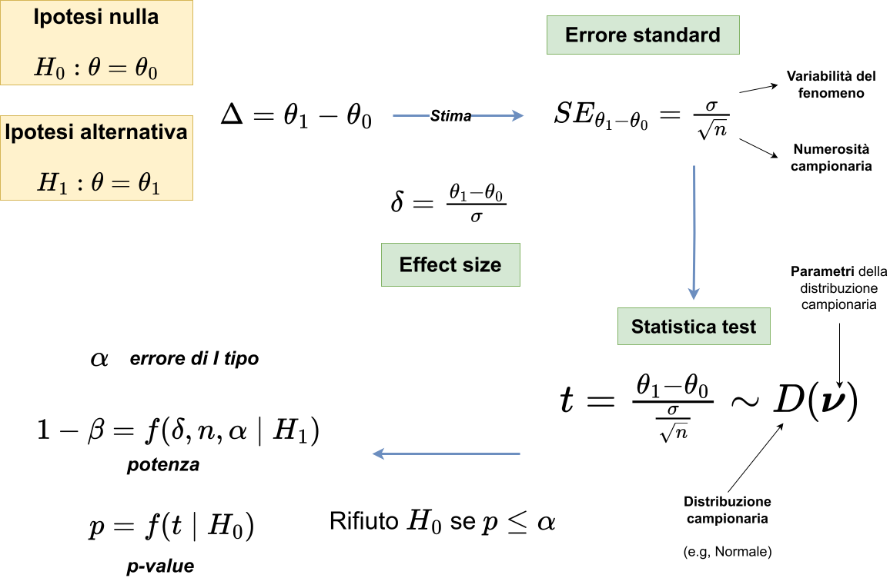

## Tutto così semplice?

Lo stesso p value può essere ottenuto con scenari molto diversi. Quindi il p value da solo non è sufficiente.

```{r}
mu0 <- 163
s <- 9
p <- c(0.001, 0.01, 0.03, 0.05)
n <- seq(10, 100, 1)
se <- s / sqrt(n)

tibble(p) |> 
    mutate(z = abs(qnorm(p)),
           data = list(data.frame(se, n))) |> 
    unnest(data) |> 
    mutate(m = mu0 + se * z) |> 
    ggplot(aes(x = n, y = m, color = factor(p))) +
    geom_line() +
    labs(
        x = "Numerosità (n)",
        y = latex2exp::TeX(r'(Media del campione ($\bar{x}$))'),
        color = "p value"
    ) +
    geom_hline(yintercept = 163, lty = "dotted")
```

## Ipotesi alternativa

Ci manca un'ipotesi alternativa $H_1$ nei termini di un valore plausibile del parametro $\mu_1$ nel mondo dove $H_0$ è falsa e $H_1$ è vera. Importante, questo non è il valore del campione, ma un valore ipotetico e plausibile del parametro.

Attenzione che dire $H_0: \mu = 163$ e $H_1: \mu > 163$ non è sufficiente. $H_1$, nel momento in cui definiamo l'ipotesi alternativa deve essere un valore definito ed empiricamente plausibile.

Il motivo è che oltre all'errore di primo tipo o falso positivo abbiamo anche altri errori e questi sono definiti quando $H_1$ è definito.

## Ipotesi alternativa

Restando sull'esempio, immaginiamo che $H_1: \mu = 165$. Quindi la media della popolazione è 170cm e non 163 (il valore *nullo*). Abbiamo quindi due distribuzioni campionarie:

- distribuzione campionaria della statistica test quando $H_0$ è vera (e quindi $H_1$ è falsa)
- distribuzione campionaria della statistica test quando $H_1$ è vera (e quindi $H_0$ è falsa)

Inoltre abbiamo il nostro valore di $\alpha$ per la decisione inferenziale. Abbiamo costruito un sistema di verifica di ipotesi molto simile a quello proposto da Neyman e Pearson.

## Ipotesi alternativa

Nel nostro caso, ipotizziamo che $H_1: \mu = 165$. Quindi possiamo disegnare entrambe le distribuzioni.

```{r}
se <- 1.47

mu0 <- 163
mu1 <- 165
xbar <- 168

par(mfrow = c(2, 1), mar = c(2, 4, 1, 2))

xlim <- c(
    min(mu0 - se * 5, mu1 - se * 5),
    max(mu0 + se * 5, mu1 + se * 5)
)

z <- qnorm(0.05/2, mean = mu0, se, lower.tail = FALSE)

# H0
curve(dnorm(x, mu0, se), xlim[1], xlim[2], xaxt = "n", xlab = "", main = latex2exp::TeX("$H_0$"), ylab = "Density")
points(x = xbar, y = 0, pch = 19, cex = 2, col = "firebrick")
abline(v = z)
abline(v = mu0, lty = "dotted")
text(x = z+2, y = 0.2, labels = latex2exp::TeX(r"($\alpha \; = 0.05$)"))
text(x = xbar, y = 0.05, labels = latex2exp::TeX(r"($\bar{x}$)"))
x_poly <- seq(z, xlim[2], length = 100)
y_poly <- dnorm(x_poly, mu0, se)
polygon(c(z, x_poly, xlim[2]), c(0, y_poly, 0), col = rgb(1, 0, 0, 0.3), border = NA)
legend("topleft", legend = TeX(r"($\alpha$)"), fill = rgb(1, 0, 0, 0.3))

# H1
curve(dnorm(x, mu1, se), xlim[1], xlim[2], main = latex2exp::TeX("$H_1$"), ylab = "Density")
abline(v = qnorm(0.05/2, mean = mu0, se, lower.tail = FALSE))
abline(v = mu1, lty = "dotted")
text(x = xbar, y = 0.05, labels = latex2exp::TeX(r"($\bar{x}$)"))
# Create polygon for beta (area to the left of z_crit under H1)
x_beta <- seq(xlim[1], z, length = 100)
y_beta <- dnorm(x_beta, mu1, se)
polygon(c(xlim[1], x_beta, z), c(0, y_beta, 0), col = rgb(0, 0, 1, 0.3), border = NA)
x_power <- seq(z, xlim[2], length = 100)
y_power <- dnorm(x_power, mu1, se)

# 2. Draw the polygon
# Coordinates: start at (z_crit, 0), trace the curve, end at (xlim[2], 0)
polygon(c(z, x_power, xlim[2]), 
        c(0, y_power, 0), 
        col = rgb(0, 0.8, 0, 0.3), # Transparent Green
        border = NA)
points(x = xbar, y = 0, pch = 19, cex = 2, col = "firebrick")
legend("topleft", legend = c(TeX(r"($1 - \beta$)"), TeX(r"($\beta$)")), fill = c(rgb(0, 0.8, 0, 0.3), rgb(0, 0, 1, 0.3)))
```

## Ipotesi nulla e alternativa

Quindi possiamo riassumere questo sistema in una tabella di contingenza 2x2:

{fig-align="center"}


## Ipotesi nulla e alternativa

Quindi, gli aspetti principali sono:

- $H_0$ e $H_1$ sono mutuamente esclusive
- La potenza è la probabilità condizionata di rifiutare $H_0$ quando questa è falsa (quindi assumendo vera $H_1$)
- L'errore di primo tipo è la probabilità di rifiutare $H_0$ quando questa è vera. Viene di solito fissato ad un valore
- il p value è la probabilità di ottenere un risultato uguale o più estremo se $H_0$ è vera

L'obiettivo di un test è avere più potenza possibile mantenendo un livello accettabile di $\alpha$.

## Come si calcola la potenza? {.smaller}

Di base, il calcolo è simile a quello del p value ma basato sull'ipotesi alternativa. Facciamo un esempio^[Calcolare o stimare la potenza non è sempre così semplice, ma la logica è sempre la stessa.]:

```{r}
#| echo: true
#| collapse: true

mu0 <- 163
mu1 <- 165
se <- sd(dat$altezza) / sqrt(nrow(camp))
alpha <- 0.05
z <- (mu1 - mu0) / se
z # differenza tra le due ipotesi, standardizzata

zcrit <- abs(qnorm(alpha/2)) # valore critico standardizzato
zcrit

# spostiamo i valori critici della normale standard in funzione della
# differenza tra le due ipotesi (H1)
(power <- pnorm(-zcrit + z) + pnorm(zcrit + z, lower.tail = FALSE))
```

In questo caso la potenza è `r round(power, 2)`, quindi se fosse vera $H_1: \mu = 165$ avremmo probabilità del `r round(power*100)`% di trovare l'effetto. Trovare l'effetto qui significa essere in grado di distinguerlo da quello *nullo* ovvero $\mu_0 = 163$.

## Da cosa dipende la potenza?

La potenza dipende fondamentalmente da due aspetti:

- il valore di $\alpha$: un valore di $\alpha$ maggiore significa una statistica test minore (in valore assoluto) e quindi maggiore probabilità di rifiutare $H_0$. Però $\alpha$ generalmente è fisso e deciso a priori.
- il grado di separazione tra le due ipotesi, quindi la statistica test. Questa a sua volta dipende da:
    - numeratore: quindi il grado di separazione *grezzo* delle ipotesi
    - denominatore (errore standard): quindi la numerosità campionaria $n$ e $\sigma$ ovvero il grado di variabilità del fenomeno.

Quindi nella pratica, essendo $\alpha$ definito a priori, la separazione tra le ipotesi $\mu_1 - \mu_0$ definito a priori e $\sigma$ stimato ($s$), l'aspetto cruciale è la numerosità campionaria $n$.

## Effect size

Un ultimo aspetto importante nell'inferenza è il concetto di effect size. L'effect size non è altro che una statistica come le altre ma che viene usata essendo direttamente e "facilmente" interpretabile. Ci sono due tipo di effect size:

- **standardizzati**: ad esempio il Cohen's $d$, correlazione, odds ratio, etc. Sono degli effect size che non dipendono dall'unità di misura originale. A prescindere da cosa sto correlando, una correlazione di 0.5 è interpretata, statisticamente, allo stesso modo.
- **non standardizzati**: ad esempio la differenza semplice tra due medie. Dal punto di vista prettamente statistico sono preferibili ma non sempre sono intepretabili. Dire che due persone differiscono di 15cm in altezza è chiaro (effetto grande). Dire che due persone differiscono di 4 punti su una scala di depressione è meno chiaro.

## Effect size, Cohen's $d$

Un esempio classico riguarda il Cohen's $d$ (o differenza tra medie standardizzate). Immaginiamo di avere la situazione di prima con $\mu_0 = 163$ e $\mu_1 = 165$. La differenza tra medie *grezza* è $\Delta = \mu_1 - \mu_0 = 5$.

Per standardizzare questa differenza tenendo conto del grado di variabilità possiamo dividere $\Delta$ per la deviazione standard della popolazione $\sigma$. Quindi:

$$
\delta = \frac{\mu_1 - \mu_0}{\sigma}
$$

Quindi la differenza ora è espressa in unità standardizzate di deviazione standard e non più in centimetri.

## Effect size, Cohen's $d$

Proviamo a calcolarlo:

```{r}
#| echo: true

sigma <- sd(dat$altezza) # deviazione standard popolazione
delta <- (mu1 - mu0) / sigma
delta
```

Quindi $\mu_1$ è `r round(delta, 2)` deviazioni standard dall'ipotesi nulla. Questo valore è facilmente confrontabile a prescindere dal tipo di variabile.

## Cohen's $d$ e statistica test

Abbiamo definito prima una statistica test come:

$$
z = \frac{\mu_1 - \mu_0}{SE_{\mu_1}} = \frac{\mu_1 - \mu_0}{\frac{\sigma}{\sqrt{n}}}
$$

La formula è simile ma $\delta$ non contiene $n$. Infatti, l'effect size è semplicemente una trasformazione standardizzata mentre la statistica test ingloba anche l'informazione della numerosità.

Il punto è proprio questo, uno stesso effect size può essere (come per tutte le altre statistiche) stimato più o meno precisamente e quindi avere più o meno errore standard.

## Cohen's $d$

Anche se standardizzato, questo effect size non è facilmente interpretabile come una correlazione (tra -1 e 1). Ci sono dei benchmark che possono essere utili:

- La differenza di altezza media tra maschi e femmine in Olanda è di 13cm o Cohen's $d = 2$ [@Schonbeck2012-ht]^[[https://lakens.github.io/statistical_inferences/06-effectsize.html](https://lakens.github.io/statistical_inferences/06-effectsize.html)]
- Ci sono delle stime degli effect size medi in Psicologia attorno a 0.4 [@Richard2003-dq]

Queste sono solo indicazioni generali, ogni ambito di ricerca può avere degli effetti plausibili. Ovviamente diffidate degli effetti troppo ottimisti, sono poco plausibili.

## Cohen's $d$ e potenza

Ora che abbiamo un valore standardizzato per esprimere il grado di separazione delle ipotesi $H_0$ e $H_1$, vediamo come è legato alla potenza.

```{r}
d <- c(0.1, 0.3, 0.5, 1)
n <- seq(5, 200, 1)

dd <- expand.grid(
    d = d, n = n
)

dd$power <- pwr::pwr.t.test(
    n = dd$n,
    d = dd$d,
    sig.level = 0.05
)$power

library(ggplot2)

ggplot(dd, aes(x = n, y = power, color = factor(d))) +
    geom_line() +
    labs(
        color = TeX(r"($\delta$)")
    ) +
    ylab("Potenza") +
    xlab("Numerosità (n)")
```

## Aspetti critici

Il primo aspetto da tenere a mente è: qualunque effetto (diverso da zero) con un certo $n$ sarà associato ad un $p \leq \alpha$, quindi sarà significativo. Quindi il p value, da solo, non ci dice chiaramente la grandezza (e quindi la rilevanza) dell'effetto.

```{r}
dd <- expand.grid(
    alpha = 0.05,
    d = seq(0.1, 1, 0.01)
)

dd$n <- NA

for(i in 1:nrow(dd)){
    dd$n[i] <- pwr::pwr.t.test(
        d = dd$d[i],
        power = 0.5,
        type = "two.sample",
        sig.level = dd$alpha[i]
    )$n
}


ggplot(dd, aes(x = d, y = n)) +
    geom_line() +
    ggtitle(latex2exp::TeX(r"($p = 0.05$)"))
```

## Aspetti critici

Allo stesso tempo, se abbiamo campioni di numerosità limitata non è possibile stimare in modo affidabile effetti molto piccoli.

```{r}
n <- c(20, 50, 100)
d <- seq(0, 1, 0.01)
pw <- sapply(d, function(x) pwr::pwr.t.test(n = 50, d = x)$power)

expand.grid(d = d, n = n) |> 
    mutate(power = map2_dbl(d, n, function(x, y) pwr::pwr.t.test(n = y, d = x)$power)) |> 
    ggplot(aes(x = d, y = power, color = factor(n))) +
    geom_line() +
    geom_hline(yintercept = 0.8, lty = "dotted") +
    ylab("Potenza") +
    xlab("Cohen's d") +
    labs(color = "n")
```

## Aspetti critici

Un ultimo aspetto critico riguarda la **selezione per la significatività**. Se vengono pubblicati solo i risultati con $p \leq \alpha$ questo porta ad una sovrastima dell'effetto.

```{r}
#| fig-height: 8
#| fig-width: 12

n <- 30
mu <- 0.3
se <- 1/sqrt(n)

pval <- function(n, d, alpha = 0.05){
    zc <- abs(qnorm(alpha/2))
    zo <- abs(d * sqrt(n))
    pnorm(-zo) * 2
}

d <- seq(mu - 4*se, mu + 4*se, length.out = 1000)
y <- dnorm(d, mean = mu, sd = se)
p <- pval(n, d)

df <- data.frame(d, y, p)

ggplot(df, aes(d, y)) +
    geom_line() +
    geom_area(aes(fill = p), alpha = 0.8) +
    labs(fill = "p-value") +
    scale_fill_viridis_c(
        direction = -1,
        limits = c(0, 1),
        breaks = c(0, 0.25, 0.5, 0.75, 1)
    ) +
    xlab("Cohen's d") +
    ylab("Density") +
    ggtitle(latex2exp::TeX(r"($n = 30$, $\delta = 0.3$)")) +
    theme(legend.position = "right")
```

## Ricapitolando

{fig-align="center"}

## Ricapitolando

- L'inferenza dipende dalla grandezza dell'effetto e dalla qualità della stima (errore standard). Effetti più complessi (test ad un campione vs a due campioni) hanno generalmente potenza minore.
- La distribuzione campionaria non è sempre normale. Di solito si usa anche la t di Student ma la logica generale è la stessa.
- La potenza è una funzione che dipende da diversi parametri. Effetti piccoli (comuni in Psicologia), richiedono campioni grandi.
- Il p value da solo non è informativo rispetto alla rilevanza statistica ed empirica dell'effetto.
- Effetti grandi con campioni piccoli sono nella maggior parte dei casi sovrastime e non dovrebbero essere considerati affidabili.